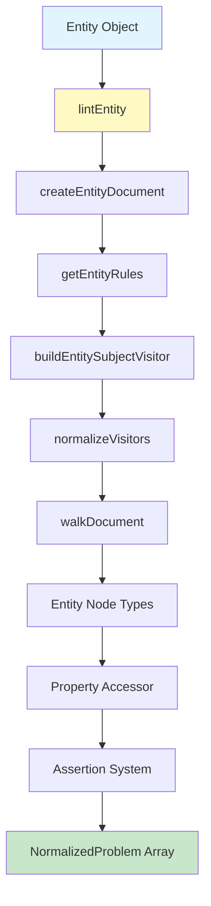
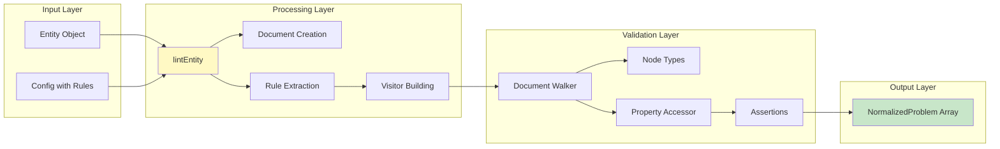
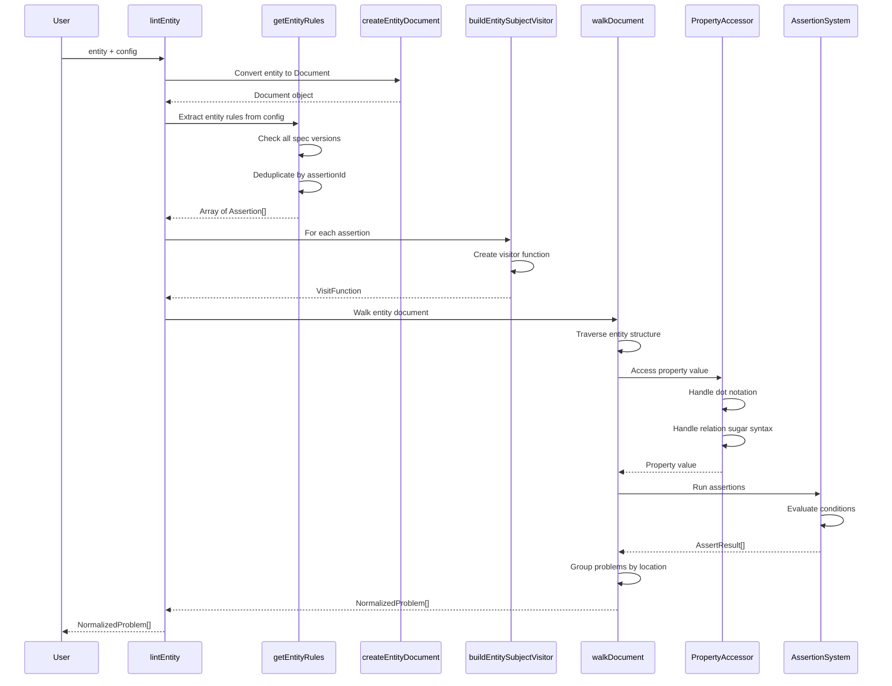
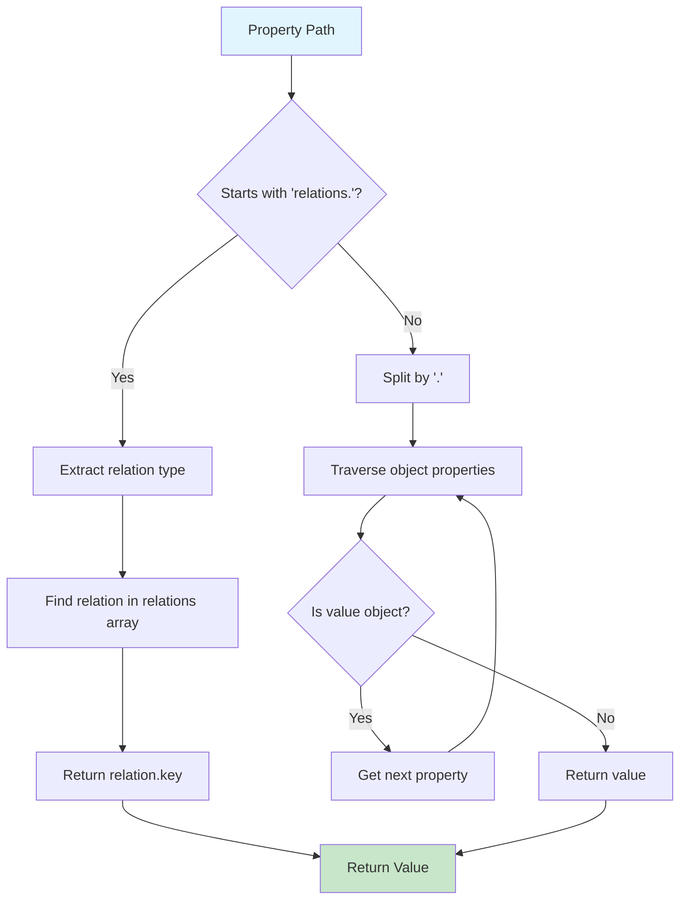
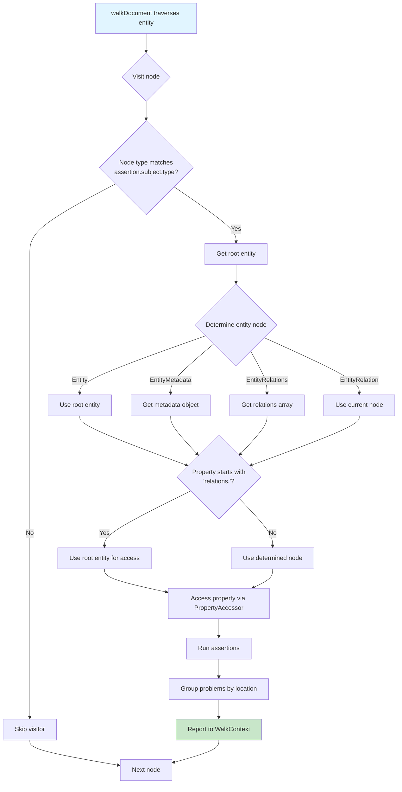
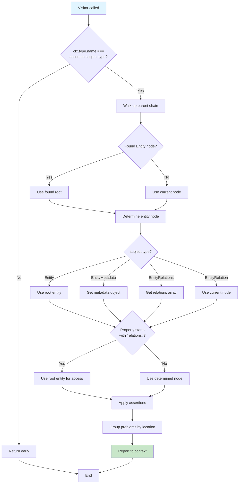

# `lintEntity` Implementation Documentation

## Table of Contents

1. [Overview](#overview)
2. [Architecture](#architecture)
3. [Implementation Flow](#implementation-flow)
4. [File-by-File Breakdown](#file-by-file-breakdown)
5. [Key Design Decisions](#key-design-decisions)
6. [Examples](#examples)
7. [Testing](#testing)

---

## Overview

The `lintEntity` function validates catalog entities (services, teams, domains, users, etc.) against configurable rules using the same assertion-based system used for OpenAPI/AsyncAPI validation. This allows consistent validation across different entity types using a unified rule system.

### Key Features

- **Entity-specific node types**: `Entity`, `EntityMetadata`, `EntityRelations`, `EntityRelation`
- **Property access**: Dot notation (`metadata.onCall`) and relation sugar syntax (`relations.ownedBy`)
- **Assertion-based rules**: Uses existing assertion system (`defined`, `nonEmpty`, `pattern`, `const`, etc.)
- **Conditional rules**: Supports `where` clauses for conditional validation
- **Consistent output**: Returns `NormalizedProblem[]` matching `lintDocument` format

---

## Architecture

### High-Level Architecture



### Component Interaction



---

## Implementation Flow

### Complete Flow Diagram



### Property Access Flow



### Visitor Execution Flow



---

## File-by-File Breakdown

### 1. `packages/core/src/lint-entity.ts`

**Purpose**: Main entry point for linting catalog entities.

#### Key Functions

##### `getEntityRules(config: Config): Assertion[]`

**Purpose**: Extracts entity-specific assertion rules from the Redocly config.

**Why**: Rules are stored across multiple spec versions (oas2, oas3_0, oas3_1, etc.) and can be duplicated. This function:

- Searches all spec versions for entity rules
- Filters rules with entity subject types (`Entity`, `EntityMetadata`, `EntityRelations`, `EntityRelation`)
- Deduplicates by `assertionId` using a `Map` to prevent duplicate rule execution

**Key Implementation Details**:

```typescript
const assertionsMap = new Map<string, Assertion>();
// Deduplicate by assertionId since rules are duplicated across spec versions
const assertionId = assertion.assertionId as string;
if (!assertionsMap.has(assertionId)) {
  assertionsMap.set(assertionId, assertion as Assertion);
}
```

**Why Map instead of array**: Prevents the same rule from being applied multiple times, which was causing test failures (rules being collected 8 times instead of once).

##### `createEntityDocument(entity: unknown, entityKey?: string): Document`

**Purpose**: Converts a plain entity object into the internal `Document` format required by the linting system.

**Why**: The existing `walkDocument` system expects a `Document` object with `source` and `parsed` properties. This function:

- Creates a `Source` object with a unique identifier (`entity://{key}`)
- Serializes the entity to JSON for the source content
- Returns a `Document` compatible with the existing system

**Design Decision**: Uses `unknown` type for entity parameter because entities come from databases and can have any structure. Validation happens through node types, not TypeScript types.

##### `lintEntity(opts): Promise<NormalizedProblem[]>`

**Purpose**: Main function that orchestrates the entire linting process.

**Flow**:

1. Release AJV instance (cleanup)
2. Create document from entity
3. Extract entity rules from config
4. Normalize entity node types
5. Build visitors for each rule
6. Create walk context
7. Resolve document (mostly no-op for entities)
8. Walk document with visitors
9. Return normalized problems

**Key Design Decisions**:

- Uses `Entity` as `rootType` instead of `EntityRoot` because `EntityRoot` is just a placeholder
- Uses `oas3_0` as default `specVersion` (not used for entities but required by WalkContext)
- Applies ignore patterns before returning problems

---

### 2. `packages/core/src/types/entity-nodes.ts`

**Purpose**: Defines the node type structure for catalog entities.

#### Node Types

##### `Entity`

- **Purpose**: Represents the root entity object
- **Properties**: Defines standard entity fields (id, key, type, title, summary, tags, metadata, relations, etc.)
- **Why**: Allows the walker to understand the entity structure and traverse it correctly

##### `EntityMetadata`

- **Purpose**: Represents the nested `metadata` object
- **Properties**: Uses `additionalProperties: {}` to allow any metadata structure
- **Why**: Metadata is flexible and can contain any properties, so we don't restrict it

##### `EntityRelations`

- **Purpose**: Represents the `relations` array
- **Items**: Points to `EntityRelation` type
- **Why**: Allows traversal of the relations array and validation of individual relations

##### `EntityRelation`

- **Purpose**: Represents a single relation object
- **Properties**: `type` and `key` (required), plus `additionalProperties` for flexibility
- **Why**: Enables validation of individual relations

##### `EntityRoot`

- **Purpose**: Placeholder root type (not actually used)
- **Why**: Initially intended as root type, but `Entity` is used directly instead

**Design Decision**: These node types integrate with the existing type system, allowing reuse of the `walkDocument` infrastructure.

---

### 3. `packages/core/src/rules/entity/property-accessor.ts`

**Purpose**: Provides utilities for accessing properties within catalog entities.

#### Key Functions

##### `getEntityProperty(entity: CatalogEntity, path: string): unknown`

**Purpose**: Retrieves property values using dot notation and relation sugar syntax.

**Features**:

1. **Relation Sugar Syntax**: Handles `relations.ownedBy`, `relations.dependsOn`, etc.

   - Extracts relation type from path
   - Finds relation in `relations` array by `type`
   - Returns the `key` property of the relation

2. **Dot Notation**: Handles nested properties like `metadata.onCall`, `metadata.contact.slack.channel`
   - Splits path by `.`
   - Traverses object properties safely
   - Returns `undefined` if any part of the path is missing

**Type Safety**:

```typescript
// Type guard: value must be an object/array to access properties
if (typeof value !== 'object') {
  return undefined;
}
value = (value as Record<string, unknown>)[part];
```

**Why**: Prevents runtime errors when accessing properties on non-object values.

**Example**:

```typescript
// Regular property
getEntityProperty(entity, "title") // → entity.title

// Nested property
getEntityProperty(entity, "metadata.onCall") // → entity.metadata?.onCall

// Relation sugar syntax
getEntityProperty(entity, "relations.ownedBy")
// → Finds { type: "ownedBy", key: "platform-team" }
// → Returns "platform-team"
```

##### `isRelationSugarSyntax(path: string): boolean`

**Purpose**: Checks if a path uses relation sugar syntax.

##### `getRelationTypeFromPath(path: string): string | undefined`

**Purpose**: Extracts relation type from a relation sugar syntax path.

---

### 4. `packages/core/src/rules/entity/entity-assertions.ts`

**Purpose**: Core logic for building visitors that apply assertions to entity nodes.

#### Key Functions

##### `runEntityAssertion(...): AssertResult[]`

**Purpose**: Executes a single assertion against an entity property.

**Flow**:

1. Gets current location (rawLocation for `ref`, location for others)
2. Validates entity node is a plain object
3. If property specified: uses `getEntityProperty` to get value, then runs assertion
4. If no property: uses entity keys/array as value, then runs assertion

**Why**: Adapts the generic assertion system to work with entity-specific property access.

##### `applyEntityAssertions(...): AssertResult[]`

**Purpose**: Applies all assertions for a rule to the entity node.

**Flow**:

1. Extracts properties from assertion subject (handles single property or array)
2. For each assertion and each property, calls `runEntityAssertion`
3. Flattens and returns all results

**Why**: Handles multiple properties and multiple assertions per rule.

##### `buildEntitySubjectVisitor(assertId: string, assertion: Assertion): VisitFunction<any>`

**Purpose**: Creates a visitor function that validates entity nodes.

**Critical Flow**:



**Key Implementation Details**:

1. **Type Guard**: Only processes when visiting the correct node type

   ```typescript
   if (ctx.type.name !== assertion.subject.type) {
     return;
   }
   ```

   **Why**: Prevents duplicate problem reporting when the visitor is triggered on child nodes.

2. **Root Entity Resolution**: Walks up parent chain to find root entity

   ```typescript
   let current = ctx.parent;
   while (current) {
     if (current.type?.name === 'Entity') {
       rootEntity = current.activatedOn?.value?.node || rootEntity;
       break;
     }
     current = current.parent;
   }
   ```

   **Why**: Need root entity to access properties like `metadata` and `relations` even when visiting child nodes.

3. **Entity Node Determination**: Based on subject type, determines which node to use

   ```typescript
   if (assertion.subject.type === 'Entity') {
     entityNode = rootEntityObj;
   } else if (assertion.subject.type === 'EntityMetadata') {
     const metadata = rootEntityObj.metadata;
     entityNode = isPlainObject(metadata) ? (metadata as CatalogEntity) : node;
   }
   ```

   **Why**: Different subject types need different nodes for property access.

4. **Relation Sugar Syntax Handling**: Special handling for `relations.*` paths

   ```typescript
   if (property && typeof property === 'string' && property.startsWith('relations.')) {
     entityNode = rootEntityObj;
   }
   ```

   **Why**: Relation sugar syntax requires access to the root entity's `relations` array.

5. **Problem Grouping**: Groups problems by location pointer
   ```typescript
   const groups: Record<string, typeof problems> = {};
   for (const problem of problems) {
     const pointer = problem.location.pointer;
     groups[pointer] = groups[pointer] || [];
     groups[pointer].push(problem);
   }
   ```
   **Why**: Multiple assertions can fail on the same property, so we group them for better error messages.

##### `buildEntityVisitorObject(...): Record<string, any>`

**Purpose**: Wraps the subject visitor into a format compatible with `normalizeVisitors`.

**Why**: The visitor system expects a specific structure. This function adapts our visitor to that structure.

**Type Note**: Uses `any` types to match the existing visitor system pattern, which uses dynamic typing for flexibility.

---

### 5. `packages/core/src/index.ts`

**Changes**: Added export for `lintEntity`

```typescript
export { lintEntity } from './lint-entity.js';
```

**Why**: Makes `lintEntity` available as part of the public API.

---

## Key Design Decisions

### 1. Reusing Existing Infrastructure

**Decision**: Reuse `walkDocument`, `normalizeVisitors`, and assertion system instead of building new infrastructure.

**Why**:

- Consistency with existing `lintDocument` function
- Less code to maintain
- Same output format (`NormalizedProblem[]`)
- Leverages battle-tested code

**Trade-off**: Some complexity in adapting entity structure to document format, but worth it for consistency.

### 2. Entity Node Types

**Decision**: Create new node types (`Entity`, `EntityMetadata`, etc.) instead of reusing OpenAPI types.

**Why**:

- Entities have different structure than OpenAPI specs
- Need flexible metadata structure
- Relations are arrays, not references
- Allows type-specific validation

**Trade-off**: More types to maintain, but provides better type safety and clarity.

### 3. Property Accessor Pattern

**Decision**: Centralize property access in `getEntityProperty` function.

**Why**:

- Handles dot notation consistently
- Supports relation sugar syntax
- Type-safe property access
- Single place to fix bugs

**Trade-off**: Additional abstraction layer, but improves maintainability.

### 4. Deduplication by assertionId

**Decision**: Use `Map<string, Assertion>` to deduplicate rules.

**Why**:

- Rules are duplicated across spec versions
- Prevents duplicate problem reporting
- Simple and efficient

**Trade-off**: Requires `assertionId` to be present, but this is already required by the assertion system.

### 5. Visitor Type Guard

**Decision**: Check `ctx.type.name !== assertion.subject.type` at start of visitor.

**Why**:

- Prevents visitor from running on wrong node types
- Avoids duplicate problem reporting
- Clear intent

**Trade-off**: Slight performance overhead, but prevents bugs.

### 6. Root Entity Resolution

**Decision**: Walk up parent chain to find root entity.

**Why**:

- Need root entity to access `metadata` and `relations`
- Works when visiting child nodes
- Flexible for nested structures

**Trade-off**: More complex, but necessary for correct property access.

### 7. Type Safety with `unknown`

**Decision**: Use `unknown` for entity parameter, validate with type guards.

**Why**:

- Entities come from databases with unknown structure
- TypeScript can't know structure at compile time
- Runtime validation through node types

**Trade-off**: Less compile-time safety, but necessary for flexibility.

---

## Examples

### Example 1: Basic Property Validation

```typescript
const entity = {
  key: 'my-service',
  type: 'service',
  title: 'My Service',
};

const config = await createConfig({
  rules: {
    'rule/has_title': {
      subject: {
        type: 'Entity',
        property: 'title',
      },
      severity: 'error',
      assertions: {
        defined: true,
        nonEmpty: true,
      },
    },
  },
});

const problems = await lintEntity({ entity, config });
// Returns [] if title exists and is not empty
```

**Flow**:

1. `lintEntity` creates document from entity
2. Extracts `rule/has_title` from config
3. Builds visitor for `Entity` node type
4. `walkDocument` visits entity
5. Visitor checks `title` property using `getEntityProperty`
6. Runs `defined` and `nonEmpty` assertions
7. Returns problems (empty if valid)

### Example 2: Nested Property Validation

```typescript
const entity = {
  key: 'prod-service',
  type: 'service',
  metadata: {
    environment: 'production',
    onCall: 'oncall@example.com',
  },
};

const config = await createConfig({
  rules: {
    'rule/production_has_on_call': {
      subject: {
        type: 'EntityMetadata',
        property: 'onCall',
      },
      severity: 'error',
      assertions: {
        defined: true,
      },
      where: [
        {
          subject: {
            type: 'EntityMetadata',
            property: 'environment',
          },
          assertions: {
            const: 'production',
          },
        },
      ],
    },
  },
});
```

**Flow**:

1. Visitor is built for `EntityMetadata` node type
2. When `walkDocument` visits `metadata` node, visitor triggers
3. Checks `where` condition first (environment === 'production')
4. If condition passes, checks `onCall` property
5. Uses `getEntityProperty(entity, 'metadata.onCall')` internally

### Example 3: Relation Sugar Syntax

```typescript
const entity = {
  key: 'my-service',
  type: 'service',
  relations: [
    { type: 'ownedBy', key: 'platform-team' },
  ],
};

const config = await createConfig({
  rules: {
    'rule/has_owner': {
      subject: {
        type: 'Entity',
        property: 'relations.ownedBy',
      },
      severity: 'error',
      assertions: {
        defined: true,
        const: 'platform-team',
      },
    },
  },
});
```

**Flow**:

1. Visitor built for `Entity` node type
2. Property path is `relations.ownedBy`
3. `getEntityProperty` detects relation sugar syntax
4. Finds relation with `type === 'ownedBy'`
5. Returns `key` property (`'platform-team'`)
6. Runs assertions on the returned key

---

## Testing

### Test Coverage

The implementation includes comprehensive tests covering:

1. **Basic Property Checks**: Title, summary validation
2. **Nested Properties**: Metadata properties, deeply nested paths
3. **Relation Checks**: File structure (`relations` array), database structure (`owners` array - documented)
4. **Conditional Rules**: Single and multiple `where` conditions
5. **Numeric Assertions**: `defined`, `const` assertions
6. **Edge Cases**: Missing properties, null/undefined, empty arrays, invalid paths
7. **Multiple Rules**: Multiple rules execution, severity levels
8. **Problem Structure**: Correct problem format, location information

### Test File

`packages/core/src/__tests__/lint-entity.test.ts`

**Key Test Patterns**:

- Tests both valid and invalid entities
- Verifies problem structure matches `lintDocument` output
- Tests edge cases and error handling
- Documents current limitations (e.g., `nonEmpty` only works for strings, not arrays)

### Running Tests

```bash
VITEST_SUITE=unit npx vitest run packages/core/src/__tests__/lint-entity.test.ts
```

**Result**: All 26 tests passing ✅

---

## Limitations and Future Enhancements

### Current Limitations

1. **Missing Metadata**: When `metadata` is undefined, `EntityMetadata` visitor doesn't run (no node to visit). This is expected behavior with the visitor pattern.

2. **Empty Arrays**: `nonEmpty` assertion only handles strings, not arrays. Use `minLength: 1` for arrays if needed.

3. **Database Structure**: Currently only supports `relations` array. Support for `owners`/`domains` arrays from database structure can be added later.

### Future Enhancements

1. **Numeric Comparisons**: Add support for `gt`, `gte`, `lt`, `lte` assertions (currently not in core assertion system).

2. **Database Structure Support**: Add support for `owners` and `domains` arrays from database structure.

3. **Array Assertions**: Enhance `nonEmpty` to handle arrays, or add `nonEmptyArray` assertion.

4. **Metadata Parsing**: Auto-parse JSON string metadata from database.

---

## Summary

The `lintEntity` implementation successfully validates catalog entities using the existing Redocly linting infrastructure. Key achievements:

- ✅ Consistent API with `lintDocument`
- ✅ Reuses existing assertion system
- ✅ Supports dot notation and relation sugar syntax
- ✅ Handles conditional rules with `where` clauses
- ✅ Comprehensive test coverage
- ✅ Well-documented code

The implementation follows Redocly's existing patterns while adding entity-specific functionality, ensuring consistency and maintainability.
