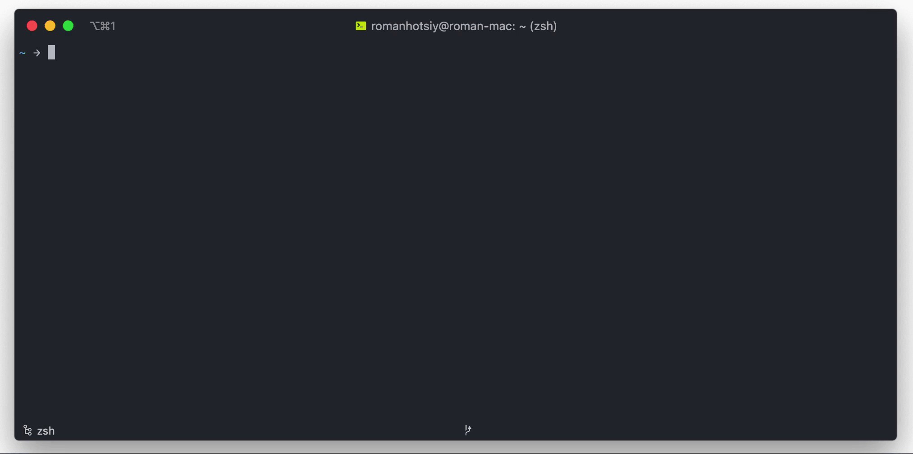

# OpenAPI 3 CLI toolset

**!WIP**: This is README for the 1.0.0-alpha.x release.

OpenAPI 3 CLI toolbox with rich validation and bundling features.




## Features

Currently, @redocly/openapi-cli supports these features:

- [x] Multifile validation. No need to bundle your file before validation.
- [x] Configurable message levels for each rule. You can tailor your experience with @redocly/openapi-cli as you wish.
- [x] Lightning-fast validation. Check 1 Mb file in less than one second.
- [x] Human-readable error messages. Now with stacktrace and codeframes.
- [x] Intuitive suggestions for misspelled types or references.
- [x] Easy to implement custom rules. Need something? Ask us or do it yourself.
- [x] Bundle a multifile definition into a single file.
- [x] Preview reference docs for local development.

## Approach

Unlike other OpenAPI validators, @redocly/openapi-cli defines the possible type tree of a valid OpenAPI definition and then traverses it. This approach is very similar to how compilers work and results in major performance benefits over other approaches. Extend functionality by following the [visitor pattern](https://en.wikipedia.org/wiki/Visitor_pattern).  Both the rules and the bundler features are following the visitor pattern to implement functionality on top of the parsed object.

## Installation

Run the `@redocly/openapi-cli` either with `npx` or after installing it locally.

If using `npx`, enter the following:

`npx @redocly/openapi-cli <command> [options]`

Otherwise, install the `@redocly/openapi-cli` with:

```npm install -g @redocly/openapi-cli```

or:

```yarn global add @redocly/openapi-cli```

Run `openapi -h` to confirm the installation was successful (you'll see the usage information).

## Usage

Currently, `@redocly/openapi-cli` provides two commands `lint` and `bundle`.

### Bundling

You can bundle your OpenAPI 3 definition into a single file (this may be important for certain tools that lack multifile support). To bundle your OpenAPI 3 definition run following command:

```
openapi bundle --output <outputName> <entryPoint>
```

`<entryPoint>` is the name of your root document and `<outputName>` is desired output filename.

Supported extensions for `outputName` are `.json`, `.yml` and `.yaml`.

Beware, if the file specified as the bundler's output already exists, it will be overwritten.

### Linting

```openapi lint [options] [entryPoint]```

Given this command, it will load the given ruleset and traverse the definition via the `entryPoint` parameter.

Also, it accepts `[options]` which can be:
- `--format` Ouput format, can be `stylish` or `codeframe`
- `--config <path>`  Specify custom yaml or json config.
- TODO: tbd

In the section below, you can learn how to provide settings for the `@redocly/openapi-cli`.

### Preview Docs (not available in alpha)

```openapi preview-docs [options] [entryPoint]```

Given this command, it will start a local development server and display the address to access the preview of the reference docs.  This works with both community-edition Redoc and the premium Redocly API Reference (with a valid license key).

## Configuration

### Configuration file

You may supply a configuration file, in YAML format, to control various options.

You can modify (or create) the `.redocly.yaml` file in the directory from which you are going to run the linter. Also, you can provide the path to the configuration file name other than `.redocly.yaml` by using `--config` option when running the @redocly/openapi-cli.

From a high-level, there are two configurable features: plugins and rules.

See more about [plugins](docs/plugins.md)

### Rules

Rules control validations used on the API definition.  You may customize them (and even extend them), or you may utilize the default configuration.

#### Extends

By default all rules from the `recommended` ruleset are enbaled if nothing else is specified.
You can extend other ruleset or disable, enalbe other rules:


```yaml
lint:
  extends:
    - recommended
  rules:
    operation-2xx-response: off

Below is the `recommended` preset:

```yaml
  rules:
    info-description: warn
    info-contact: off
    info-license: off
    info-license-url: off

    tag-description: warn
    tags-alphabetical: off

    no-server-example.com: warn
    no-server-trailing-slash: error
    no-empty-servers: warn

    parameter-description: off
    no-path-trailing-slash: error
    path-declaration-must-exist: error
    path-not-include-query: error
    path-parameters-defined: error
    operation-description: off
    operation-2xx-response: warn
    operation-operationId-unique: error
    operation-parameters-unique: error
    operation-tag-defined: off
    operation-security-defined: warn
    operationId-valid-in-url: error
    operation-singular-tag: off

    no-example-value-and-externalValue: error

    no-unused-components: warn
    no-unresolved-refs: error
    no-enum-type-mismatch: error

    boolean-parameter-prefixes: off
    paths-kebab-case: off
    spec: 'error'
```

All of the rules are configurable in terms of disabling or changing their severity, or even defining pinpoint exclusions.

Here is an example of a modified use `.redocly.yaml` file:

```yaml
lint:
  rules:
    parameter-description: warn
    operationId-valid-in-url: off
```

Each rule can be turned `off`. In addition, you can control the log-level severity, between `warn` and `error`.

Enabling a rule:
```yaml
lint:
  rules:
    <rule-name>: error
```

Disabling a rule:
```yaml
lint:
  rules:
    <rule-name>: off
```

#### Rules Severity Levels

Changing the severity of a rule when rule accepts options:

```yaml
lint:
  rules:
    <rule-name>:
      level: <value>
      # ...rule options
```

or

```yaml
lint:
  rules:
    <rule-name>: <value>
```

Possible values are:

* warn
* error

#### Ignore file

This file instructs Redocly's linter to ignore the rules contained for specific parts of your API.

You can exclude some known errors to not show up/break you validation using ignore file.
Ignore file should be named `.redocly.lint-ignore.yaml` and should be placed next to `.redocly.yaml`.

```yaml
"filename.yaml":
  rule-id-1:
    - "#/excluded/json/pointer"
    - "#/excluded/json/pointer"
  rule-id-2:
    - "#/excluded/json/pointer"
    - "#/excluded/json/pointer"
```

Ignore file can be autogenerated to add all messages to it by running `openapi lint --generate-ignore-file`

#### Built-in Rules

[Read the docs](docs/rules.md) for the built-in rules.

### Advanced

[Plugins](docs/plugins.md)
[Custom rules](docs/custom-rules.md)
[Decorators](docs/decorators.md)
[Preprocessors](docs/preprocessors.md)
[Type extensions](docs/type-extensions.md)

## Credits

Thanks to [graphql-js](https://github.com/graphql/graphql-js) and [eslint](https://github.com/eslint/eslint) for inspiration of the definition traversal approach and to [Swagger](https://github.com/swagger-api/swagger-editor), [Spectral](https://github.com/stoplightio/spectral), and [Speccy](https://github.com/wework/speccy) for inspiring the ruleset.
