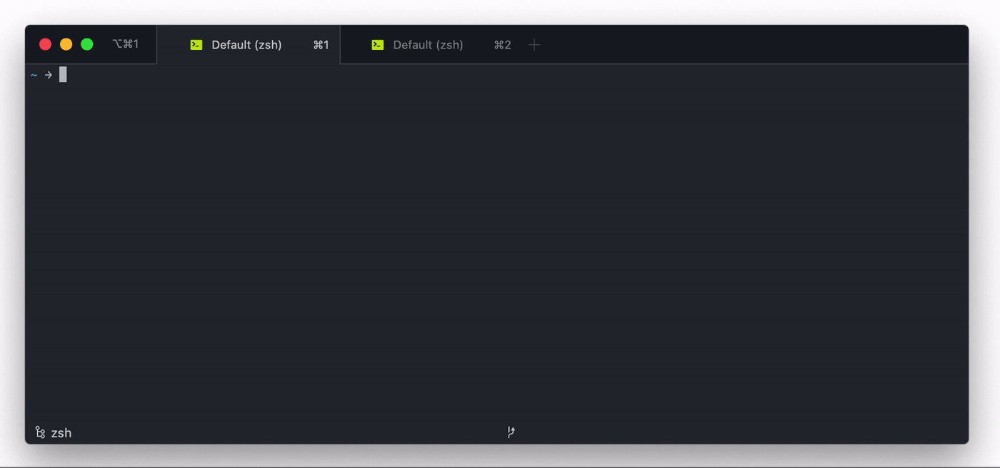

# Redocly CLI

[@Redocly](https://redocly.com) CLI is your all-in-one API documentation utility.
It builds, manages, improves, and quality-checks your API descriptions, all of which comes in handy for various phases of the API Lifecycle.
Create your own rulesets to make API governance easy, publish beautiful API reference documentation, and more.
Supports OpenAPI 3.2, 3.1, 3.0 and OpenAPI 2.0 (legacy Swagger), AsyncAPI 3.0 and 2.6, Arazzo 1.0.




## Migration

Migrating from Redocly CLI v1 to v2?
Here's the [guide](https://redocly.com/docs/cli/guides/migrate-to-v2) to make the transition smoother.

## Usage

### Node

```sh
npx @redocly/cli@latest lint path-to-root-file.yaml
```

Alternatively, install it globally with `npm`:

```sh
npm install @redocly/cli -g
```

Then you can use it as `redocly [command] [options]`, for example:

```sh
redocly lint path-to-root-file.yaml
```

The minimum required versions of Node.js and NPM are 22.12.0 and 10.9.2 respectively.

### Docker

To give the Docker container access to the OpenAPI description files, you need to mount the containing directory as a volume.
Assuming the API description is rooted in the current working directory, you need the following command:

```sh
docker run --rm -v $PWD:/spec redocly/cli lint path-to-root-file.yaml
```

To build and run with a local image, run the following from the project root:

```sh
docker build -t redocly/cli .
docker run --rm -v $PWD:/spec redocly/cli lint path-to-root-file.yaml
```

## Common tasks

### Generate API reference documentation

Redocly CLI is a great way to render API reference documentation.
It uses open source [Redoc](https://github.com/redocly/redoc) to build your documentation.
Use a command like this:

```sh
redocly build-docs openapi.yaml
```

Your API reference docs are in `redoc-static.html` by default.
You can customize this in many ways.
[Read the main docs](https://redocly.com/docs/cli/commands/build-docs) for more information.

> :bulb: Redocly also has [hosted API management solution](https://redocly.com/reunite/), a (commercial) alternative to Redoc.
> Redoc, Revel, Reef, and Realm can be worked on locally using the `preview` command.

### Bundle multiple OpenAPI documents

Having one massive OpenAPI description can be annoying, so most people split them up into multiple documents via `$ref`, only to later find out some tools don't support `$ref` or don't support multiple documents.
Redocly CLI to the rescue! It has a `bundle` command you can use to recombine all of those documents back into one single document.
The bundled output that Redocly CLI provides is clean, tidy, and looks like a human made it.

### Automate API guidelines with Linting

Check that your API matches the expected API guidelines by using the `lint` command.
API guidelines are an important piece of API governance. They help to keep APIs consistent by enforcing the same standards and naming conventions, and they can also guide API teams through potential security hazards and other pitfalls.
Automating API guidelines means you can keep APIs consistent and secure throughout their lifecycle.
Even better, you can shape the design of the API before it even exists by combining API linting with a design-first API workflow.

Our API linter is designed for speed on even large documents, and it's easy to run locally, in CI, or anywhere you need it.
It's also designed for humans, with meaningful error messages to help you get your API right every time.

Try it like this:

```sh
redocly lint openapi.yaml
```

**Configure the rules** as you wish.
Other API Linters use complicated identifiers like JSONPath, but Redocly makes life easy with simple expressions that understand the OpenAPI structure.
You can either use the [built-in rules](https://redocly.com/docs/cli/rules) to mix-and-match your ideal API guidelines, or break out the tools to build your own.

**Format the output** in whatever way you need.
The `stylish` output is as good as it sounds, but if you need JSON, Markdown, Checkstyle and other outputs to integrate with other tools, the `lint` command can output those too.

**Multiple files supported** so you don't need to bundle your API description to lint it; just point Redocly CLI at the "entry point" (e.g.: `openapi.yaml`) and it handles the rest.

[Learn more about API standards and configuring Redocly rules](https://redocly.com/docs/cli/api-standards).

Looking for more examples? Check out our [Cookbook](https://github.com/Redocly/redocly-cli-cookbook).

### API contract testing with Respect

Ensure your APIs match their OpenAPI descriptions with **Respect**, Redocly's API contract testing system. Respect sends real HTTP requests to your API server and validates that responses match the expectations defined in your OpenAPI description and Arazzo workflows.

- Verify API responses match your OpenAPI schema
- Test complex API sequences using OpenAPI Arazzo format
- Catch API drift early in development and CI/CD
- Ensure external APIs you depend on behave as expected
- Track response times and detect anomalies

#### Quick start

```sh
# Generate test workflows from your OpenAPI spec
redocly generate-arazzo openapi.yaml

# Run contract tests against your API
redocly respect auto-generated.arazzo.yaml --verbose
```

#### Respect vs. Respect Monitoring

Respect is Redocly's community-edition product. Looking for something more? We also offer continuous API monitoring with additional features including:

- Real-time insights
- Automated alerts via email or Slack
- Automated API checks
- Proactive API quality assurance

Learn more about [Respect](https://redocly.com/respect) and [get started with API contract testing](https://redocly.com/docs/respect/get-started).

### Transform an OpenAPI description

If your OpenAPI description isn't everything you hoped it would be, enhance it with the Redocly [decorators](https://redocly.com/docs/cli/decorators) feature.
This allows you to:

- Publish reference docs with a subset of endpoints for public use
- Improve the docs by adding examples and descriptions
- Adapt an existing OpenAPI description, and replace details like URLs for use on staging platforms

## Data collection

This tool [collects data](./docs/usage-data.md) to help Redocly improve our products and services.
You can opt out by setting the `REDOCLY_TELEMETRY` environment variable to `off`.

## Update notifications

Redocly CLI checks for updates on startup.
You can disable this by setting the `REDOCLY_SUPPRESS_UPDATE_NOTICE` environment variable to `true`.

## More resources

[Read the detailed docs](https://redocly.com/docs/cli/).

## Credits

Thanks to [graphql-js](https://github.com/graphql/graphql-js) and [eslint](https://github.com/eslint/eslint) for inspiration of the API description traversal approach and to [Swagger](https://github.com/swagger-api/swagger-editor), [Spectral](https://github.com/stoplightio/spectral), and [OAS-Kit](https://github.com/Mermade/oas-kit) for inspiring the recommended ruleset.

## Development

Contributions are welcome!
All the information you need is in [CONTRIBUTING.md](CONTRIBUTING.md).
