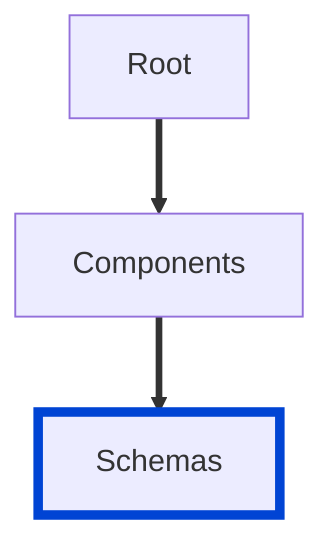

# no-required-schema-properties-undefined

Ensures there are no required schema properties that are undefined.

| OAS | Compatibility |
| --- | ------------- |
| 2.0 | ✅            |
| 3.0 | ✅            |
| 3.1 | ✅            |



## API design principles

If a required schema property is declared but not defined, this rule informs you which of the required schema properties are missing.

## Configuration

| Option   | Type   | Description                                                                              |
| -------- | ------ | ---------------------------------------------------------------------------------------- |
| severity | string | Possible values: `off`, `warn`, `error`. Default `off` (in `recommended` configuration). |

An example configuration:

```yaml
rules:
  no-required-schema-properties-undefined: error
```

## Examples

Given this configuration:

```yaml
rules:
  no-required-schema-properties-undefined: error
```

Example of **incorrect** schema properties:

```yaml
schemas:
  Pet:
    type: object
    required:
      - id
      - name
    properties:
      id:
        type: integer
        format: int64
```

Expected error message when linting incorrect schema example:

```bash
Required property 'name' is undefined.
```

Example of **correct** schema properties:

```yaml
schemas:
  Pet:
    type: object
    required:
      - id
      - name
    properties:
      id:
        type: integer
        format: int64
      name:
        type: string
        example: doggie
```

The rule is case-sensitive, which means a property `name` does not match the string `Name` in the `required` list:

```yaml
schemas:
  Pet:
    type: object
    properties:
      name:
        type: string
    required:
      - Name
```

## Related rules

- [no-invalid-schema-examples](./no-invalid-schema-examples.md)

## Resources

- [Rule source](https://github.com/Redocly/redocly-cli/blob/main/packages/core/src/rules/common/no-required-schema-properties-undefined.ts)
- [Schema docs](https://redocly.com/docs/openapi-visual-reference/schemas/)
