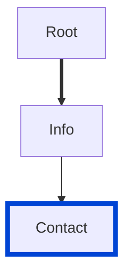

# info-contact

Requires the `Contact` info object defined in your API.

| Overlay | Compatibility |
| ------- | ------------- |
| 1.0     | ✅            |



## API design principles

When it comes to APIs, we generally want more consumers.
If they need help to purchase, integrate, or troubleshoot, your contact info should be front and center.

## Configuration

| Option   | Type   | Description                                             |
| -------- | ------ | ------------------------------------------------------- |
| severity | string | Possible values: `off`, `warn`, `error`. Default `off`. |

An example configuration:

```yaml
rules:
  info-contact: warn
```

## Examples

Given this configuration:

```yaml
rules:
  info-contact: error
```

Example of **incorrect** contact:

```yaml Incorrect example
info:
  version: 1.0.0
  title: Incorrect example missing contact
```

Example of **correct** contact:

```yaml Correct example
info:
  contact:
    name: Redocly API Support
    url: https://www.redocly.com/support
    email: team@redocly.com
```

## Related rules

- [spec](./struct.md)
- [configurable rules](../configurable-rules.md)

## Resources

- [Rule source](https://github.com/Redocly/redocly-cli/blob/main/packages/core/src/rules/common/info-contact.ts)
- [Contact object docs](https://redocly.com/docs/openapi-visual-reference/contact/)
