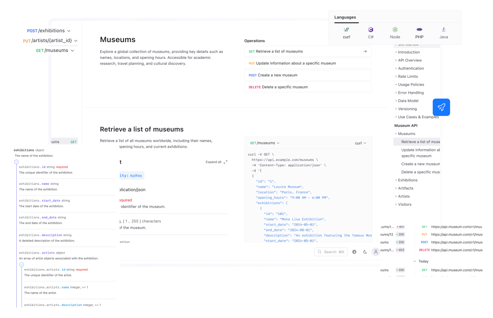

---
seo:
  title: API docs
---

# API documentation

Good quality API documentation is the most important factor for a good developer experience. Redocly offers two options for web-based API reference documentation, so you can choose what fits your needs.

## API reference

Use the Redocly platform to produce beautiful API documentation, and automatically update it every time your OpenAPI description changes.
Change the theme to fit your brand, and make your API consumers very happy with clear documentation, code examples, and the all-important ability to try API calls from within the documentation itself.

This option is ideal for teams that want **hassle-free hosting**, lots of **theme customization options**, and good CI/CD integration features straight out of the box.
There's a **free trial** on all our plans, so you can take it for a spin before you commit.

Discover [Reunite's features](https://redocly.com/reunite).

Feel free to check out [Reunite documentation](https://redocly.com/docs/realm/get-started/start-reunite-editor).

## Redoc

Redoc is open source, and yours to use however you wish. It has fewer features and theming options, but still integrates well with Redocly CLI, allowing you to preview and also build your docs to publish to a platform of your choice.

Use this option if you plan to host your API reference documentation yourself, or are looking for an open source solution.

Get started with Redoc:

- Visit the [Redoc section of the docs](https://redocly.com/docs/redoc/quickstart/) to learn more about redoc
- Check out the project and community [on GitHub](https://github.com/redocly/redoc).
- Use Redocly CLI for [local preview of API documentation](./commands/preview.md) while you're making changes to the API description or docs configuration, and to [build your API docs](./commands/build-docs.md).
- Add the [Redocly VS Code extension](https://redocly.com/docs/vscode) to your IDE for better OpenAPI editing support and autocomplete on Redocly configuration settings.
