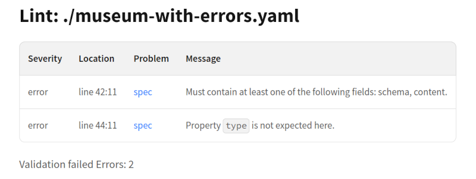

# `lint`

## Introduction

Redocly CLI can identify and report on problems found in OpenAPI, AsyncAPI, or Arazzo descriptions.
This helps you avoid bugs and make API or Arazzo descriptions more consistent.

The `lint` command reports on problems and executes preprocessors and rules.
Unlike the `bundle` command, `lint` doesn't execute decorators.


To learn more about choosing and configuring linting rules to meet your needs, visit the [API standards](../api-standards.md) page.


## Usage

```bash
redocly lint
redocly lint <apis>...
redocly lint [--max-problems=<n>] [--config=<path>] [--format=<value>]
redocly lint [--generate-ignore-file] [--help]
redocly lint --version
```

## Options

| Option                 | Type     | Description                                                                                                                                                                                         |
| ---------------------- | -------- | --------------------------------------------------------------------------------------------------------------------------------------------------------------------------------------------------- |
| apis                   | [string] | Array of API or Arazzo description filenames that need to be linted. See [the API section](#specify-api) for more options.                                                                          |
| --config               | string   | Specify path to the [configuration file](#use-custom-configuration-file).                                                                                                                           |
| --extends              | [string] | [Extend a specific configuration](#extend-configuration) (defaults or config file settings). Build-in rulesets are: `minimal`, `recommended`, `recommended-strict`. Default value is `recommended`. |
| --format               | string   | Format for the output.<br />**Possible values:** `codeframe`, `stylish`, `json`, `checkstyle`, `codeclimate`, `github-actions`, `markdown`, `summary`. Default value is `codeframe`.                |
| --generate-ignore-file | boolean  | [Generate ignore file](#generate-ignore-file).                                                                                                                                                      |
| --help                 | boolean  | Show help.                                                                                                                                                                                          |
| --lint-config          | string   | Specify the severity level for the configuration file. <br/> **Possible values:** `warn`, `error`, `off`. Default value is `warn`.                                                                  |
| --max-problems         | integer  | Truncate output to display the specified [maximum number of problems](#limit-the-displayed-problems-count). Default value is 100.                                                                   |
| --skip-preprocessor    | [string] | Ignore certain preprocessors. See the [Skip preprocessor or rule section](#skip-preprocessor-or-rule) below.                                                                                        |
| --skip-rule            | [string] | Ignore certain rules. See the [Skip preprocessor or rule section](#skip-preprocessor-or-rule) below.                                                                                                |
| --version              | boolean  | Show version number.                                                                                                                                                                                |

## Examples

### Specify API

The `lint` command behaves differently depending on how you pass the API(s) to it, and whether the [configuration file](#use-custom-configuration-file) exists.

#### Pass API directly

```bash
redocly lint openapi/openapi.yaml
```

In this case, `lint` validates the API or Arazzo description(s) passed to the command.
If you have no configuration file defined, the [recommended ruleset](../rules/recommended.md) is used.
If you have `extends` or `rules` defined in `redocly.yaml`, those are used when linting.

The `apis` argument can also use any glob format supported by your file system.
For example:

```bash
redocly lint ./root-documents/*.yaml
```

#### Pass API alias

Instead of full paths, you can use names listed in the `apis` section of your Redocly configuration file.
The example `redocly.yaml` configuration file below shows an API alias `core@v1` defined:

```yaml
apis:
  core@v1:
    root: ./openapi/api-description.json
```

Use the alias with the lint command as shown:

```bash
redocly lint core@v1
```

In this case, after resolving the path behind the `core@v1` name, `lint` validates the `api-description.json` file.
For this approach, the Redocly configuration file is mandatory.

#### Lint all configured APIs

You can omit the `apis` argument completely when executing the `lint` command to check all APIs defined in the configuration file.
Run `redocly lint` with no arguments to lint all defined APIs.
An example `redocly.yaml` file is shown below:

```yaml
apis:
  core@v1:
    root: ./openapi/api-description.json
  production:
    root: ./openapi/production.yaml
  sandbox:
    root: ./openapi/sandbox.yaml
```


If you try to execute the `lint` command without apis when your project doesn't have any configuration files, the `lint` command displays an error.


### Use custom configuration file

By default, the CLI tool looks for the [Redocly configuration file](../configuration/index.md) in the current working directory.
Use the optional `--config` argument to provide an alternative path to a configuration file.

```bash
redocly lint --config=./another/directory/config.yaml
```

### Extend configuration

The `--extends` option allows you to extend the existing configuration.
This option accepts one of the following values: `minimal`, `recommended`, or `recommended-strict`.
Each of the values is a base set of rules that the `lint` command uses.
You can further modify this set in cases when you want to have your own set of rules based on the existing one, including particular rules that cover your specific needs.
For more details, see [rulesets](../rules.md).

```bash
redocly lint --extends=recommended-strict
```


When you run the `lint` command without a configuration file, it uses the `extends: [recommended]` by default.
However, if you have a configuration file, but it doesn't include any rules or extends configuration, the `lint` command displays an error.


### Specify output format

The standard `codeframe` output format works well in most situations, but `redocly` can also produce output to integrate with other tools.


Some formats, such as `checkstyle` or `json`, don't work well when multiple APIs are linted in a single command.
Try linting each API separately when you pass the command output to another tool.


#### Codeframe (default)

```bash
redocly lint --format=codeframe
```

This command lints the file and uses the default output format of `codeframe`.
It has the same behavior as omitting the `--format` parameter.
Here's an output example:

<pre>
[1] museum-with-errors.yaml:19:7 at #/paths/~1museum-hours/get/operationIds

Property `operationIds` is not expected here.

Did you mean: operationId ?

17 | summary: Get museum hours
18 | description: Get upcoming museum operating hours
19 | operationIds: getMuseumHours
20 | tags:
21 |   -  Operations

Error was generated by the struct rule.
</pre>

Note that the problems are displayed in the following format: `file:line:column`.
For example, `museum-with-errors.yaml:19:7`.

Depending on the terminal emulator you use, it may be possible to directly click this indicator to edit the file in place.

#### Stylish

```bash
redocly lint --format=stylish
```

This command uses the `stylish` format to get a more condensed output that is useful for summarizing the linting results, as seen in the example below:

<pre>
museum-with-errors.yaml:
  19:7   error    struct                   Property `operationIds` is not expected here.
  29:11  error    struct                   Property `require` is not expected here.
  16:5   warning  operation-operationId  Operation object should contain `operationId` field.
</pre>

In this format, `lint` shows the file name, line number, and column where the problem occurred.
However, the output is compressed and omits other contexts and suggestions.

#### JSON

```bash
redocly lint --format=json
```

It can be useful to get the output in JSON format to be processed by other tools.
Using this command gets the following example output:

<pre>
{
  "totals": {
    "errors": 2,
    "warnings": 1,
    "ignored": 0
  },
  "version": "1.7.0",
  "problems": [
    {
      "ruleId": "struct",
      "severity": "error",
      "message": "Property `operationIds` is not expected here.",
      "suggest": [
        "operationId"
      ],
      "location": [
        {
          "source": {
            "ref": "museum-with-errors.yaml"
          },
          "pointer": "#/paths/~1museum-hours/get/operationIds",
          "reportOnKey": true
        }
      ]
    },
    {
      "ruleId": "struct",
      "severity": "error",
      "message": "Property `require` is not expected here.",
      "suggest": [],
      "location": [
        {
          "source": {
            "ref": "museum-with-errors.yaml"
          },
          "pointer": "#/paths/~1museum-hours/get/responses/200/require",
          "reportOnKey": true
        }
      ]
    },
    {
      "ruleId": "operation-operationId",
      "severity": "warn",
      "message": "Operation object should contain `operationId` field.",
      "location": [
        {
          "source": {
            "ref": "museum-with-errors.yaml"
          },
          "pointer": "#/paths/~1museum-hours/get/operationId",
          "reportOnKey": true
        }
      ],
      "suggest": []
    }
  ]
}
</pre>

#### Checkstyle

```bash
redocly lint --format=checkstyle
```

The `lint` command also supports the [Checkstyle](https://checkstyle.org/) XML report format.
Run this command to use the following standard format output with your other tools:

```xml
<?xml version="1.0" encoding="UTF-8"?>
<checkstyle version="4.3">
<file name="museum-with-errors.yaml">
<error line="19" column="7" severity="error" message="Property `operationIds` is not expected here." source="struct" />
<error line="29" column="11" severity="error" message="Property `require` is not expected here." source="struct" />
<error line="16" column="5" severity="warning" message="Operation object should contain `operationId` field." source="operation-operationId" />
</file>
</checkstyle>
```

Due to the limitations of this format, only file name, line, column, severity, and rule ID (in the `source` attribute) are included.
All other information is omitted.

#### GitHub Actions

```bash
redocly lint --format=github-actions
```

The `lint` command also comes with support for a [GitHub Actions](https://docs.github.com/en/actions) specific formatting.
Specify this output format to have any encountered problem annotated on the affected files.

<pre>
::error title=struct,file=museum-with-errors.yaml,line=19,endLine=19,col=7,endColumn=7::Property `operationIds` is not expected here.
::error title=struct,file=museum-with-errors.yaml,line=29,endLine=29,col=11,endColumn=11::Property `require` is not expected here.
::warning title=operation-operationId,file=museum-with-errors.yaml,line=16,endLine=16,col=5,endColumn=5::Operation object should contain `operationId` field.
</pre>

#### Markdown

Use `markdown` format output with the `lint` command to get a Markdown-ready output format.
This output format is useful if you want to report the outcomes to a document, or use the information in a GitHub Job Summary.

Running the `lint` command with `--format=markdown` produces output like the following example:

<pre>
## Lint: ./museum-with-errors.yaml

| Severity | Location | Problem | Message |
|---|---|---|---|
| error | line 42:11 | [struct](https://redocly.com/docs/cli/rules/oas/struct) | Must contain at least one of the following fields: schema, content. |
| error | line 44:11 | [struct](https://redocly.com/docs/cli/rules/oas/struct) | Property `type` is not expected here. |

Validation failed
Errors: 2
</pre>

The output includes a formatted table, and links to any built-in rules that identified problems.
An example is shown in the following screenshot.



### Limit the displayed problems count

With the `--max-problems` option, you can limit the number of problems displayed in the command output.
Here's an example command:

```bash
redocly lint --max-problems=20
```

If the number of detected problems exceeds the specified threshold, the remaining problems are hidden under the "spoiler message" that lets you know how many problems were hidden.

<pre>
< ... 2 more problems hidden > increase with `--max-problems N`
</pre>

Note that the default value is `100`.

### Generate ignore file

With this option, you can generate the `.redocly.lint-ignore.yaml` file to suppress error and warning severity problems in the output.
You still receive visual feedback to let you know how many problems were ignored.

This option is useful when you have an API design standard, but have some exceptions to the rule (for example, a legacy API operation).
It allows for highly granular control.


This command overwrites an existing ignore file.


The following command runs `lint` and adds all the errors to an ignore file:

```bash
redocly lint museum-with-errors.yaml --generate-ignore-file
```

Here's the example output:

<pre>
Generated ignore file with 3 problems.
</pre>

The errors in the ignore file `.redocly.lint-ignore.yaml` are ignored when the `lint` command is run.

To generate an ignore file for multiple API descriptions, pass them as arguments:

```bash
redocly lint v1.yaml v2.yaml --generate-ignore-file
```

Example of an ignore file:

```yaml .redocly.lint-ignore.yaml file
# This file instructs Redocly's linter to ignore the rules contained for specific parts of your API.
# See https://redoc.ly/docs/cli/ for more information.
museum-with-errors.yaml:
  struct:
    - '#/paths/~1museum-hours/get/operationIds'
    - '#/paths/~1museum-hours/get/responses/200/require'
  operation-operationId:
    - '#/paths/~1museum-hours/get/operationId'
```

The rule in the example is named `struct`, which indicates compliance with the OpenAPI specification structure.
You can also manually add problems to be ignored by specific rules.

### Skip preprocessor or rule

You may want to skip specific preprocessors or rules upon running the command.
Examples for each option are as follows:




```bash
redocly lint --skip-preprocessor=discriminator-mapping-to-one-of --skip-preprocessor=another-example
```




```bash
redocly lint --skip-rule=no-sibling-refs --skip-rule=no-parent-tags
```




To learn more about preprocessors, rules, and decorators, refer to the [custom plugins](../custom-plugins/index.md) page.

### Lint config file

The `lint` command also validates the configuration file.
You can set severity level by using the `--lint-config` option.
This option accepts one of the following values: `warn`,`error`, or `off`.
Default value is `warn`.

```bash
redocly lint --lint-config=off
```

### Lint Arazzo description file

The `lint` command also validates [The Arazzo](https://spec.openapis.org/arazzo/latest.html) description files.
You can pass the Arazzo description file to the `lint` command as shown below:

`redocly lint arazzo.yaml`
