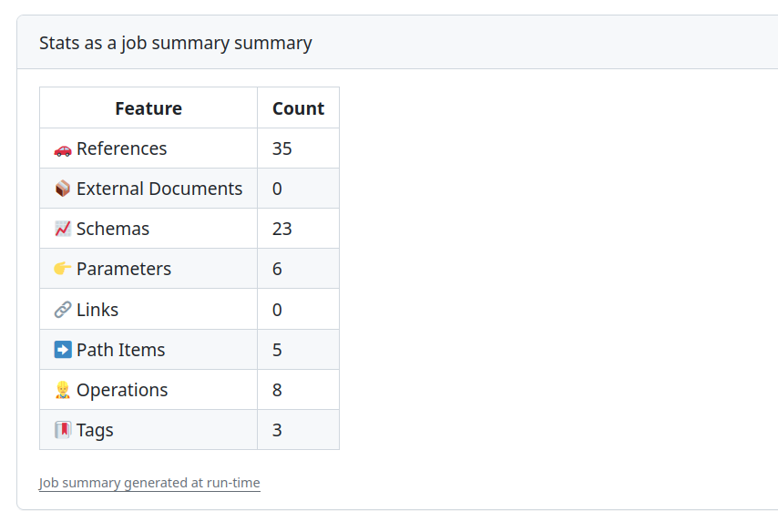

# `stats`

## Introduction

The `stats` command provides statistics about the structure of one or more API description files.


It supports OpenAPI 3.x, AsyncAPI 2.x, and AsyncAPI 3.x descriptions.


The metrics reported depend on the type of API description:

**OpenAPI 3.x**

- References
- External Documents
- Schemas
- Parameters
- Links
- Path Items
- Webhooks
- Operations
- Tags

**AsyncAPI 2.x and AsyncAPI 3.x**

- References
- External Documents
- Schemas
- Parameters
- Channels
- Operations
- Tags

If you're interested in the technical details, the statistics are calculated using the counting logic from the `StatsVisitor` module.

## Usage

```bash
redocly stats <api>
redocly stats <api> [--format=<option>] [--config=<path>]
redocly stats --version
```

## Options

| Option        | Type    | Description                                                                                                                                                          |
| ------------- | ------- | -------------------------------------------------------------------------------------------------------------------------------------------------------------------- |
| api           | string  | **REQUIRED.** Path to the API description filename or alias that you want to generate the statistics for. Refer to [the API section](#specify-api) for more details. |
| --config      | string  | Specify path to the [configuration file](#use-alternative-configuration-file).                                                                                       |
| --format      | string  | Format for the output.<br />**Possible values:** `stylish`, `json`, `markdown`. Default value is `stylish`.                                                          |
| --help        | boolean | Show help.                                                                                                                                                           |
| --lint-config | string  | Specify the severity level for the configuration file. <br/> **Possible values:** `warn`, `error`, `off`. Default value is `warn`.                                   |
| --version     | boolean | Show version number.                                                                                                                                                 |

## Examples

### Specify API

The `stats` command behaves differently depending on how you pass the API to it, and whether the [configuration file](#use-alternative-configuration-file) exists.

#### Pass an API directly

You can use the `stats` command with an OpenAPI or AsyncAPI description directly, with a command like the following:

```bash
redocly stats openapi/openapi.yaml
```

```bash
redocly stats asyncapi/asyncapi.yaml
```

In this case, `stats` shows statistics for the API description that was passed in.

#### Pass an API alias

Instead of a full path, you can use an API name from the `apis` section of your Redocly configuration file.
For example, with a `redocly.yaml` configuration file containing the following entry for `core@v1`:

```yaml
apis:
  core@v1:
    root: ./openapi/api-description.json
```

You can obtain the statistics by giving the API alias name, as shown below:

```bash
redocly stats core@v1
```

In this case, after resolving the path behind the `core@v1` name, `stats` displays statistics for the `openapi/api-description.json` file.
For this approach, the Redocly configuration file is mandatory.

### Use alternative configuration file

By default, the CLI tool looks for the [Redocly configuration file](../configuration/index.md) in the current working directory.
Use the optional `--config` argument to provide an alternative path to a configuration file.

```bash
redocly stats --config=./another/directory/config.yaml
```

### Specify output format

#### Specify the stylish (default) output format

The default output format for `stats` is called "stylish".
It outputs a nice format for your terminal, as shown in the following examples:

**OpenAPI example:**

<pre>
Document: museum.yaml stats:

🚗 References: 35
📦 External Documents: 0
📈 Schemas: 23
👉 Parameters: 6
🔗 Links: 0
🔀 Path Items: 5
🎣 Webhooks: 0
👷 Operations: 8
🔖 Tags: 3

museum.yaml: stats processed in 4ms
</pre>

**AsyncAPI example:**

<pre>
Document: asyncapi.yaml stats:

🚗 References: 2
📦 External Documents: 1
📈 Schemas: 1
👉 Parameters: 0
📡 Channels: 1
👷 Operations: 1
🔖 Tags: 2

asyncapi.yaml: stats processed in 4ms
</pre>

In this format, `stats` shows the statistics in a condensed but readable manner with an icon at the beginning of each line.

#### Specify the JSON output format

Use `--format=json` to get a machine-readable output format.
The following is an example JSON output for an OpenAPI description:

<pre>
{
  "refs": {
    "metric": "🚗 References",
    "total": 35
  },
  "externalDocs": {
    "metric": "📦 External Documents",
    "total": 0
  },
  "schemas": {
    "metric": "📈 Schemas",
    "total": 23
  },
  "parameters": {
    "metric": "👉 Parameters",
    "total": 6
  },
  "links": {
    "metric": "🔗 Links",
    "total": 0
  },
  "pathItems": {
    "metric": "🔀 Path Items",
    "total": 5
  },
  "webhooks": {
    "metric": "🎣 Webhooks",
    "total": 0
  },
  "operations": {
    "metric": "👷 Operations",
    "total": 8
  },
  "tags": {
    "metric": "🔖 Tags",
    "total": 3
  }
}
</pre>

For AsyncAPI descriptions, the output uses `channels` instead of `links`, `pathItems`, and `webhooks`.

The JSON format output is suitable when you want to use the stats data in another program.

#### Specify the Markdown output format

Use `--format=markdown` to return output that you can use in Markdown files or other Markdown-friendly applications.
A table format is used.

The following is an example source output for an OpenAPI description:

<pre>
| Feature  | Count  |
| --- | --- |
| 🚗 References | 35 |
| 📦 External Documents | 0 |
| 📈 Schemas | 23 |
| 👉 Parameters | 6 |
| 🔗 Links | 0 |
| 🔀 Path Items | 5 |
| 🎣 Webhooks | 0 |
| 👷 Operations | 8 |
| 🔖 Tags | 3 |

</pre>

Here's the rendered example source output:

| Feature               | Count |
| --------------------- | ----- |
| 🚗 References         | 35    |
| 📦 External Documents | 0     |
| 📈 Schemas            | 23    |
| 👉 Parameters         | 6     |
| 🔗 Links              | 0     |
| 🔀 Path Items         | 5     |
| 🎣 Webhooks           | 0     |
| 👷 Operations         | 8     |
| 🔖 Tags               | 3     |

For AsyncAPI descriptions, the table includes a `📡 Channels` row instead of the `🔗 Links`, `🔀 Path Items`, and `🎣 Webhooks` rows.

The Markdown format is suitable when a printable summary is needed, such as for regularly updated reports or human-readable output from your CI system.

The following example shows how to use the `stats` command in a GitHub action to make a [GitHub summary](https://github.blog/2022-05-09-supercharging-github-actions-with-job-summaries/):

```yaml
name: Get API stats
on: push

jobs:
  get_stats:
    name: Stats as a job summary
    runs-on: ubuntu-latest
    steps:
      - name: Check out repo's default branch
        uses: actions/checkout@v4
      - name: Set up node
        uses: actions/setup-node@v4
      - name: Install Redocly CLI
        run: npm install -g @redocly/cli@latest
      - name: Get stats
        run: redocly stats --format=markdown museum.yaml >> $GITHUB_STEP_SUMMARY 2>&1
```

This GitHub action uses the output of the `stats` command in Markdown format as the input value for `$GITHUB_STEP_SUMMARY`.
When the job is complete, your API stats are added to the summary page, as shown in the following screenshot:


