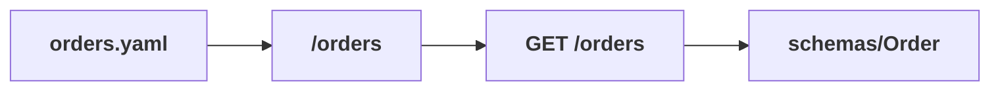
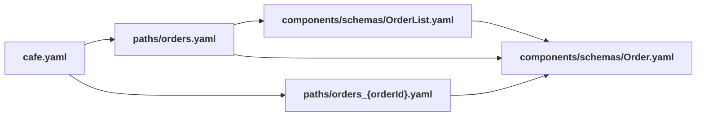

# `tree`

## Introduction

The `tree` command prints the structure of an API description: its paths, operations, and the component dependency chains between them through `$ref`.
The default view bundles the description first, so a multi-file API shows the same full tree as its single-file form.
The command works fully with OpenAPI 2.0 and 3.x.
AsyncAPI and Arazzo descriptions are supported too, but render as a flat list of their top-level referenced (`$ref`) components rather than a paths and operations tree.

Use `tree` to:

- Get quick orientation in any API, whether single-file or multi-file.
- Run impact analysis with `--uses` — which paths and operations use a given component or file.
  This analysis is useful in CI and automated code review.
- Produce machine-readable JSON, a Mermaid diagram, or a Graphviz DOT graph with `--format`.
- View the file-level `$ref` graph with `--files`.

## Usage

```bash
redocly tree
redocly tree <api>
redocly tree <api> [--format=<value>] [--uses=<value>] [--output=<file>] [--config=<path>]
redocly tree --files [apis...]
```

With no API argument, the command takes the API from the Redocly configuration file.
The default structure view displays one API at a time.
Use `--files` for the multi-API file graph.

## Options

| Option       | Type     | Description                                                                                                                                                                                                                                                                      |
| ------------ | -------- | -------------------------------------------------------------------------------------------------------------------------------------------------------------------------------------------------------------------------------------------------------------------------------- | --- |
| apis         | [string] | In default mode, exactly one API description file or alias. In `--files` mode, one or more files or aliases. Defaults to APIs from the Redocly configuration file.                                                                                                               |
| --config     | string   | Specify the path to the [Redocly configuration file](../configuration/index.md).                                                                                                                                                                                                 |
| --files      | boolean  | Display the file-level `$ref` graph instead of the document structure.                                                                                                                                                                                                           |
| --format     | string   | Output format: `stylish` (default, tree view), `json`, `mermaid`, or `dot`.                                                                                                                                                                                                      |
| --help       | boolean  | Display help.                                                                                                                                                                                                                                                                    |     |
| --output, -o | string   | Write the output to a file instead of `stdout`.                                                                                                                                                                                                                                  |
| --uses       | [string] | Display only the part of the tree that uses (depends on) the given components, paths, or files. The default view accepts a JSON pointer, shorthand pointer, bare component name, or file path. `--files` mode accepts file paths only. Repeat the option to pass several values. |
| --version    | boolean  | Display version number.                                                                                                                                                                                                                                                          |

## Examples

### Print the structure of an API description

```bash
redocly tree cafe.yaml
```

```treeview
cafe.yaml
├── /menu
│   ├── GET
│   │   ├── parameters/After
│   │   ├── parameters/Before
│   │   ├── parameters/Filter
│   │   ├── parameters/Limit
│   │   ├── parameters/Search
│   │   ├── parameters/Sort
│   │   ├── responses/BadRequest
│   │   │   └── schemas/Error
│   │   ├── responses/InternalServerError
│   │   │   └── schemas/Error
│   │   └── schemas/MenuItemList
│   │       ├── schemas/MenuItem
│   │       │   ├── schemas/Beverage
│   │       │   │   └── schemas/MenuBaseItem
│   │       │   └── schemas/Dessert
│   │       │       └── schemas/MenuBaseItem
│   │       └── schemas/Page
│   └── POST
│       ├── responses/BadRequest
│       │   └── schemas/Error
│       ├── responses/Conflict
│       │   └── schemas/Error
│       ├── responses/Forbidden
│       │   └── schemas/Error
│       ├── responses/InternalServerError
│       │   └── schemas/Error
│       ├── responses/Unauthorized
│       │   └── schemas/Error
│       └── schemas/MenuItem
│           ├── schemas/Beverage
│           │   └── schemas/MenuBaseItem
│           └── schemas/Dessert
│               └── schemas/MenuBaseItem
├── /menu-item-images/{menuItemId}
│   ├── GET
│   │   ├── parameters/PhotoSize
│   │   ├── responses/InternalServerError
│   │   │   └── schemas/Error
│   │   └── responses/NotFound
│   │       └── schemas/Error
│   └── parameters/MenuItemId
└── … (other paths)
```

The tree above is truncated for readability (`… (other paths)`); the full output lists every path.
An operation is shown as the method only (`GET`) under its path, since the path is its parent.

Markers legend:

- `🔁` — a cycle: the node references one of its ancestors (a recursive schema). It is marked and not expanded further, so traversal terminates. A node that simply appears in more than one place (fan-in, without forming a cycle) is shown without a marker and expanded under each parent.
- `❌` — an unresolvable `$ref` (only in `--files` mode; in the default view an unresolvable `$ref` is an error, see below)
- `🔗` — a reference to a URL

A recursive schema produces the `🔁` marker:




```yaml
# menu.yaml
openapi: 3.2.0
info:
  title: Cafe menu
  version: 1.0.0
paths:
  /menu:
    get:
      responses:
        '200':
          description: A menu section with nested subsections.
          content:
            application/json:
              schema:
                $ref: '#/components/schemas/MenuSection'
components:
  schemas:
    MenuSection:
      type: object
      properties:
        name:
          type: string
        subsections:
          type: array
          items:
            $ref: '#/components/schemas/MenuSection'
```




```treeview
menu.yaml
└── /menu
    └── GET
        └── schemas/MenuSection
            └── schemas/MenuSection 🔁
```

`MenuSection` references itself, so the cycle is marked `🔁` and not expanded again.




`❌` and `🔗` appear only with `--files`. In the default view an unresolvable `$ref` is a bundling error instead (see _Invalid descriptions_ below), so this example must be run with `--files`:




```yaml
# openapi.yaml — has a missing-file ref and an unreachable URL ref
openapi: 3.2.0
info:
  title: Cafe
  version: 1.0.0
paths:
  /orders:
    get:
      responses:
        '200':
          description: An order.
          content:
            application/json:
              schema:
                $ref: './schemas/Order.yaml'
        '500':
          description: Shared remote error.
          content:
            application/json:
              schema:
                $ref: 'https://example.com/schemas/Error.yaml'
```




```bash
redocly tree openapi.yaml --files
```

```treeview
openapi.yaml
├── https://example.com/schemas/Error.yaml 🔗 ❌
└── schemas/Order.yaml ❌
```

`schemas/Order.yaml` does not exist, so it is `❌`. The URL is `🔗`; here it is also unreachable, so it is `❌` too.




The default view bundles the description, so components and operations split across files are resolved to their canonical place.
A multi-file API therefore produces the same tree as its single-file equivalent — operations and named components, not file nodes.

### Find what uses a component, path, or file

Pass one or more components, paths, or files to `--uses` to see only the part of the tree that depends on them:

```bash
redocly tree cafe.yaml --uses schemas/Order
```

```treeview
cafe.yaml
├── /orders
│   ├── GET
│   │   └── schemas/OrderList
│   │       └── schemas/Order
│   └── POST
│       └── schemas/Order
└── /orders/{orderId}
    ├── GET
    │   └── schemas/Order
    └── PATCH
        └── schemas/Order

4 of 12 operations affected · affected paths: /orders, /orders/{orderId}
```

`--uses` accepts several input forms:

- full JSON pointer: `#/components/schemas/Order`
- shorthand pointer (the node id): `schemas/Order`
- bare component name: `Order` — ambiguous bare names match all candidates and print a note to `stderr`
- a file path (in `--files` mode): `components/schemas/Order.yaml`
- the root file itself: the whole tree is affected

Examples of the different input forms:

```bash
# full JSON pointer
redocly tree cafe.yaml --uses '#/components/schemas/Order'

# shorthand pointer (the node id)
redocly tree cafe.yaml --uses schemas/Order

# bare component name — matches any component with that name
redocly tree cafe.yaml --uses Order

# several values at once — repeat the flag
redocly tree cafe.yaml --uses schemas/Order --uses schemas/MenuItem

# file-level: which files depend on a given file
redocly tree cafe.yaml --files --uses components/schemas/Order.yaml
```

The summary line reports how many operations are affected.
A change that only affects path-level parameters can report `0 of N operations affected` while still listing the affected path: the path itself is impacted, not its operations.
For AsyncAPI or Arazzo descriptions, which have no operation nodes, the summary counts nodes instead — for example, `5 of 8 nodes affected`.

An unknown `--uses` value (a typo, or a component that no longer exists) prints a warning and still exits with code `0`, so a stale query never fails a CI run.
A file path that matches nothing also points you to `--files`.

### Machine-readable output

`--format` produces output for other tools: `json`, `mermaid`, or `dot`.




```yaml
# orders.yaml
openapi: 3.2.0
info:
  title: Cafe orders
  version: 1.0.0
paths:
  /orders:
    get:
      responses:
        '200':
          description: An order.
          content:
            application/json:
              schema:
                $ref: '#/components/schemas/Order'
components:
  schemas:
    Order:
      type: object
      properties:
        id:
          type: string
        total:
          type: number
```




The graph in the common `nodes`/`links` shape (compatible with D3, force-graph, and similar tools).
Every node carries `resolved` and `external`; `kind` and `file` are present in the default view.
Each link carries the exact `$ref` strings.

```json
{
  "nodes": [
    { "id": "/orders", "resolved": true, "kind": "path", "file": "orders.yaml" },
    { "id": "GET /orders", "resolved": true, "kind": "operation", "file": "orders.yaml" },
    { "id": "orders.yaml", "resolved": true, "kind": "root", "file": "orders.yaml", "root": true },
    { "id": "schemas/Order", "resolved": true, "kind": "component", "file": "orders.yaml" }
  ],
  "links": [
    { "source": "/orders", "target": "GET /orders", "refs": [] },
    { "source": "GET /orders", "target": "schemas/Order", "refs": ["#/components/schemas/Order"] },
    { "source": "orders.yaml", "target": "/orders", "refs": [] }
  ]
}
```




A [Mermaid](https://mermaid.js.org/) `flowchart` definition. It renders as:






A [DOT](https://graphviz.org/doc/info/lang.html) `digraph`, consumable by Graphviz and most graph-drawing tools.

```text
digraph tree {
  "/orders";
  "GET /orders";
  "orders.yaml" [shape=box, style=bold];
  "schemas/Order";
  "/orders" -> "GET /orders";
  "GET /orders" -> "schemas/Order";
  "orders.yaml" -> "/orders";
}
```




### Write the output to a file

Use `--output` (`-o`) to write any format to a file instead of `stdout`:

```bash
redocly tree cafe.yaml --format=mermaid --output cafe.md
```

### Invalid descriptions

The default view bundles the description before walking it.
If the description cannot be bundled — for example, it has unresolvable or invalid `$ref`s — `tree` prints the bundling problems and exits with a non-zero code instead of printing a partial tree.

### File-level graph

`--files` shows how a description is split across files, so the examples below use a multi-file version of the API.
A single bundled file has no file-level `$ref`s, so its `--files` graph is just the root.

```bash
redocly tree cafe.yaml --files
```

```treeview
cafe.yaml
├── paths/menu.yaml
│   ├── components/parameters/Limit.yaml
│   ├── components/responses/BadRequest.yaml
│   │   └── components/schemas/Error.yaml
│   └── components/schemas/MenuItemList.yaml
│       └── components/schemas/MenuItem.yaml
└── paths/orders.yaml
    └── components/schemas/OrderList.yaml
        └── components/schemas/Order.yaml
```

The tree above is abbreviated; the real output lists every file.
`--files` displays only which files reference other files — not the paths, operations, and components inside them.
Paths are shown relative to the directory of the root description, so the folder you run the command from does not appear as a prefix.
The default view already traverses those elements, following `$ref`s across files.
`--files` also accepts multiple APIs in one run, merging their graphs.
In this mode, `--uses` takes file paths.
They are matched relative to the API root — the same way they appear in the output — and paths relative to your current working directory also work.
The summary counts affected files and roots.

### Combine `--files`, `--uses`, and `--format`

The flags compose. For example, render just the files that depend on `Order.yaml` as a Mermaid graph:

```bash
redocly tree cafe.yaml --files --uses components/schemas/Order.yaml --format=mermaid
```


