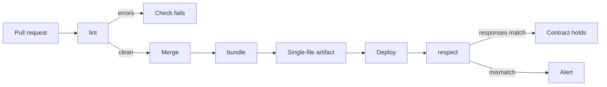

---
seo:
  title: Set up a full CI/CD pipeline with Redocly CLI
  description: Lint, bundle, and test API descriptions automatically on every change, with recipes for GitHub Actions, GitLab CI, and any other CI system.
---

# Set up a full CI/CD pipeline for API governance

Redocly CLI checks every change to an API description when you run it in a CI/CD pipeline.
The `lint` command validates the change against your standards, `bundle` produces a single file for downstream tools, and `respect` tests the description against the running API.

This guide shows how to run those checks on your machine first, and then how to add them to GitHub Actions, GitLab CI, or another CI system.
GitHub Actions and GitLab CI get a detailed recipe each, and the same commands work in any CI system that runs Node.js or Docker.

## How the pipeline fits together

The pipeline has three stages, and each one runs at a different point in the change:

- `lint` runs on every pull request and checks that the change meets your standards.
- `bundle` runs on merge and produces the single file that downstream tools consume.
- `respect` runs after deployment and checks that the running API still matches the description.



In every recipe in this guide, CI decides pass or fail from the exit code: any value other than 0 fails the step.



- Exit code
- Meaning

---

- 0
- Success.

---

- 1
- Problems found, or the command failed to execute.

---

- 2
- Configuration error.



A problem at `error` severity fails the `lint` command with exit code 1.
A problem at `warn` severity appears in the output but leaves the exit code unchanged, so it does not block a merge.

## Before you begin

You need the following:

- An OpenAPI description stored in a git repository.
  The examples use a file named `openapi.yaml` in the repository root.
- Node.js v22.12.0 or later (or v20.19.0 or later) available locally and in CI, or Docker.
- Optionally, a [`redocly.yaml` configuration file](../configuration/index.md).
  Without one, `lint` applies the `recommended` ruleset, so the pipeline works before you write any configuration.

## Step 1: Run the checks locally

Run the checks on your machine before you add them to a pipeline, so CI starts from a passing state.
Lint the API description:

```bash
npx @redocly/cli@latest lint openapi.yaml
```

The default `codeframe` output points at the exact file, line, and column of each problem.
Fix the errors (or [adjust the rules](./configure-rules.md)) until the command exits successfully.

If you use a `redocly.yaml` file, validate it too:

```bash
npx @redocly/cli@latest check-config
```


Commit `redocly.yaml` to the repository.
Every command reads the configuration from the working directory, so a committed file guarantees that your machine and CI apply the same rules.


## Step 2: Decide how CI installs the CLI

There are four common ways to make the `redocly` command available in a pipeline.




Install Redocly CLI as a development dependency:

```bash
npm install --save-dev @redocly/cli
```

CI then runs `npm ci` and calls `npx redocly <command>`.
The lockfile pins the version, so every pipeline run uses the same CLI until you update it on purpose, for example through Renovate or Dependabot.

Shell steps need the `npx` prefix, because the binary lives in `node_modules/.bin`, which is not on the shell's `PATH`.
To call plain `redocly` instead, wrap the command in an npm script and run it with `npm run`, because npm adds `node_modules/.bin` to the `PATH` for scripts.




Install the CLI globally on the runner, pinned to an exact version:

```bash
npm install -g @redocly/cli@2.49.0
```

A global install puts the `redocly` binary on the `PATH`, so later steps call it directly:

```bash
redocly lint openapi.yaml
```

This option doesn't use a lockfile, so pin the version in the install command itself.




Run the CLI without installing it:

```bash
npx @redocly/cli@latest lint openapi.yaml
```

This option needs no setup and always uses the newest release.
The trade-off is that a new release can change lint results without any change in your repository.




Use the [pre-built Docker image](../installation.md#docker) when the CI runner has no Node.js:

```bash
docker run --rm -v $PWD:/spec redocly/cli lint openapi.yaml
```

The image's entrypoint is the `redocly` command itself, so pass only the subcommand and its arguments.
For registries, version tags, and CI-specific examples, see [Use the Docker image in CI](#use-the-docker-image-in-ci).




The rest of the examples use `npx @redocly/cli@latest`.
Replace it with your installation method.

## Step 3: Lint every pull request in GitHub Actions

Create `.github/workflows/api-governance.yaml`:

```yaml
name: API governance
on: pull_request

jobs:
  lint:
    runs-on: ubuntu-latest
    steps:
      - uses: actions/checkout@v4
      - uses: actions/setup-node@v4
        with:
          node-version: 22
      - run: npx @redocly/cli@latest lint openapi.yaml --format=github-actions
```

The `--format=github-actions` option turns each problem into a workflow annotation.
The problem then appears on its exact line in the pull request's diff view instead of in a log, so reviewers see the failing rule next to the code.

To make the check mandatory, add the `lint` job to the repository's branch protection rules (or ruleset) as a required status check.

## Step 4: Bundle on merge and keep the artifact

Multi-file descriptions are easier for humans to review, but most downstream tools expect a single file.
Add a job that bundles the description after a merge to the default branch and stores the result as a build artifact:

```yaml
name: Bundle API description
on:
  push:
    branches: [main]

jobs:
  bundle:
    runs-on: ubuntu-latest
    steps:
      - uses: actions/checkout@v4
      - uses: actions/setup-node@v4
        with:
          node-version: 22
      - run: npx @redocly/cli@latest bundle openapi.yaml -o dist/openapi.yaml
      - uses: actions/upload-artifact@v4
        with:
          name: openapi-bundle
          path: dist/openapi.yaml
```

Downstream jobs such as SDK generation, documentation builds, and gateway imports download the artifact instead of resolving `$ref`s themselves.

The two commands don't read the same document: `lint` checks the source as written, and `bundle` applies any [decorators](../decorators.md) from your configuration.
One source file can therefore produce different outputs, such as a public bundle with the internal endpoints removed.
The [Hide internal APIs](./hide-apis.md) guide shows that setup.

To run both commands in one step and fail if either one fails, chain them with `&&`, as shown in the [Lint and bundle](./lint-and-bundle.md) guide.

## Step 5: Lint merge requests in GitLab CI

GitLab renders lint results best through its code quality report, which expects the Code Climate format.
Add this job to `.gitlab-ci.yml`:

```yaml
lint-api:
  image: node:22
  rules:
    - if: $CI_PIPELINE_SOURCE == "merge_request_event"
  script:
    - npx @redocly/cli@latest lint openapi.yaml --format=codeclimate > gl-code-quality-report.json
  artifacts:
    reports:
      codequality: gl-code-quality-report.json
    when: always
```

Problems appear in the merge request's code quality widget, next to the lines that caused them.
The `when: always` setting uploads the report even when the job fails, so you can still read the report for a failing pipeline.

For test-style reporting, use `--format=junit` and declare the file under `artifacts:reports:junit` instead.
The results then appear on the merge request's Tests tab.

To use the Docker image instead of a Node.js image, override the entrypoint so GitLab can run the script shell:

```yaml
lint-api:
  image:
    name: redocly/cli
    entrypoint: ['']
  script:
    - redocly lint openapi.yaml
```

## Step 6: Use any other CI system

Nothing in this pipeline is specific to one CI vendor.
Any CI system that runs Node.js or Docker and reacts to an exit code can run every stage of this guide.




```groovy
stage('API governance') {
  steps {
    sh 'npx @redocly/cli@latest lint openapi.yaml'
  }
}
```




```yaml
steps:
  - task: NodeTool@0
    inputs:
      versionSpec: '22.x'
  - script: npx @redocly/cli@latest lint openapi.yaml
    displayName: Lint API description
```




```yaml
pipelines:
  pull-requests:
    '**':
      - step:
          name: Lint API description
          image: node:22
          script:
            - npx @redocly/cli@latest lint openapi.yaml
```




For output that other tools read, `lint` also supports the `checkstyle`, `json`, `markdown`, `summary`, and `stylish` formats.
The [lint command reference](../commands/lint.md) has an example of each.

## Use the Docker image in CI

Every stage of this pipeline can run from the pre-built Docker image instead of a Node.js installation.
This helps on runners where you don't control the toolchain.

The image is published to two registries on every release:



- Registry
- Image

---

- Docker Hub
- `redocly/cli`

---

- GitHub Packages
- `ghcr.io/redocly/cli`



Each release is tagged with its exact version and with `latest`.
The image is built for `linux/amd64` and `linux/arm64`, so it runs on Intel and ARM runners.
Pin the version tag in CI to get the same reproducibility as a pinned npm dependency:

```bash
docker run --rm -v $PWD:/spec redocly/cli:2.49.0 lint openapi.yaml
```

The entrypoint is the `redocly` command itself, so pass only the subcommand and its arguments.
The working directory inside the container is `/spec`.
Mount your repository there, and relative paths in commands and in `redocly.yaml` resolve as they do locally.

In GitHub Actions, run the image directly on the default runner.
Annotations still work, because the runner reads them from the step output:

```yaml
- run: docker run --rm -v "$PWD":/spec redocly/cli:2.49.0 lint openapi.yaml --format=github-actions
```

In GitLab CI, use the image as the job image with the `entrypoint: [""]` override shown in [Step 5](#step-5-lint-merge-requests-in-gitlab-ci).
For `respect`, pass environment-specific values through the command arguments as usual, or forward secrets into the container with Docker's `-e` option.

## Step 7: Test the running API with respect

Linting proves the description is valid and follows your standards, but it can't prove the running API agrees with it.
The [`respect` command](../commands/respect.md) makes that check: it sends the real HTTP requests described in an [Arazzo](https://spec.openapis.org/arazzo/latest.html) file and validates the live responses against your OpenAPI schemas.

Create a minimal test file, `smoke.arazzo.yaml`:

```yaml
arazzo: 1.0.1
info:
  title: Smoke test
  version: 1.0.0
sourceDescriptions:
  - name: main-api
    type: openapi
    url: openapi.yaml
workflows:
  - workflowId: api-is-up
    steps:
      - stepId: list-products
        operationId: listProducts
        successCriteria:
          - condition: $statusCode == 200
```

Run it against a deployed environment by overriding the server URL:

```bash
npx @redocly/cli@latest respect smoke.arazzo.yaml --server main-api=https://staging.example.com
```

`respect` calls the real endpoint, checks the status code, and validates the response body against the schema that the `listProducts` operation references.
A response that no longer matches the description fails the command, and with it the pipeline step.

In CI, run `respect` after deployment and pass credentials from the secret store with `--input`:

```yaml
contract-test:
  needs: deploy
  runs-on: ubuntu-latest
  steps:
    - uses: actions/checkout@v4
    - uses: actions/setup-node@v4
      with:
        node-version: 22
    - run: >-
        npx @redocly/cli@latest respect smoke.arazzo.yaml
        --server main-api=${{ vars.STAGING_URL }}
        --input apiKey=${{ secrets.API_KEY }}
```

Add a scheduled run too, for example with GitHub Actions `on: schedule`.
It catches drift from changes that never went through this pipeline.


`respect` currently covers synchronous HTTP flows.


## Step 8: Scale to multiple APIs

One repository often holds more than one API description.
Register each one in `redocly.yaml`:

```yaml
extends:
  - recommended

apis:
  orders@v1:
    root: ./apis/orders/openapi.yaml
  payments@v1:
    root: ./apis/payments/openapi.yaml
    rules:
      operation-4xx-response: error
```

`redocly lint` with no arguments now lints every registered API in one step, and each API can have its own rule overrides and decorators.
The CI jobs from the earlier steps stay the same: remove the file argument, and the pipeline grows with the `apis` section.

## Make the gate stricter over time

`recommended` is a ruleset to start from.
Make it stricter as your team gets used to the pipeline:

- Promote the rules that matter most to your organization from `warn` to `error`, so they block merges.
- Switch `extends` to `recommended-strict` to turn every warning in the recommended set into an error.
- Write your organization's own standards as [configurable rules](./configure-rules.md), which need no plugin code.
- Check the configuration itself in CI with `check-config`, so a broken `redocly.yaml` fails early with exit code 2.

To validate real traffic against the description, try the experimental [`drift` command](../commands/drift.md).
It reads recorded HTTP traffic (HAR, NDJSON, and common gateway log formats) and reports undocumented endpoints, missing parameters, and schema mismatches.
Its behavior and flags can change between releases, so use it to explore rather than as a merge gate.

## Resources

- The [lint command](../commands/lint.md) reference has all the options, including every output format used in this guide.
- The [bundle command](../commands/bundle.md) reference has the options for resolving multi-file descriptions into a single output file.
- The [respect command](../commands/respect.md) reference has all the flags for running Arazzo test files against live APIs.
- [Lint and bundle in one command](./lint-and-bundle.md) explains how to chain commands so a pipeline step fails correctly.
- [Hide internal APIs](./hide-apis.md) shows how to produce audience-specific bundles from one source of truth with decorators.
- [Configure API linting rules](./configure-rules.md) shows how to combine built-in and configurable rules to encode your API standards.
