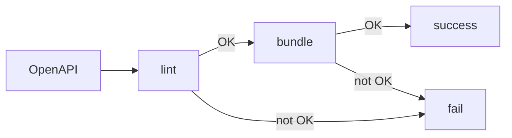

# Lint and bundle API descriptions with Redocly CLI

It's common to run more than one command on an API description during the API lifecycle.
The most common combination is to `lint` an API description to check it meets the API guidelines, followed by a `bundle` command to resolve references and produce a single file for another tool to use.
This guide shows how to combine these commands.

## Lint, and if all is well then bundle

The workflow described in this guide is illustrated in the diagram below:



Starting with an OpenAPI file, apply linting rules to check that the API description conforms to the expected standards.
Only if this step is successful, proceed to bundle the file for use by another tool.

The aim of this workflow is to exit successfully only if both steps are completed with successful outcomes.
If the first step, `lint`, doesn't complete successfully, then do not proceed to bundle.
To achieve this aim, the [exit status](https://en.wikipedia.org/wiki/Exit_status) of the commands can be used.
Successful commands output a value of zero, whereas failed commands return a value greater than zero (sometimes the exact value describes the failure, although that is beyond the scope of this guide).

## Use the logical AND operator

To combine the commands only if succesful, use the logical AND operator `&&`.
The first part of the command must complete successfully for the second one to be run.
For example, to lint and bundle an API description in the file, `openapi.yaml`, the command would be as shown below:

```yaml
redocly lint openapi.yaml && redocly bundle openapi.yaml
```

Using this syntax, the command only completes successfully if both the `lint` and the `bundle` step are marked as successful.
If the `lint` step returns errors, then the `bundle` command does not run at all.
If `lint` succeeds but `bundle` fails, the exit code indicates the failure.
Helpfully this approach means that even when used in automation, any failure state can be clearly identified, and the second step only proceeds if the first completes succesfully.
