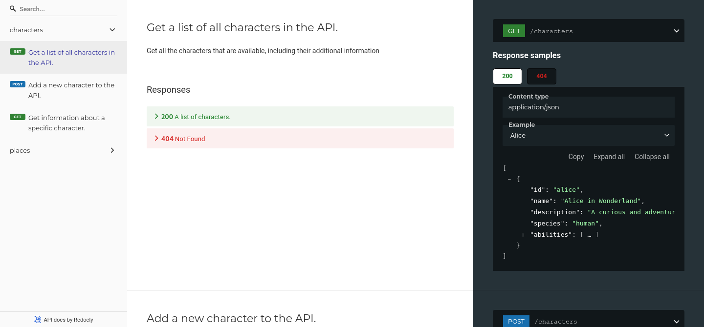

# Redocly CLI quickstart guide

Take your first steps with the Redocly CLI by following the steps in this guide.

Before you start:

- [Install the Redocly CLI](./installation.md) if you haven't already
- Create a new project folder and `cd` into the folder
- If you have an OpenAPI description to use, copy it into your project (we assume it's called `openapi.yaml`), or [try our example](https://github.com/Redocly/openapi-starter/blob/main/openapi/openapi.yaml)


There's also an [openapi-starter](https://github.com/Redocly/openapi-starter) repository that you can clone and experiment with to get your bearings



## Build API documentation

Redocly CLI has support for building your API documentation into an HTML file.
Run the command:

```bash
redocly build-docs openapi.yaml
```

The command produces a static HTML file named `redoc-static.html` in the current directory by default.

Open it in your browser, and admire your lovely API documentation!



## Lint an OpenAPI description

Linting helps create consistent API descriptions and helps you avoid bugs, leading to a smoother developer experience. Using linting as part of your API workflow optimizes maintainability, facilitates ease of onboarding, and increases the adoption of the API.

The `lint` command is used to check that the OpenAPI description is compliant with a set of rules. To get started using a default ruleset, try the following command:

```bash
redocly lint --extends minimal openapi.yaml
```

The command uses a [minimal ruleset](./rules/minimal.md) to lint the API description, and outputs a report of whether the API met the expected standard, as shown in the following example:

```text
validating openapi-starter/openapi/openapi.yaml...
[1] openapi-starter/openapi/openapi.yaml:72:10 at #/servers/1/url

Server `url` should not point to example.com or localhost.

70 |         default: www
71 |         description: Your tenant id
72 |   - url: https://example.com/api/v1
73 | paths:
74 |   '/users/{username}':

Warning was generated by the no-server-example.com rule.


openapi-starter/openapi/openapi.yaml: validated in 109ms

Woohoo! Your API description is valid. 🎉
You have 1 warning.
```

The output shows any aspects where the OpenAPI doesn't meet the standard. If you get too much output, try adding the `--format summary` parameter to the command.

Feeling brave and highly API compliant? Try the `recommended` standard instead and see how yours measures up.

## Craft a custom ruleset

Redocly CLI has some [great built-in rules](./rules/built-in-rules.md), and you can use these to build up a ruleset that works for you.

For example, let's build a lightweight ruleset using the [minimal ruleset](./rules/minimal.md) and adding some built-in rules to create a custom ruleset. You can see an example in the following snippet:

```yaml
extends:
 - minimal

rules:
  path-parameters-defined: error
  operation-operationId: error
  paths-kebab-case: warn
```

By taking the existing ruleset and adding some rule configuration, we can alter the rules and make a ruleset that suits our use case. Use this example as a starting point and then iterate to create a configuration that fits your needs.

## Next steps

After this quick tour of Redocly CLI, you can spend more time in the areas that interest you. Try one of the following:

- Check the [list of CLI commands](./commands/index.md) to find out what else you can do and get more information about each command.
- Add some [configurable rules](./rules/configurable-rules.md) to your setup for anything you need that doesn't have a built-in rule.
- [Use Redocly CLI with GitHub Actions](https://redocly.com/blog/consistent-apis-redocly-github-actions) for repeatably awesome API governance.
