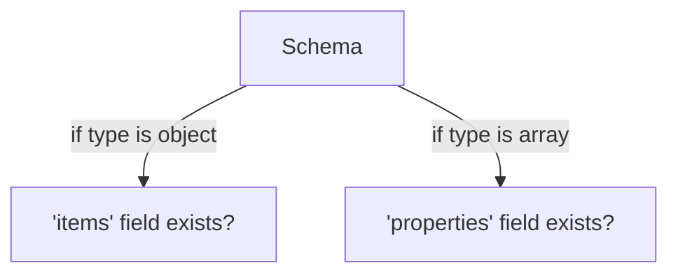

# no-schema-type-mismatch

Ensures that a schema's structural properties match its declared `type`. In particular:

- A schema of type `object` **must not** include an `items` field.
- A schema of type `array` **must not** include a `properties` field.

| OAS | Compatibility |
| --- | ------------- |
| 2.0 | ✅            |
| 3.0 | ✅            |
| 3.1 | ✅            |

| AsyncAPI | Compatibility |
| -------- | ------------- |
| 2.6      | ✅            |
| 3.0      | ✅            |

| Arazzo | Compatibility |
| ------ | ------------- |
| 1.0    | ✅            |



## API design principles

When designing an API schema, the defined `type` should be consistent with its structure:

- **Objects** are collections of key/value pairs. They should be defined using `properties` (or additionalProperties) and must not use `items`.
- **Arrays** are ordered lists of items and must use `items` to define their content. Including `properties` is invalid.

This rule helps catch typos and misconfigurations early in your API definition.

## Configuration

| Option   | Type   | Description                                                                                   |
| -------- | ------ | --------------------------------------------------------------------------------------------- |
| severity | string | Possible values: `off`, `warn`, `error`. Default is `error` in the recommended configuration. |

Example configuration:

```yaml
rules:
  no-schema-type-mismatch: error
```

## Examples

### Incorrect Examples

#### Object type with an `items` field

```yaml
properties:
  user:
    type: object
    properties:
      id:
        type: string
    items:
      type: number
```

_Error:_ An `object` type should not include an `items` field.

#### Array type with a `properties` field

```yaml
properties:
  tags:
    type: array
    properties:
      name:
        type: string
```

_Error:_ An `array` type should not include a `properties` field.

### Correct Examples

#### Object type with proper `properties`

```yaml
properties:
  user:
    type: object
    properties:
      id:
        type: string
      name:
        type: string
```

#### Array type with proper `items`

```yaml
properties:
  tags:
    type: array
    items:
      type: string
```

## Related rules

- [no-enum-type-mismatch](./no-enum-type-mismatch.md)
- [no-required-schema-properties-undefined](./no-required-schema-properties-undefined.md)
- [configurable rules](../configurable-rules.md)
- [no-invalid-media-type-examples](./no-invalid-media-type-examples.md)
- [no-invalid-parameter-examples](./no-invalid-parameter-examples.md)
- [no-invalid-schema-examples](./no-invalid-schema-examples.md)

## Resources

- [Rule source](https://github.com/Redocly/redocly-cli/blob/main/packages/core/src/rules/common/no-schema-type-mismatch.ts)
