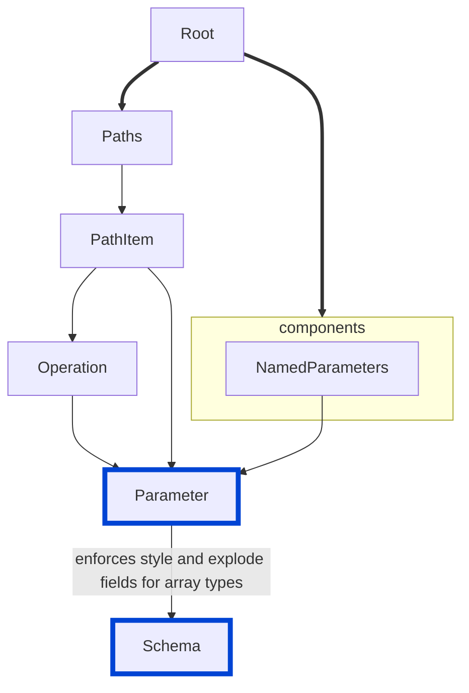

# array-parameter-serialization

Enforces the inclusion of `style` and `explode` fields for parameters with array type or parameters with a schema that includes `items` or `prefixItems`.

| OAS | Compatibility |
| --- | ------------- |
| 2.0 | ❌            |
| 3.0 | ✅            |
| 3.1 | ✅            |
| 3.2 | ✅            |



## API design principles

Specifying serialization details consistently helps developers understand how to interact with the API effectively.

## Configuration

| Option   | Type     | Description                                                                                                                      |
| -------- | -------- | -------------------------------------------------------------------------------------------------------------------------------- |
| severity | string   | Possible values: `off`, `warn`, `error`. Default `off`.                                                                          |
| in       | [string] | List of valid parameter locations where the rule should be enforced. By default the rule applies to parameters in all locations. |

An example configuration:

```yaml
rules:
  array-parameter-serialization:
    severity: error
    in:
      - query
      - header
```

## Examples

Given this configuration:

```yaml
rules:
  array-parameter-serialization:
    severity: error
    in:
      - query
```

Example of **incorrect** parameter:

```yaml
paths:
  /example:
    get:
      parameters:
        - name: exampleArray
          in: query
          schema:
            type: array
            items:
              type: string
```

Example of **correct** parameter:

```yaml
paths:
  /example:
    get:
      parameters:
        - name: exampleArray
          in: query
          style: form
          explode: true
          schema:
            type: array
            items:
              type: string
```

## Related rules

- [configurable rules](../configurable-rules.md)
- [boolean-parameter-prefixes](./boolean-parameter-prefixes.md)
- [no-invalid-parameter-examples](./no-invalid-parameter-examples.md)
- [parameter-description](./parameter-description.md)
- [operation-parameters-unique](./operation-parameters-unique.md)

## Resources

- [Rule source for OAS 3.0, 3.1, and 3.2](https://github.com/Redocly/redocly-cli/blob/main/packages/core/src/rules/oas3/array-parameter-serialization.ts)
- [OpenAPI Parameter](https://redocly.com/docs/openapi-visual-reference/parameter/) docs
