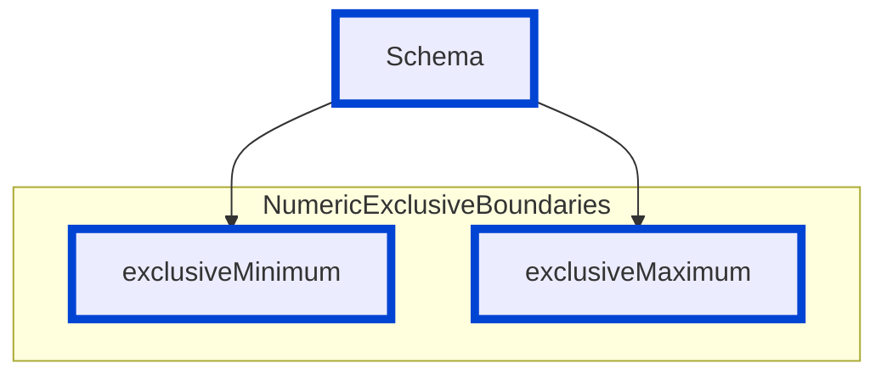

# exclusive-minimum-maximum

Enforce correct numeric usage of `exclusiveMinimum` and `exclusiveMaximum` in OpenAPI 3.1 schemas.

Prior to OpenAPI 3.1 (in 3.0.x and 2.0), `exclusiveMinimum` and `exclusiveMaximum` were boolean flags that modified the inclusive `minimum` / `maximum` values. In OpenAPI 3.1 these fields themselves MUST be numeric values defining an exclusive boundary, and the boolean form is no longer valid. This rule reports legacy boolean usage in OpenAPI 3.1 documents.

| OAS | Compatibility |
| --- | ------------- |
| 2.0 | ❌            |
| 3.0 | ❌            |
| 3.1 | ✅            |



## API design principles

Use the form that is valid for the OpenAPI version of your document. Migrating a definition from 3.0.x to 3.1 requires converting boolean `exclusiveMinimum` / `exclusiveMaximum` flags into numeric exclusive boundary values. Keeping outdated boolean usage causes ambiguity and can lead to incorrect validation or tooling errors.

## Configuration

| Option   | Type   | Description                                                   |
| -------- | ------ | ------------------------------------------------------------- |
| severity | string | Possible values: `off`, `warn`, `error`. Default `error`.     |

Example configuration:

```yaml
rules:
  exclusive-minimum-maximum: error
```

## Examples

Given the following configuration:

```yaml
rules:
  exclusive-minimum-maximum: error
```

Example of **incorrect** (legacy boolean) usage in an OpenAPI 3.1 document:

```yaml
openapi: 3.1.0
info:
  title: Store API
  version: 1.0.0
components:
  schemas:
    Product:
      type: object
      properties:
        price:
          type: number
          minimum: 0
          exclusiveMinimum: true  # ❌ Invalid in 3.1 (must be a number)
        discountRate:
          type: number
          maximum: 1
          exclusiveMaximum: false # ❌ Invalid in 3.1 (must be a number if present)
```

Example of **correct** numeric exclusive boundary usage in OpenAPI 3.1:

```yaml
openapi: 3.1.0
info:
  title: Store API
  version: 1.0.0
components:
  schemas:
    Product:
      type: object
      properties:
        price:
          type: number
          exclusiveMinimum: 0       # price must be > 0
        discountRate:
          type: number
          exclusiveMaximum: 1       # discountRate must be < 1
```

Example migration from 3.0.x to 3.1:

```yaml
# Before (3.0.x style)
minimum: 0
exclusiveMinimum: true
maximum: 100
exclusiveMaximum: true

# After (3.1 style)
exclusiveMinimum: 0    # replaces minimum + exclusiveMinimum: true
exclusiveMaximum: 100  # replaces maximum + exclusiveMaximum: true
```

## Related rules

- [no-schema-type-mismatch](../common/no-schema-type-mismatch.md)
- [no-required-schema-properties-undefined](../common/no-required-schema-properties-undefined.md)

## Resources

- [Rule source](https://github.com/Redocly/redocly-cli/blob/main/packages/core/src/rules/oas3/exclusive-minimum-maximum.ts)
- [OpenAPI 3.1 Schema Object](https://spec.openapis.org/oas/v3.1.0#schema-object)
- [Redocly Schema docs](https://redocly.com/docs/openapi-visual-reference/schemas/)
