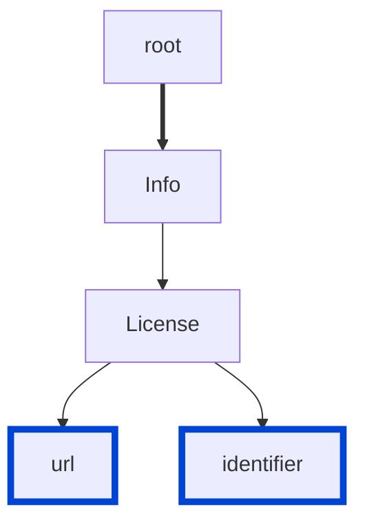

# info-license-strict

Requires either the license URL or identifier in your API descriptions.

| OAS | Compatibility |
| --- | ------------- |
| 2.0 | ✅            |
| 3.0 | ✅            |
| 3.1 | ✅            |



## API design principles

The principle of providing your users with accurate and relevant information does not apply to API design only, but to any product-related communication in general.

Before they can work with your API, your users must understand the terms and conditions of your API usage.

By being upfront with the API license, you can reduce friction and encourage API adoption.

## Configuration

| Option   | Type   | Description                                                                               |
| -------- | ------ | ----------------------------------------------------------------------------------------- |
| severity | string | Possible values: `off`, `warn`, `error`. Default `warn` (in `recommended` configuration). |

An example configuration:

```yaml
rules:
  info-license-strict: error
```

## Examples

Given the following configuration:

```yaml
rules:
  info-license-strict: error
```

Example of an **incorrect** license:

```yaml Object example
info:
  license:
    name: MIT
```

Example of a **correct** license with URL:

```yaml Object example
info:
  license:
    name: Apache 2.0
    url: https://www.apache.org/licenses/LICENSE-2.0.html
```

Example of a **correct** license with identifier:

```yaml Object example
info:
  license:
    name: Apache 2.0
    identifier: Apache-2.0
```

## Related rules

- [info-contact](./info-contact.md)
- [info-license](./info-license.md)

## Resources

- [Rule source](https://github.com/Redocly/redocly-cli/blob/main/packages/core/src/rules/common/info-license-strict.ts)
- [License object docs](https://redocly.com/docs/openapi-visual-reference/license/)
