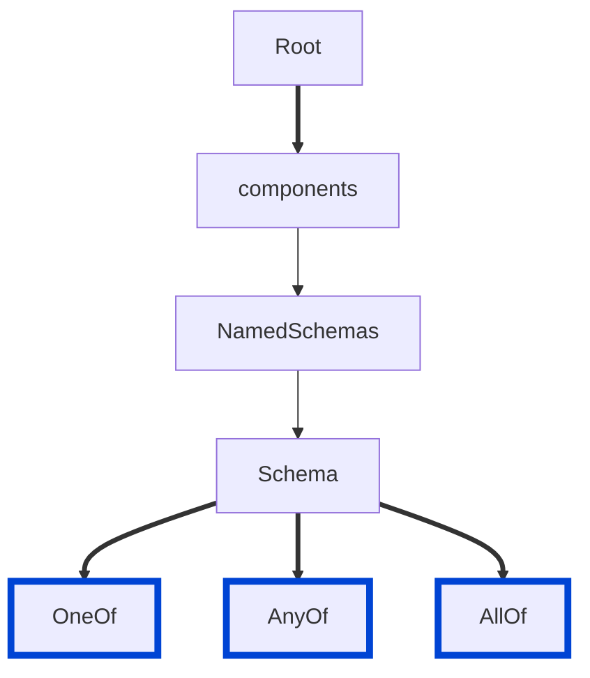

# no-illogical-composition-keywords

Ensures that `oneOf`, `anyOf`, and `allOf` combine schemas that a value can actually resolve against.

The rule reports:

- A `oneOf` or `anyOf` with fewer than two schemas, unless the schema declares a `discriminator`.
- `oneOf` or `anyOf` with fewer than two schemas, unless the schema declares a `discriminator`
- `allOf` with fewer than two schemas that neither declares another keyword of its own nor extends a discriminated schema
- schemas repeated inside the same keyword
- empty schemas (`{}`) used as members
- two `oneOf` schemas that a single value can match at the same time
- schemas that accept null alongside a `oneOf` member that also accepts null
- member schemas that omit the `discriminator` property from required
- inline `oneOf` or `anyOf` members that a `discriminator` cannot select

| OAS | Compatibility |
| --- | ------------- |
| 2.0 | ❌            |
| 3.0 | ✅            |
| 3.1 | ✅            |
| 3.2 | ✅            |



## API design principles

`oneOf` means "exactly one".
When a value matches two of the listed schemas, no tool can tell which one was intended.
Validators, code generators, and documentation all disagree about the result.

One of the most common ambiguous patterns is nullability.
If a referenced schema already accepts `null` and the `oneOf` also lists `type: 'null'`, a null value matches both branches.
The same ambiguity appears one level up, when the schema holding the `oneOf` is itself nullable and a member accepts `null` too.

Deciding whether two arbitrary schemas overlap is not solvable in general, so the comparison stays deliberately narrow.
It reads `type`, `nullable`, `enum`, `const`, `properties`, `required`, and `additionalProperties: false`.
A `const` counts as a single-value `enum`.
One member can use `enum` and the other `const`.
When a member uses any other constraint, such as `not`, `pattern`, `minimum`, or a nested `allOf`, that constraint may be what separates the schemas.
In such cases, the rule reports nothing for the pair.

A `discriminator` names the property that tells the members apart.
The rule trusts it and checks only what the specification requires.
The property must be listed in `required` in every member schema, because a value can otherwise omit it and nothing decides which schema applies.
OAS 3.2 turned this into a specification requirement and added `defaultMapping` as an alternative to marking the property required, so on 3.2 documents [spec-discriminator-defaultMapping](./spec-discriminator-defaultMapping.md) reports it and this rule stays quiet.
Every member must also be a `$ref`: a `discriminator` selects a schema by its component name, and the specification states that inline `oneOf` and `anyOf` subschemas are not considered, so an inline member can never be selected.
A member that declares `$id` is exempt, because a `mapping` entry can name it by URI.

Wrapping one schema in `allOf` to attach sibling keywords, such as `description` or `readOnly` next to a `$ref`, stays common because support for `$ref` siblings is uneven across tools.
Referencing a schema that declares a `discriminator` carries meaning of its own too: the discriminator resolves the subtype by its schema name, so the wrapper declares a subtype even when it adds no properties.
The rule reports an `allOf` wrapper only when neither applies.

## Configuration

| Option   | Type   | Description                                                                               |
| -------- | ------ | ----------------------------------------------------------------------------------------- |
| severity | string | Possible values: `off`, `warn`, `error`. Default `warn` (in `recommended` configuration). |

An example configuration:

```yaml
rules:
  no-illogical-composition-keywords: error
```

## Examples

Given this configuration:

```yaml
rules:
  no-illogical-composition-keywords: error
```

Example of an **incorrect** `oneOf` where both schemas accept `null`:

```yaml
components:
  schemas:
    PhotoUrl:
      type: [string, 'null']
      format: uri
    MenuItemPhoto:
      oneOf:
        - $ref: '#/components/schemas/PhotoUrl'
        - type: 'null'
```

Example of a **correct** `oneOf`:

```yaml
components:
  schemas:
    PhotoUrl:
      type: string
      format: uri
    MenuItemPhoto:
      oneOf:
        - $ref: '#/components/schemas/PhotoUrl'
        - type: 'null'
```

Example of an **incorrect** `discriminator` with an inline member:

```yaml
components:
  schemas:
    Beverage:
      type: object
      properties:
        category:
          type: string
          const: beverage
      required:
        - category
    MenuItem:
      discriminator:
        propertyName: category
      oneOf:
        - $ref: '#/components/schemas/Beverage'
        - type: object
          properties:
            category:
              type: string
              const: dessert
          required:
            - category
```

Move the inline schema into `components/schemas` as `Dessert` and reference it with a `$ref`.

Example of an **incorrect** `discriminator`, where `category` is optional:

```yaml
components:
  schemas:
    MenuItem:
      discriminator:
        propertyName: category
      oneOf:
        - $ref: '#/components/schemas/Beverage'
        - $ref: '#/components/schemas/Dessert'
    Beverage:
      type: object
      properties:
        category:
          type: string
          const: beverage
    Dessert:
      type: object
      properties:
        category:
          type: string
          const: dessert
```

Add `category` to `required` in both `Beverage` and `Dessert` to fix this.

Example of a **correct** single-schema `allOf` that declares a subtype:

```yaml
components:
  schemas:
    MenuBaseItem:
      type: object
      required:
        - category
      properties:
        category:
          type: string
      discriminator:
        propertyName: category
    Dessert:
      allOf:
        - $ref: '#/components/schemas/MenuBaseItem'
```

Example of **incorrect** composition keywords:

```yaml
components:
  schemas:
    MenuItem:
      oneOf:
        - $ref: '#/components/schemas/Beverage'
    Order:
      allOf:
        - $ref: '#/components/schemas/Beverage'
        - $ref: '#/components/schemas/Beverage'
        - {}
```

`MenuItem` wraps a single schema, and `Order` repeats one schema and adds an empty one that matches any value.

## Related rules

- [no-schema-type-mismatch](../common/no-schema-type-mismatch.md)
- [no-required-schema-properties-undefined](../common/no-required-schema-properties-undefined.md)
- [spec-discriminator-defaultMapping](./spec-discriminator-defaultMapping.md) — on OAS 3.2, flags a discriminator whose `propertyName` is optional but has no `defaultMapping` required by OAS 3.2.
  `no-illogical-composition-keywords` checks the same issue on OAS 3.0 and 3.1, where `defaultMapping` doesn't exist.
  Enable both rules to cover every OAS version.

## Resources

- [Rule source](https://github.com/Redocly/redocly-cli/blob/main/packages/core/src/rules/oas3/no-illogical-composition-keywords.ts)
- [Schema object docs](https://redocly.com/docs/openapi-visual-reference/schemas/)
- [Discriminator object docs](https://redocly.com/docs/openapi-visual-reference/discriminator/)
- [How to use oneOf and anyOf in OpenAPI](https://redocly.com/learn/openapi/any-of-one-of)
