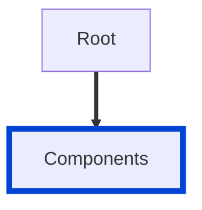

# no-unused-components

Ensures that every component specified in your API description is used at least once.
In this context, "used" means that a component defined in the `components` object is referenced elsewhere in the API document with `$ref`.

| OAS | Compatibility |
| --- | ------------- |
| 2.0 | ❌            |
| 3.0 | ✅            |
| 3.1 | ✅            |



## API design principles

This rule is intended to help security-focused enterprises prevent data leaks. Components can leak schemas, parameters, and other properties that may be unused in the exposed APIs, but used internally elsewhere.

However, your API document may contain common components used in other APIs.
If that describes your use-case, turn this rule off.

## Configuration

| Option   | Type   | Description                                                                               |
| -------- | ------ | ----------------------------------------------------------------------------------------- |
| severity | string | Possible values: `off`, `warn`, `error`. Default `warn` (in `recommended` configuration). |

An example configuration:

```yaml
rules:
  no-unused-components: error
```

## Examples

Given this configuration:

```yaml
rules:
  no-unused-components: error
```

Example of **incorrect** components:

```yaml
openapi: 3.1.0
paths:
  /customers:
    $ref: '#/components/pathItems/customers'
components:
  pathItems:
    customers:
      # ...
    dealers:
      # ...
```

> The dealers `PathItem` is an unused component.

Example of **correct** components:

```yaml
openapi: 3.1.0
paths:
  /customers:
    $ref: '#/components/pathItems/customers'
components:
  pathItems:
    customers:
      # ...
```

## Related rules

- [no-undefined-refs](./no-unresolved-refs.md)

## Resources

- [Rule source](https://github.com/Redocly/redocly-cli/blob/main/packages/core/src/rules/oas3/no-unused-components.ts)
- [Components docs](https://redocly.com/docs/openapi-visual-reference/components/)
