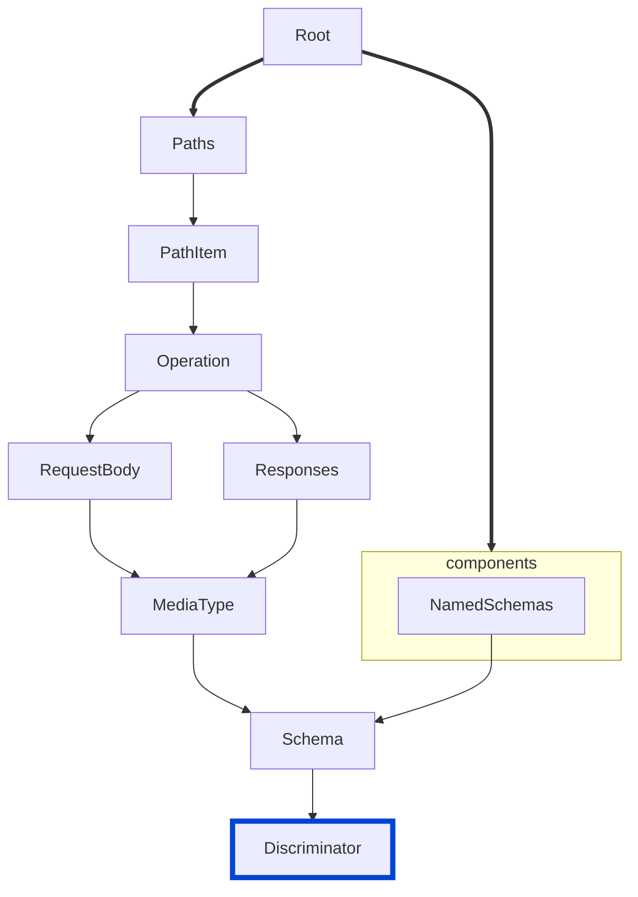

# spec-discriminator-defaultMapping

Ensures that discriminator objects with optional `propertyName` include a `defaultMapping` field as required by the OpenAPI 3.2.0 specification.

| OAS | Compatibility |
| --- | ------------- |
| 2.0 | ❌            |
| 3.0 | ❌            |
| 3.1 | ❌            |
| 3.2 | ✅            |



## API design principles

According to the OpenAPI 3.2.0 specification, when a discriminator's `propertyName` is optional (not in the `required` array), the discriminator MUST include a `defaultMapping` field.
This field specifies the schema to validate against when the discriminating property is absent or has no explicit/implicit mapping.

## Configuration

| Option   | Type   | Description                                                                               |
| -------- | ------ | ----------------------------------------------------------------------------------------- |
| severity | string | Possible values: `off`, `warn`, `error`. Default `warn` (in `recommended` configuration). |

An example configuration:

```yaml
rules:
  spec-discriminator-defaultMapping: warn
```

## Examples

Given this configuration:

```yaml
rules:
  spec-discriminator-defaultMapping: warn
```

Example of an **incorrect** discriminator object:

```yaml
components:
  schemas:
    Base:
      type: object
      discriminator:
        propertyName: type
        mapping:
          a: SomeType
      properties:
        type:
          type: string
    SomeType:
      allOf:
        - $ref: '#/components/schemas/Base'
```

Example of a **correct** discriminator object:

```yaml
components:
  schemas:
    Base:
      type: object
      discriminator:
        propertyName: type
        defaultMapping: DefaultType
      properties:
        type:
          type: string
    DefaultType:
      allOf:
        - $ref: '#/components/schemas/Base'
```

## Related rules

- [struct](../common/struct.md)
- [spec-example-values](./spec-example-values.md)
- [spec-no-invalid-encoding-combinations](./spec-no-invalid-encoding-combinations.md)
- [spec-no-invalid-tag-parents](./spec-no-invalid-tag-parents.md)

## Resources

- [Rule source](https://github.com/Redocly/redocly-cli/blob/main/packages/core/src/rules/oas3/spec-discriminator-defaultMapping.ts)
- [Discriminator object docs](https://redocly.com/docs/openapi-visual-reference/discriminator/)
