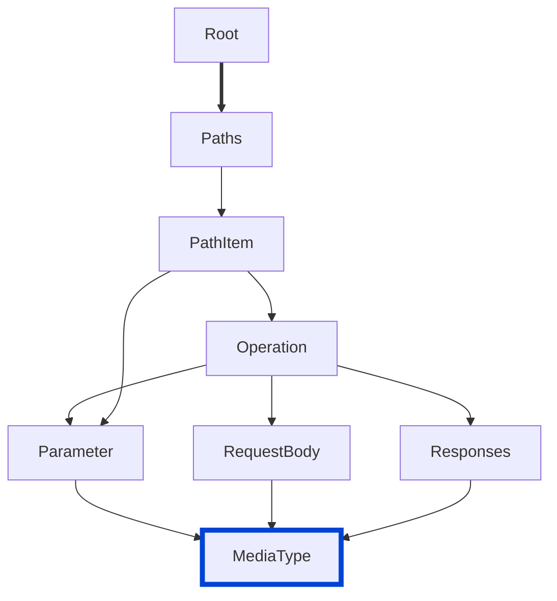

# spec-no-invalid-encoding-combinations

Ensures that MediaType objects have valid combinations of encoding fields according to the OpenAPI 3.2.0 specification.

| OAS | Compatibility |
| --- | ------------- |
| 2.0 | ❌            |
| 3.0 | ❌            |
| 3.1 | ❌            |
| 3.2 | ✅            |



## API design principles

According to the [OpenAPI 3.2.0 specification](https://spec.openapis.org/oas/v3.2.0.html#fixed-fields-11), MediaType objects have strict rules about which encoding fields can be used together.
This rule ensures that only valid encoding field combinations are used in MediaType objects.

## Configuration

| Option   | Type   | Description                                                                                |
| -------- | ------ | ------------------------------------------------------------------------------------------ |
| severity | string | Possible values: `off`, `warn`, `error`. Default `error` (in `recommended` configuration). |

An example configuration:

```yaml
rules:
  spec-no-invalid-encoding-combinations: error
```

## Examples

Given this configuration:

```yaml
rules:
  spec-no-invalid-encoding-combinations: error
```

Example of **incorrect** MediaType objects:

```yaml
requestBody:
  content:
    'multipart/form-data':
      schema:
        type: object
        properties:
          id:
            type: integer
      encoding:
        id:
          style: form
      prefixEncoding:
        - style: form
    'application/x-www-form-urlencoded':
      schema:
        type: object
        properties:
          name:
            type: string
      encoding:
        name:
          style: form
      itemEncoding:
        style: form
```

Example of **correct** MediaType objects:

```yaml
requestBody:
  content:
    'multipart/form-data':
      schema:
        type: object
        properties:
          id:
            type: integer
      encoding:
        id:
          style: form
    'multipart/form-data-positional':
      schema:
        type: object
        properties:
          items:
            type: array
      prefixEncoding:
        - style: form
      itemEncoding:
        style: form
```

## Related rules

- [struct](../common/struct.md)
- [spec-example-values](./spec-example-values.md)
- [spec-discriminator-defaultMapping](./spec-discriminator-defaultMapping.md)
- [spec-no-invalid-tag-parents](./spec-no-invalid-tag-parents.md)

## Resources

- [Rule source](https://github.com/Redocly/redocly-cli/blob/main/packages/core/src/rules/oas3/spec-no-invalid-encoding-combinations.ts)
- [MediaType object docs](https://redocly.com/docs/openapi-visual-reference/media-type/)
