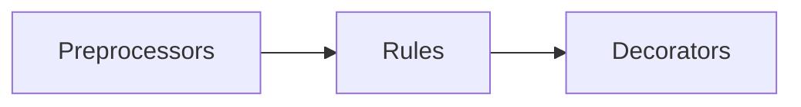

# `bundle`

API definitions can grow and become difficult to manage, especially if several teams are collaborating on them. It's a good practice to maintain the reusable parts as separate files, and include them in the main (root) API definition by referencing them with `$ref`. However, most OpenAPI tools do not support that multi-file approach, and require a single-file API definition.

Redocly OpenAPI CLI can help you combine separate API definition files into one. The `bundle` command pulls the relevant parts of an API definition into a single file output in JSON or YAML format.

The `bundle` command first executes preprocessors, then rules, then decorators.



### `bundle` usage

```
Positionals:
  entrypoints                                              [array] [default: []]
Options:
  --version            Show version number.                            [boolean]
  --help               Show help.                                      [boolean]
  --lint               Lint definitions               [boolean] [default: false]
  --output, -o                                                          [string]
  --format             Use a specific output format.
                        [choices: "stylish", "codeframe"] [default: "codeframe"]
  --max-problems       Reduce output to max N problems.  [number] [default: 100]
  --ext                Bundle file extension.   [choices: "json", "yaml", "yml"]
  --skip-rule          Ignore certain rules.                             [array]
  --skip-preprocessor  Ignore certain preprocessors.                     [array]
  --skip-decorator     Ignore certain decorators.                        [array]
  --dereferenced, -d   Produce fully dereferenced bundle.              [boolean]
  --force, -f          Produce bundle output even when errors occur.   [boolean]
  --config             Specify path to the config file.                 [string]
```

The command:

```bash
openapi bundle --output <outputName> --ext <ext> [entrypoints...]
```

- `[entrypoints...]` corresponds to the name(s) of your root document(s).
- Instead of full paths, you can use aliases assigned in your `apiDefinitions` within your `.redocly.yaml` configuration file as entrypoints.
- The `<outputName>` is your desired output filename or folder. If the folder doesn't exist, it's automatically created.
- Use `--ext <ext>` to specify the type and extension of the output file: `.json`, `.yml` or `.yaml`.

<div class="warning">
If the file specified as the bundler's output already exists, it will be overwritten.
</div>

### How to bundle a single API definition

This command produces a bundled file in JSON format at the path `dist/openapi.json` starting from the root API definition file `openapi/openapi.yaml`.

```
openapi bundle --output dist/openapi.json openapi/openapi.yaml
```

### How to bundle multiple API definitions

This command creates one bundled file for each of the specified entrypoints in the folder `dist/`. Bundled files are in JSON format.

```
openapi bundle --output dist --ext json openapi/openapi.yaml openapi/petstore.yaml
```

The output will be:

```
dist/openapi.json
dist/petstore.json
```

### How to make a fully dereferenced bundle

<div class="warning">
JSON output only works when there are no circular references.
</div>

```
openapi bundle --dereferenced --output dist --ext json openapi/openapi.yaml openapi/petstore.yaml
```

### Options

#### Skip preprocessor

You may want to skip specific preprocessors upon running the command.

```
openapi bundle --skip-preprocessor=discriminator-mapping-to-one-of,another-example
```

Learn more about [preprocessors](../custom-rules.md).

#### Skip rule

You may want to skip specific rules upon running the command.

```
openapi bundle --skip-rule=no-sibling-refs,no-parent-tags
```

Learn more about [rules](../custom-rules.md).

#### Skip decorator

You may want to skip specific decorators upon running the command.

```
openapi bundle --skip-decorator=generate-code-samples,remove-internal-operations
```

Learn more about [decorators](../custom-rules.md).
