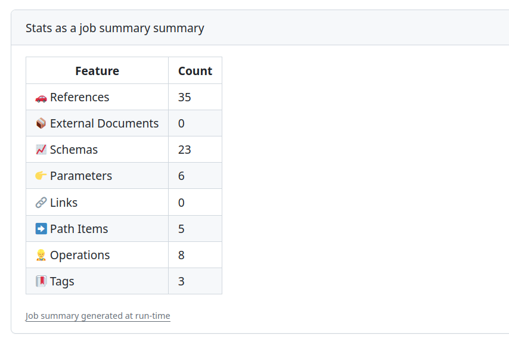

# `stats`

## Introduction

The `stats` command provides statistics about the structure of one or more API description files.
This command generates statistics for the following metrics:

- References
- External Documents
- Schemas
- Parameters
- Links
- Path Items
- Operations
- Tags

If you're interested in the technical details, the statistics are calculated using the counting logic from the `StatsVisitor` module.

## Usage

```bash
redocly stats <api>
redocly stats <api> [--format=<option>] [--config=<path>]
redocly stats --version
```

## Options

| Option        | Type    | Description                                                                                                                        |
| ------------- | ------- | ---------------------------------------------------------------------------------------------------------------------------------- |
| api           | string  | **REQUIRED.** Path to the API description file that you want to split into a multi-file structure.                                 |
| --config      | string  | Specify path to the [configuration file](#custom-configuration-file).                                                              |
| --format      | string  | Format for the output.<br />**Possible values:** `stylish`, `json`, `markdown`.                                                    |
| --help        | boolean | Show help.                                                                                                                         |
| --lint-config | string  | Specify the severity level for the configuration file. <br/> **Possible values:** `warn`, `error`, `off`. Default value is `warn`. |
| --version     | boolean | Show version number.                                                                                                               |

## Examples

### API

The `stats` command behaves differently depending on how you pass the API to it and whether the [configuration file](#custom-configuration-file) exists.

#### Pass an OpenAPI file

You can use the `stats` command with an OpenAPI description directly, with a command like the following:

```bash
redocly stats openapi/openapi.yaml
```

In this case, `stats` shows statistics for the API description that was passed to the command.

#### Use an API alias in the configuration file

Instead of full paths, you can use API names from the `apis` section of your Redocly configuration file.
With a `redocly.yaml` file containing the following entry for `core@v1`:

```yaml
apis:
  core@v1:
    root: ./openapi/api-description.json
```

You can obtain the stats by giving the API alias name, as shown below:

```bash
redocly stats core@v1
```

In this case, after resolving the path behind the `core@v1` name, `stats` displays statistics for the `openapi/api-description.json` file.

### Custom configuration file

By default, the CLI tool looks for the [Redocly configuration file](../configuration/index.md) in the current working directory. Use the optional `--config` argument to provide an alternative path to a configuration file.

```bash
redocly stats --config=./another/directory/config.yaml
```

### Format

#### Stylish (default)

The default output format for `stats` is called "stylish".
It outputs a nice format for your terminal, as shown in the following example:

```bash
Document: museum.yaml stats:

🚗 References: 35
📦 External Documents: 0
📈 Schemas: 23
👉 Parameters: 6
🔗 Links: 0
➡️  Path Items: 5
👷 Operations: 8
🔖 Tags: 3

museum.yaml: stats processed in 4ms
```

In this format, `stats` shows the statistics in condensed but readable output with colored text and an icon at the beginning of each line.

#### JSON

Add `--format=json` to get a machine-readable output format.
The JSON format outout is great when you want to grab the stats data to use elsewhere.
An example of the format is shown in the following example:

```json
{
  "refs": {
    "metric": "🚗 References",
    "total": 35
  },
  "externalDocs": {
    "metric": "📦 External Documents",
    "total": 0
  },
  "schemas": {
    "metric": "📈 Schemas",
    "total": 23
  },
  "parameters": {
    "metric": "👉 Parameters",
    "total": 6
  },
  "links": {
    "metric": "🔗 Links",
    "total": 0
  },
  "pathItems": {
    "metric": "➡️  Path Items",
    "total": 5
  },
  "operations": {
    "metric": "👷 Operations",
    "total": 8
  },
  "tags": {
    "metric": "🔖 Tags",
    "total": 3
  }
}
```

You can use the JSON output to pass to another program.

#### Markdown

Add `--format=markdown` and the command returns output that you can use in Markdown files or other Markdown-friendly applications.
It uses a table format; there are examples of the source and the formatted output below:

```markdown
| Feature  | Count  |
| --- | --- |
| 🚗 References | 35 |
| 📦 External Documents | 0 |
| 📈 Schemas | 23 |
| 👉 Parameters | 6 |
| 🔗 Links | 0 |
| ➡️  Path Items | 5 |
| 👷 Operations | 8 |
| 🔖 Tags | 3 |
```

| Feature               | Count |
| --------------------- | ----- |
| 🚗 References         | 35    |
| 📦 External Documents | 0     |
| 📈 Schemas            | 23    |
| 👉 Parameters         | 6     |
| 🔗 Links              | 0     |
| ➡️ Path Items         | 5     |
| 👷 Operations         | 8     |
| 🔖 Tags               | 3     |

The Markdown format is very useful for situations where a printable summary is useful.
A good example is using it with regular update reports, or as a human-readable output from your CI system.
The following example shows how to use the `stats` command in a GitHub action to make a nice [GitHub summary](https://github.blog/2022-05-09-supercharging-github-actions-with-job-summaries/):

```yaml
name: Get API stats
on: push

jobs:
  get_stats:
    name: Stats as a job summary
    runs-on: ubuntu-latest
    steps:
      - name: Check out repo's default branch
        uses: actions/checkout@v4
      - name: Set up node
        uses: actions/setup-node@v4
      - name: Install Redocly CLI
        run: npm install -g @redocly/cli@latest
      - name: Get stats
        run: redocly stats --format=markdown museum.yaml >> $GITHUB_STEP_SUMMARY 2>&1
```

This GitHub action uses the output of the `stats` command in Markdown format as the value for `$GITHUB_STEP_SUMMARY`.
When the job is complete, it adds your API stats to the summary page, as shown in the following screenshot:


