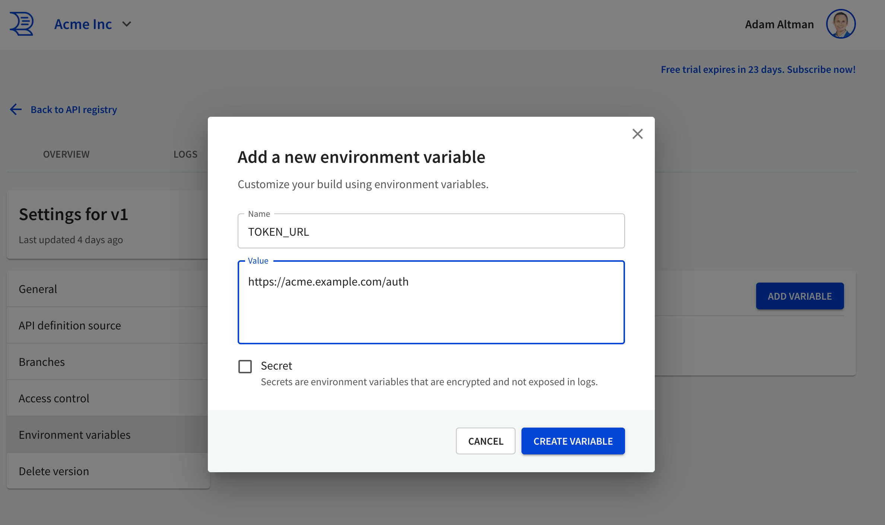

---
redirectFrom:
  - /docs/resources/change-token-url/
---
# Change OAuth2 token URL

Use a custom decorator to change the OAuth credentials flow token URL.

Estimated time: 20 minutes


## Step-by-step instructions

1. Add environment variables to the API version's settings.
    

1. Add this code to your repo with the API (the Redocly configuration file is an example).
    ```yaml redocly.yaml
    styleguide:
      extends:
        - recommended
      plugins:
        - './plugins/acme-plugin.js'
      decorators:
        acme/change-token-urls: error
    ```

    ```js acme-plugin.js
    const ChangeTokenUrl = require('./decorators/change-token-url');
    const id = 'acme';

    /** @type {import('@redocly/cli').CustomRulesConfig} */
    const decorators = {
      oas3: {
        'change-token-url': ChangeTokenUrl,
      },
    };

    module.exports = {
      id,
      decorators,
    };
    ```

    ```js decorators/change-token-url.js
    module.exports = ChangeTokenUrl;

    /** @type {import('@redocly/cli').OasDecorator} */
    function ChangeTokenUrl() {
      return {
        SecuritySchemeFlows: {
          leave(flows, ctx) {
            if ('TOKEN_URL' in process.env && flows?.clientCredentials) {
              flows.clientCredentials.tokenUrl = process.env.TOKEN_URL;
            }
          }
        }
      }
    };
    ```
