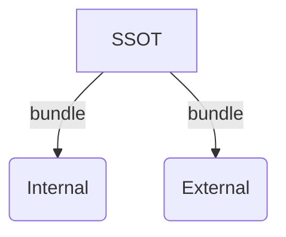
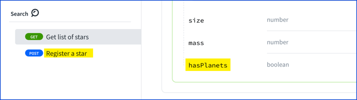
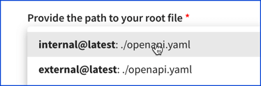

# Hide your internal APIs

Several times a month, a variation of this question comes up:

> How do we hide endpoints that are for internal use only?

Follow along using our sample API provided with this tutorial to hide APIs, and then try this again with your APIs.

## Overview

In this tutorial, we'll maintain a single source of truth (SSOT) OpenAPI definition.
Then, we'll generate an internal and an external version of the API.



The following image highlights what we'll remove in this tutorial.


## Prerequisites

:::note We do, You do
This tutorial is most effective when you follow along and complete the steps.
:::

- [Install @redocly/cli](../installation.md) with version 1.0.0-beta.90 or later (we use 1.0.0-beta.94 in this tutorial).
- Download the [sample.yaml](https://gist.github.com/adamaltman/ee07bf94a967926ee0e54bcd56fdcdfb) file into a new directory named `hide-apis-demo`.
- Use your favorite IDE for editing the YAML file (we use VS Code and have the [Redocly extension](../../redocly-openapi/index.md) installed).

## Step 1: Add `x-internal` to the API definition

In this step, you will mark operations and properties of the API definition as internal.

Open the `sample.yaml` file in your IDE. We'll change it in a few places.

1. Go to line 22 and add a new line between `post` and `operationId`.
  The indentation is important.
  Type `x-internal: true` on that line.
  The space after the colon is important too.
  It should look like the following example.
    ```yaml
        post:
          x-internal: true
          operationId: postStars
    ```
1. Go to line 52 and add a new line between `hasPlanets` and `type`, like we did previously. The following example shows how it should look.
    ```yaml
            hasPlanets:
              x-internal: true
              type: boolean
    ```
1. Save the file.

## Step 2: Add a Redocly configuration file

In this step, you will create a Redocly configuration file with two APIs pointing to the same root file.

Make a new file in the same `hide-apis-demo` directory named `redocly.yaml` (the casing is important).

Then, add this snippet to the file:

```yaml
apis:
  internal@latest:
    root: ./sample.yaml
```

Let's explain what's going on here.
The `apis` object contains a collection of our APIs.
The `internal@latest` matches the expected configuration `{name@version}` pattern for each API.
The `root` is the path to the root of the API definition.

We only have one root API file (`sample.yaml`), but we want to generate two APIs from that SSOT.
To do that, we add another API to the API section.

```yaml
apis:
  internal@latest:
    root: ./sample.yaml
  external@latest:
    root: ./sample.yaml
```
Finally, we want the [remove-x-internal](../decorators/remove-x-internal.md) decorator to be applied to the external API.
To accomplish that, add the last three lines as shown in the following example.

```yaml
apis:
  internal@latest:
    root: ./sample.yaml
  external@latest:
    root: ./sample.yaml
    decorators:
      remove-x-internal: on
```

Save the `redocly.yaml` file.

## Step 3: Output internal and external APIs

In this step, you'll produce the two API snapshots from the single source of truth.
This can be done in two ways:

- Option A: Let Redocly's API registry handle the work (which uses the `bundle` command under the hood).
- Option B: Your machine plus the [`bundle` command](../commands/bundle.md).

### Option A: Redocly's API registry bundles automatically

1. Add the APIs to the API registry.
  This process will vary depending on the source type you use.
  If using the CICD `push` command, it can push all APIs or the API you specify by the API `name@version`.
  If using a git-based integration, select the appropriate API in the path to your root file.

    

1. Confirm the API in the registry has the appropriate content.

1. Repeat this step for each API.
### Option B: Use your machine and the `bundle` command

1. Bundle the `external@latest` API.
    ```shell
    redocly bundle external@latest --output dist/external.yaml
    ```
1. Inspect the file at `dist/external.yaml`.
  Confirm the following:
    - The `postStars` operation is removed.
    - The `hasPlanets` property is removed.
1. Bundle the `internal@latest` API.

    ```shell
    redocly bundle internal@latest --output dist/internal.yaml
    ```
    Inspect the file at `dist/internal.yaml`.
    Confirm the following:
      - The `postStars` operation is **not** removed.
      - The `hasPlanets` property is **not** removed.

## Next steps

If you enjoyed this tutorial, please share it with a colleague, or on the social networks.
Be sure to tag `@Redocly` as it lets us know how we're doing and where we can improve.

Try this technique with your own APIs to accomplish the use case demonstrated above.

:::danger Security through obscurity
If an endpoint is discovered, your API authentication mechanism **must** prevent unauthorized access.
Removing APIs from documentation is not a security mechanism. Use access controls for your internal API documentation as well.
:::
