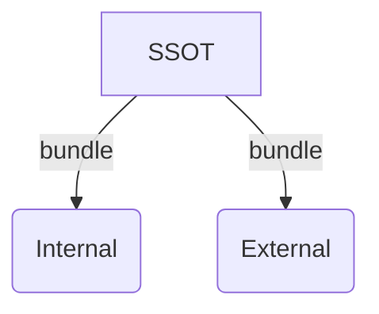

# Hide OpenAPI specification extensions

When you want to hide internal operations and properties, you can follow our [hide internal APIs](./hide-apis.md) guide.
However, this approach won't work if you use [specification extensions](https://redocly.com/docs/openapi-visual-reference/specification-extensions/)
in your API and want to hide their details as well. For this purpose, you need a custom decorator.

## Overview

In this tutorial, we'll maintain a single source of truth (SSOT) OpenAPI definition.
Then, we'll generate an internal and an external version of the API.



For this tutorial, we've prepared a sample containing OpenAPI specification extensions starting with `x-amazon-apigateway`.

## Prerequisites

:::note We do, You do
This tutorial is most effective when you follow along and complete the steps.
:::

- [Install @redocly/cli](../installation.md) with version 1.0.0-beta.117 or later (we use 1.0.0-beta.117 in this tutorial).
- Download the [sample.yaml](https://gist.github.com/bandantonio/e1331ba5afd24485de5e6229c91d25ed) file into a new directory named `hide-openapi-extensions`.
- Use your favorite IDE for editing the YAML file (we use VS Code and have the [Redocly extension](../../redocly-openapi/index.md) installed).

## Step 1: Create a custom plugin

In this step, create a custom plugin and define the decorator dependency.

1. Create a new directory called `plugins`.
1. In the `plugins` directory, create a `plugin.js` file with the following code:

    ```js
    const hideOpenapiExtensions = require('./decorators/hide-openapi-extensions');
    const id = 'plugin';

    const decorators = {
      oas3: {
        'hide-openapi-extensions': hideOpenapiExtensions,
      },
    };

    module.exports = {
      id,
      decorators,
    };
    ```

1. Save the file.

:::attention
You can name the plugins directory and the file anything you want. Make sure you use the correct name in the Redocly configuration file (Step 3 below).
:::

## Step 2: Add a decorator and associate it with an environment variable

1. In the `plugins` directory, create a new directory called `decorators`.
1. In the `decorators` directory, create a `hide-openapi-extensions.js` file with the following code:

    ```js
    module.exports = hideOpenapiExtensions;

    /** @type {import('@redocly/cli').OasDecorator} */

    function hideOpenapiExtensions({ pattern }) {
      return {
        any: {
          enter: node => {
            pattern.forEach(item => {
              Object.keys(node).forEach(key => {
                const regex = new RegExp(item, 'i');
                if (regex.test(key)) {
                  delete node[key];
                }
              });
            });
          }
        }
      }
    }
    ```

1. Save the file.

:::attention
You can name the decorators directory anything you want. Make sure you use the correct directory name in the line 1 of the `plugin.js` file (Step 1 above).
:::

## Step 3: Configure the plugin for use

To use the decorator, you will need to register your plugin in your Redocly configuration file `redocly.yaml`. Register your `plugins` and `decorators`.

```yaml
apis:
  internal@latest:
    root: ./sample.yaml
  external@latest:
    root: ./sample.yaml
    decorators:
      plugin/hide-openapi-extensions:
        pattern:
          - x-amazon-apigateway
plugins:
  - "./plugins/plugin.js"
extends:
  - recommended
```

Make sure your `hide-openapi-extensions` looks as follows:

```bash
.
├── plugins
│   ├── decorators
│   │   └── hide-openapi-extensions.js
│   └── plugin.js
├── redocly.yaml
└── sample.yaml
```

## Step 4: Output internal and external APIs

In this step, you'll produce the two API snapshots from the single source of truth. To do this, you can use the [`bundle` command](../commands/bundle.md) on your machine.

1. Bundle the `external@latest` API.

    ```bash
    redocly bundle external@latest -o dist/bundle-external.yaml
    // or
    npx @redocly/cli bundle external@latest -o dist/bundle-external.yaml
    ```
    
    Inspect the file at `dist/external.yaml`.
    Confirm that all the occurrences of `x-amazon-apigateway` are removed.

1. Bundle the `internal@latest` API.

    ```bash
    redocly bundle internal@latest -o dist/bundle-internal.yaml
    // or
    npx @redocly/cli bundle internal@latest -o dist/bundle-internal.yaml
    ```

    Inspect the file at `dist/internal.yaml`.
    Confirm that all the occurrences of `x-amazon-apigateway` are **not** removed.

## Advanced usage

If you want to hide multiple specification extensions, open the `redocly.yaml` and add the corresponding extension names
to the `pattern` list (after the line 9):

```yaml
decorators:
  plugin/hide-openapi-extensions:
    pattern:
      - x-amazon-apigateway
      - x-another-custom-extension
```

## Next steps

If you enjoyed this tutorial, please share it with a colleague, or on the social networks.
Be sure to tag `@Redocly` as it lets us know how we're doing and where we can improve.

Try this technique with your own APIs to accomplish the use case demonstrated above.
