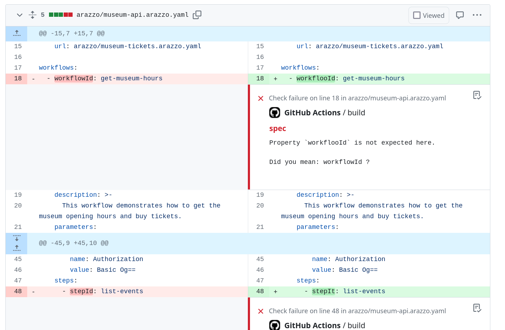

---
seo:
  title: Lint Arazzo with Redocly CLI
  description: Unlock powerful linting capabilities for Arazzo documents. Use the Redocly CLI to enforce basic validation, configure rules, or even build custom plugins for Arazzo.
---

# Lint Arazzo with Redocly CLI

[Arazzo](https://spec.openapis.org/arazzo/latest.html#arazzo-specification) is an open standard from the OpenAPI Initiative for describing a sequence API calls, defining success criteria, and adding response content to subsequent API calls.
While under development, this standard was also known as "OpenAPI Workflows".
Redocly CLI offers support for checking that your Arazzo files are valid.


This feature is at an early stage, please send us lots of [feedback](https://github.com/redocly/redocly-cli/issues/new)!


## Lint an Arazzo file

Use your existing Arazzo files, or use the Arazzo examples in the [Museum API project](https://github.com/Redocly/museum-openapi-example) if you'd prefer to use sample data to try things out.

**Pro-tip:** linting is much more interesting if the file actually does contain problems.
Be your own chaos monkey and introduce some errors before you proceed!

Lint using a command like the following:

```bash
redocly lint arazzo/museum-api.arazzo.yaml
```

If the file does not match the specification, the tool shows the details of each error that it finds, like in the following example:

```text
validating arazzo/museum-api.arazzo.yaml...
[1] arazzo/museum-api.arazzo.yaml:18:5 at #/workflows/0

The field `workflowId` must be present on this level.

16 |
17 | workflows:
18 |   - workflooId: get-museum-hours
19 |     description: >-
 … |     < 20 more lines >
40 |   - workflowId: events-crud
41 |     description: >-
42 |       This workflow demonstrates how to list, create, update, and delete special events at the museum.

Error was generated by the spec rule.


[2] arazzo/museum-api.arazzo.yaml:18:5 at #/workflows/0/workflooId

Property `workflooId` is not expected here.

Did you mean: workflowId ?

16 |
17 | workflows:
18 |   - workflooId: get-museum-hours
19 |     description: >-
20 |       This workflow demonstrates how to get the museum opening hours and buy tickets.

Error was generated by the spec rule.


arazzo/museum-api.arazzo.yaml: validated in 14ms

❌ Validation failed with 2 errors.
run `redocly lint --generate-ignore-file` to add all problems to the ignore file.
```


No additional rules or configuration are available for Arazzo in the current version of Redocly CLI; the tool merely checks that the file meets the specification.


## Choose output format

Since Redocly CLI is already a fully-featured lint tool, additional features such as a choice of formats are already included.

Get a report in **Markdown format** with the following command:

```bash
redocly lint --format=markdown arazzo/museum-api.arazzo.yaml
```

Choose your preferred output format from `codeframe`, `stylish`, `json`, `checkstyle`, `codeclimate`, `github-actions`, `markdown`, or `summary`.
The [lint command page](../commands/lint.md) has full details of the command's options.

## Add Arazzo linting to GitHub Actions

To make sure that your Arazzo description remains valid, add linting to your CI (Continuous Integration) setup.
You can use Redocly CLI with the `github-actions` output format to get annotations directly in your pull request if any validation problems are found.
The following snippet shows an example of configuring a GitHub action for linting:

```yaml
name: Validate museum Arazzo descriptions

on: [pull_request]

jobs:
  build:
    runs-on: ubuntu-latest
    steps:
      - name: Checkout
        uses: actions/checkout@v4
      - name: Set up node
        uses: actions/setup-node@v4
      - name: Install Redocly CLI
        run: npm install -g @redocly/cli@latest
      - name: Run linting
        run: redocly lint arazzo/*yaml --format=github-actions
```

With this action in place, the intentional errors I added to the Arazzo description are shown as annotations on the pull request:



## Arazzo rules

To expand the linting checks for an Arazzo description, start by enabling
some of the built-in rules. The currently-supported rules are:

- `parameters-no-body-inside-in`: the `in` section inside `parameters` must not contain a `body`.
- `source-description-type`: the `type` property of the `sourceDescription` object must be either `openapi` or `arazzo`.
- `version-enum`: the `version` property must be one of the supported values.
- `workflow-workflowId-unique`: the `workflowId` property must be unique across all workflows.
- `step-stepId-unique`: the `stepId` must be unique amongst all steps described in the workflow.
- `sourceDescription-name-unique`: the `name` property of the `sourceDescription` object must be unique across all source descriptions.
- `workflow-dependsOn`: the items in the `workflow` `dependsOn` property must exist and be unique.
- `parameters-unique`: the `parameters` list must not include duplicate parameters.
- `step-onSuccess-unique`: the `onSuccess` actions of the `step` object must be unique.
- `step-onFailure-unique`: the `onFailure` actions of the `step` object must be unique.
- `requestBody-replacements-unique`: the `replacements` of the `requestBody` object must be unique.

## Participate in Redocly CLI

Redocly CLI is an open source project, so we invite you to check out the [code on GitHub](https://github.com/Redocly/redocly-cli/), and open issues to report problems or request features.
