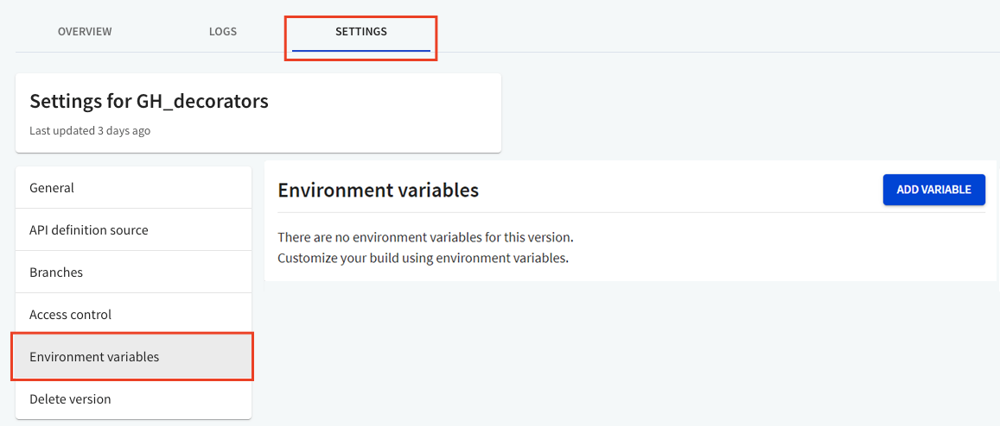
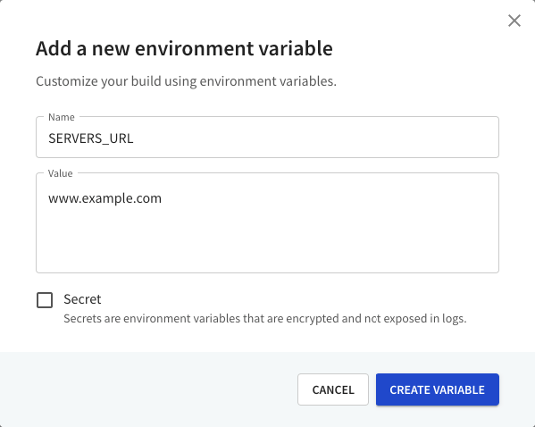
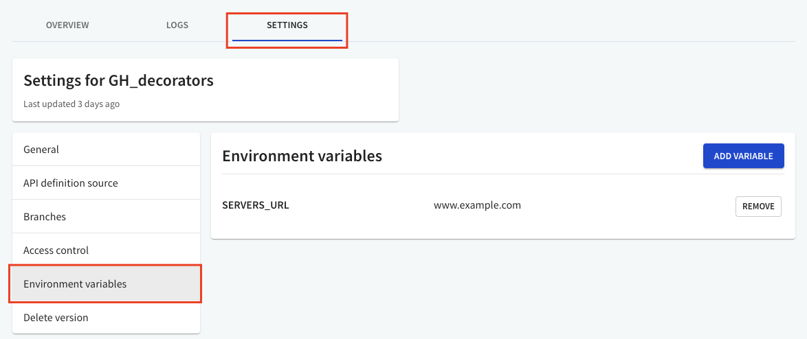

---
redirectFrom:
  - /docs/workflows/guides/replace-server-url/
---
# Replace server URL in different environments

Redocly allows you to use [custom decorators](../resources/custom-rules.md) to modify content in the API definition during the bundling process.

This page describes how to replace the server URL with a decorator for a given environment.

## Step 1: Create a custom plugin

In this step, you will create a custom plugin and define the decorator dependency.

1. Create a `demo-plugin.js` file with this information.

```JavaScript
const ReplaceServersURL = require('./decorators/replace-servers-url');
const id = 'demo';

/** @type {import('@redocly/cli').CustomRulesConfig} */
const decorators = {
  oas3: {
    'replace-servers-url': ReplaceServersURL,
  },
};

module.exports = {
  id,
  decorators,
};
```

2. Save the `demo-plugin.js` file in a directory called `plugins`.


:::attention

You can name the plugins directory anything you want. Make sure you use the correct name in the Redocly configuration file (Step 4).

:::


## Step 2: Add a decorator and associate it with an environment variable

In this step, you will add a decorator and define the environment variable associated with it.

1. Create a `replace-servers-url.js` file with this information.

``` JavaScript
module.exports = ReplaceServersURL;

/** @type {import('@redocly/cli').OasDecorator} */

function ReplaceServersURL() {
  return {
    Server: {
      leave(Server) {

        if ( 'SERVERS_URL' in process.env) {
          Server.url = process.env.SERVERS_URL;
        }

      }
    }
  }
};
```

`SERVERS_URL` is the environment variable to be defined in the API version settings.

2. Save the `replace-servers-url.js` file in a directory called `decorators`.

:::attention

You can name the decorators directory anything you want. Make sure you use the correct directory name in the `demo-plugin.js` file (Step 1).

:::

## Step 3: Add an environment variable

In this step, add the environment variable `SERVERS_URL` (defined in the previous step) to your API's version settings.

1. In your Redocly app, navigate to **API Registry > API Version > Settings > Environment variables**.



2. Select **Add Variable** to add a new environment variable. The _Add a new environment variable_ dialog opens.



3. Under Name, type in **SERVERS_URL**. Type in the value for the variable, and select **Create Variable**. The environment variable is now added to your API version settings.



To create API versions for different server URLs, use the **API registry**. [Add another version](../../api-registry/guides/manage-versions.md) of the API with a different environment variable value.

## Step 4: Register the plugin for Redocly use

To use the decorator, you will need to register your plugin in your Redocly configuration file. Register your `plugins` and `decorators` within the `lint` section.

```yaml
# See https://redocly.com/docs/cli/configuration/ for more information.
apis:
  main:
    root: openapi/openapi.yaml
extends:
  - recommended
plugins:
  - './plugins/demo-plugin.js'
decorators:
  # The key below is the combination of the plugin id (demo) and decorator name (replace-servers-url) defined in step 1 with a forward slash separator.
  demo/replace-servers-url: error

features.openapi:
  htmlTemplate: ./docs/index.html
  theme:
    colors:
      primary:
        main: "#32329f"
```

When you bundle the API, the decorator will replace the server's URL, if you've set the `SERVERS_URL` environment variable.
