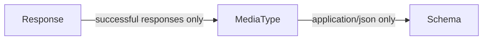

# Response contains property custom rule

Do you want to ensure your API responses contain a specific property (or multiple properties)?
A custom rule can verify the API definition has defined your desired properties.

Practical examples:

- `id` (or equivalent)
- `created_at` (or equivalent)
- `updated_at` (or equivalent)
- `_links` (or equivalent)

:::attention

If there are exceptions to the rule, the exceptions can be explicitly added to the ignore file.

:::

## Steps to writing the rule

1. Identify the type of object to visit. The rules follow the visitor pattern and traverses the tree of the OpenAPI definition.
    - The [Response](https://github.com/Redocly/openapi-cli/tree/master/packages/core/src/types) object is appropriate because we want to verify the property on the response (not on requests).
1. Find the relationship between the starting object and the property we must evaluate for our decision. (Sometimes this will be the same object as above.)
1. Craft the logic for the rule.
1. Report the problem.

### Identify the type of object to visit

Our rule is about making sure our response contains one or more properties.
Because schema are used in other areas of the specification, such as requests and parameters, we can't use `Schema` as the starting point of our rule.
Instead, we'll use the `Response` because our rule is specifically applying to the response schema.

### Traverse for evaluation



Based on that, our rule will look like this (before filling in the logic).

```js
module.exports = ResponseContainsProperty

/** @type {import('@redocly/openapi-cli').OasRule} */
function ResponseContainsProperty (options) {
  return {
    Response: {
      MediaType: {
        Schema (schema, { report, location }) {
        }
      }
    }
  }
};
```

### Craft the logic

While we could hard code the properties we want, it seems like it would be better to let those be configured in the `.redocly.yaml` file with a configurable option.

This sets the default options as `[]`.

```js
module.exports = ResponseContainsProperty

/** @type {import('@redocly/openapi-cli').OasRule} */
function ResponseContainsProperty (options) {
  const mustExist = options.mustExist || [];
  return {
    Response: {
// ...
```

We would configure this in our `.redocly.yaml` file like this:

```yaml
lint:
  rules:
    demo/response-contains-property:
      severity: warn
      mustExist:
        - email
        - createdAt
        - _links
```

Next, we'll add more logic.

We want to skip non-2XX messages, so we identify only the responses we don't want to skip, and use the `skip` predicate method.
We also skip 204 messages, because those requests have no response content.

```js
skip: (_response, key) => {
  return !['200', '201', '202'].includes(key.toString());
},
```

Next, we want our rule to only apply to when the `MediaType` content-type is `application/json` to avoid binary files.
We'll skip any responses that don't have the `application/json` content-type.

```js
skip: (_media, key) => {
  return key !== 'application/json';
},
```
Next, we'll start to inspect the schema for our configured properties.
However, properties are parts of objects, so if the response schema is anything other than an object, we won't be able to inspect the property.

```js
Schema (schema, { report, location }) {
  if (schema.type !== 'object') return;
```

Finally, our actual validation logic...

```js
for (let element of mustExist) {
  if (!schema.properties[element]) {
    // This is a problem we need to report...
  }
}
```

### Report the problem

We must specify a message when we report the problem.
In addition, we can adjust the location so the context of the code frame reported is most appropriate.

```js
report({
  message: `Response object must have a top-level "${element}" property.`,
  location: location.child('properties'),
});
```

## Putting it all together

You can copy/paste this to try it out.

1. Your `.redocly.yaml` file should be inside of the root repository directory.
1. Then, create a directory `plugins` inside of your root repository directory.
  The `demo-plugin.js` file should go inside of that directory.
1. Create a `rules` directory inside of the `plugins` directory. Place the `response-contains-property.js` file there.

```js response-contains-property.js
module.exports = ResponseContainsProperty

/** @type {import('@redocly/openapi-cli').OasRule} */
function ResponseContainsProperty (options) {
  const mustExist = options.mustExist || [];
  return {
    Response: {
      skip: (_response, key) => {
        return !['200', '201', '202'].includes(key.toString());
      },
      MediaType: {
        skip: (_media, key) => {
          return key !== 'application/json';
        },
        Schema (schema, { report, location }) {
          if (schema.type !== 'object') return;

          for (let element of mustExist) {
            if (!schema.properties[element]) {
              report({
                message: `Response object must have a top-level "${element}" property.`,
                location: location.child('properties'),
              });
            }
          }
        }
      }
    }
  }
};
```

```js demo-plugin.js
const ResponseContainsProperty = require('./rules/response-contains-property');
const id = 'demo';

/** @type {import('@redocly/openapi-cli').CustomRulesConfig} */
const rules = {
  oas3: {
    'response-contains-property': ResponseContainsProperty,
  },
};

module.exports = {
  id,
  rules,
};
```

```yaml .redocly.yaml
# See https://redoc.ly/docs/cli/configuration/ for more information.
apiDefinitions:
  internal: openapi/internal.yaml
  main: openapi/external.yaml
lint:
  extends:
    - recommended
  plugins:
    - './plugins/demo-plugin.js'
  rules:
    demo/response-contains-property:
      severity: warn
      mustExist:
        - email
        - createdAt
        - _links
referenceDocs:
  htmlTemplate: ./docs/index.html
  theme:
    colors:
      primary:
        main: "#32329f"
```

Now that you've followed along in the creation of a rule, you can try to craft your own.
What if all requests should have a particular header parameter?

Please let us know what you build. We would love to hear from you.

Also, if you have ideas but unsure how to implement them, contact us.
