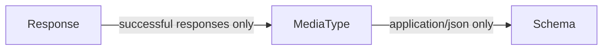

# Check that response contains property custom rule

With a custom rule, you can verify that the API definition contains a specific property (or multiple properties).

Examples:

- `id` (or equivalent)
- `created_at` (or equivalent)
- `updated_at` (or equivalent)
- `_links` (or equivalent)

:::attention

If there are exceptions to the rule, the exceptions can be explicitly added to the ignore file.

:::

## Steps

1. [Identify the type of object to visit](#identify-the-type-of-object-to-visit). The rules follow the visitor pattern and traverse the tree of the OpenAPI definition.
    - The [Response](https://github.com/Redocly/openapi-cli/tree/master/packages/core/src/types) object is valid as you want to verify the property on the response, not on request.
1. Find relationship between the starting object and the property you must evaluate for the decision. Sometimes, it is the same object as above.
1. [Define the logic for the rule.](#define-the-logic)
1. Report the problem.

### Identify the type of object to visit

As the title says, this guide is about a rule that ensures that the response contains one or more properties. As a result, you cannot use `Schema` as the starting point of your rule because it is used in other areas of the specification, such as requests and parameters.

Instead, you can use the `Response` for the rule because it is specifically applies to the response schema.

### Traverse for evaluation



Based on the diagram, your rule will look as follows (before filling in the logic):

```js
module.exports = ResponseContainsProperty

/** @type {import('@redocly/openapi-cli').OasRule} */
function ResponseContainsProperty (options) {
  return {
    Response: {
      MediaType: {
        Schema (schema, { report, location }) {
        }
      }
    }
  }
};
```

### Define the logic

While you could hardcode the properties you want, it is better to allow configuration of these properties from the Redocly configuration file.

This sets the default options as `[]`.

```js
module.exports = ResponseContainsProperty

/** @type {import('@redocly/openapi-cli').OasRule} */
function ResponseContainsProperty (options) {
  const mustExist = options.mustExist || [];
  return {
    Response: {
// ...
```

So the configuration in the Redocly configuration file would look as follows:

```yaml
lint:
  rules:
    demo/response-contains-property:
      severity: warn
      mustExist:
        - email
        - createdAt
        - _links
```

Let's add more logic.

For example, skip non-2XX messages. To do this, you identify only the responses you don't want to skip, and use the `skip` predicate method.

It is good to skip 204 messages as well, because those requests have no response content.

```js
skip: (_response, key) => {
  return !['200', '201', '202'].includes(key.toString());
},
```

Next, let's apply the rule only when the `MediaType` content-type is `application/json` (to avoid binary files). Let's also skip any responses that don't have the `application/json` content-type.

```js
skip: (_media, key) => {
  return key !== 'application/json';
},
```

Next, let's start to inspect the schema for the configured properties.
As properties are parts of objects, you should filter out the cases when the response schema is anything other than an object. Otherwise, you won't be able to inspect the property.

```js
Schema (schema, { report, location }) {
  if (schema.type !== 'object') return;
```

Finally, the actual validation logic:

```js
for (let element of mustExist) {
  if (!schema.properties[element]) {
    // This is a problem we need to report...
  }
}
```

### Report the problem

You must specify a message when reporting the problem.
In addition, you can adjust the location to ensure that the context of the code frame reported is the most appropriate.

```js
report({
  message: `Response object must have a top-level "${element}" property.`,
  location: location.child('properties'),
});
```

### Putting it all together

You can copy/paste the code below to try it out.

1. Make sure your Redocly configuration file is located in the root repository directory.
1. Inside the root repository directory, create the `plugins` directory.
1. Add the `demo-plugin.js` file to the `plugins` directory.
1. Inside the `plugins` directory, create the `rules` directory.
1. Add the `response-contains-property.js` file to the `rules` directory.

As a result, your repository hierarchy should look as follows:

```
.
├── plugins
│   ├── rules
│   │   └── response-contains-property.js
│   └── demo-plugin.js
└── .redocly.yaml
```

```js response-contains-property.js
module.exports = ResponseContainsProperty

/** @type {import('@redocly/openapi-cli').OasRule} */
function ResponseContainsProperty (options) {
  const mustExist = options.mustExist || [];
  return {
    Response: {
      skip: (_response, key) => {
        return !['200', '201', '202'].includes(key.toString());
      },
      MediaType: {
        skip: (_media, key) => {
          return key !== 'application/json';
        },
        Schema (schema, { report, location }) {
          if (schema.type !== 'object') return;

          for (let element of mustExist) {
            if (!schema.properties[element]) {
              report({
                message: `Response object must have a top-level "${element}" property.`,
                location: location.child('properties'),
              });
            }
          }
        }
      }
    }
  }
};
```

```js demo-plugin.js
const ResponseContainsProperty = require('./rules/response-contains-property');
const id = 'demo';

/** @type {import('@redocly/openapi-cli').CustomRulesConfig} */
const rules = {
  oas3: {
    'response-contains-property': ResponseContainsProperty,
  },
};

module.exports = {
  id,
  rules,
};
```

```yaml Configuration file
# See https://redocly.com/docs/cli/configuration/ for more information.
apis:
  internal:
    root: openapi/internal.yaml
  main:
    root: openapi/external.yaml
lint:
  extends:
    - recommended
  plugins:
    - './plugins/demo-plugin.js'
  rules:
    demo/response-contains-property:
      severity: warn
      mustExist:
        - email
        - createdAt
        - _links
features.openapi:
  htmlTemplate: ./docs/index.html
  theme:
    colors:
      primary:
        main: "#32329f"
```

Now that you've followed along in the creation of a rule, you can try to create your own.
What if all requests should have a particular header parameter?

Please let us know what you build. We would love to hear from you.

Also, if you have ideas but are unsure how to implement them, feel free to contact us.
