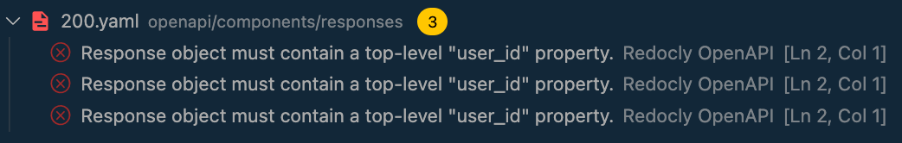
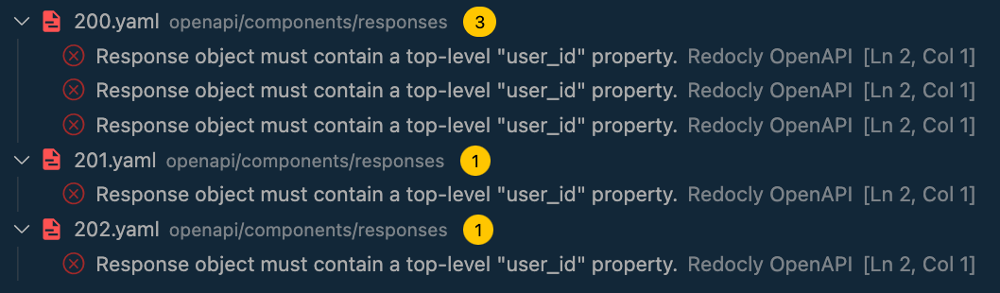
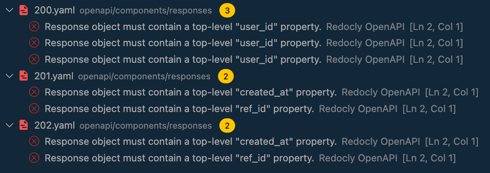

# Enforce response contents with the `response-contains-property` rule

## Overview

This guide describes how to ensure that the API operation's response [contains a specific property](../rules/response-contains-property.md)
with three different cases:

1. Single response containing one property
1. Multiple responses containing one property
1. Multiple responses containing multiple properties

Let's get started!

## Before you begin

- [Use the openapi-starter repository](../openapi-starter.md) to set up a basic project that we will use for this guide.
- [Download the modified project files](https://gist.github.com/bandantonio/c6047e3ee70c90da013a2f8e6757edb0) and use them to
replace the corresponding files in the `openapi` folder:

```bash
.
└── openapi
    ├── components
    │   └── responses
    │       ├── 200.yaml
    │       ├── 201.yaml
    │       └── 202.yaml
    └── paths
        ├── path-item-with-examples.yaml
        ├── path-item.yaml
        └── users_{username}.yaml
```

:::note
Make sure that the @redocly/cli has version `1.0.0-beta.99` or later
:::

- If you're using VS Code as your favorite code editor, we recommend you install the [Redocly OpenAPI VS Code extension](../../redocly-openapi/index.md).

:::note We do, You do
This guide is most effective when you follow along and complete the steps.
:::

## Case 0 - Check that the current OpenAPI definition is valid

After downloading the `openapi-starter` repository, ensure that you installed the project's dependencies via `npm install`.

Once completed, in the project folder, execute the `npx redocly lint` command. You should receive confirmation that the OpenAPI definition is valid:

```bash
npx redocly lint

validating /openapi/openapi.yaml...
/openapi/openapi.yaml: validated in 39ms

Woohoo! Your OpenAPI definition is valid. 🎉
```

Now you are ready to configure the rules.

## Case 1 - Single response containing one property

Imagine that your API definition describes users' data, and it should have `user_id` as a part of
all successful (`200`) responses. Let's define this.

1. Open the `.redocly.yaml` in the project folder
1. After the line 9, add the rule configuration block:

```yaml .redocly.yaml
rules:
  no-unused-components: error
  response-contains-property:
    severity: error
    names:
      200:
        - user_id
```

```bash npx redocly lint
npx redocly lint

validating /openapi/openapi.yaml...
[1] openapi/components/responses/200.yaml:2:1 at #/properties

Response object must contain a top-level "user_id" property.

...

Error was generated by the response-contains-property rule.


[2] openapi/components/responses/200.yaml:2:1 at #/properties

Response object must contain a top-level "user_id" property.

...

Error was generated by the response-contains-property rule.


[3] openapi/components/responses/200.yaml:2:1 at #/properties

Response object must contain a top-level "user_id" property.

...

Error was generated by the response-contains-property rule.


/openapi/openapi.yaml: validated in 51ms

❌ Validation failed with 3 errors.
run `openapi lint --generate-ignore-file` to add all problems to the ignore file.
```

If you're using the Redocly OpenAPI extension for VS Code, this is how the lint errors look
in the integrated terminal (Problems tab):



**What does the lint output mean**

As you can see from the output, the rule triggered an error in the `200.yaml` file
indicating there is no `user_id` property for `200` responses.

Three "copies" of the error mean that there are three $refs within the OpenAPI definition
that refer to the `200` response schema object.

## Case 2 - Multiple responses containing one property

When you want to check that your OpenAPI definition contains property in all responses
of a specific [class](https://en.wikipedia.org/wiki/List_of_HTTP_status_codes), you can use ranges.

Let's modify the previous example to check that all `2xx` responses contain the `user_id` property.

```yaml .redocly.yaml
rules:
  no-unused-components: error
  response-contains-property:
    severity: error
    names:
      2xx:
        - user_id
```

```bash npx redocly lint
npx redocly lint

validating /openapi/openapi.yaml...
[1] openapi/components/responses/200.yaml:2:1 at #/properties

Response object must contain a top-level "user_id" property.

...

Error was generated by the response-contains-property rule.


[2] openapi/components/responses/201.yaml:2:1 at #/properties

Response object must contain a top-level "user_id" property.

...

Error was generated by the response-contains-property rule.


[3] openapi/components/responses/202.yaml:2:1 at #/properties

Response object must contain a top-level "user_id" property.

...

Error was generated by the response-contains-property rule.


[4] openapi/components/responses/200.yaml:2:1 at #/properties

Response object must contain a top-level "user_id" property.

...

Error was generated by the response-contains-property rule.


[5] openapi/components/responses/200.yaml:2:1 at #/properties

Response object must contain a top-level "user_id" property.

...

Error was generated by the response-contains-property rule.


/openapi/openapi.yaml: validated in 71ms

❌ Validation failed with 5 errors.
run `openapi lint --generate-ignore-file` to add all problems to the ignore file.
```

If you're using the Redocly OpenAPI extension for VS Code, this is how the lint errors look
in the integrated terminal (Problems tab):


 
**What does the lint output mean**

There are three `2xx` class responses defined for this guide, and you can see that the rule
has successfully triggered errors with the missing `user_id` property for all of them.

Yet, three $refs within the OpenAPI definition refer to the `200` response
schema object and one $ref refers to each of the `201` and `202` responses, resulting in
5 errors in total

## Case 3 - Multiple responses containing multiple properties

Imagine that your API evolves, and in addition to `user_id` for successful (`200`) responses, it
should have `created_at` and `ref_id` properties for all other `2xx` responses. Let's define this.

```yaml .redocly.yaml
rules:
  no-unused-components: error
  response-contains-property:
    severity: error
    names:
      200:
        - user_id
      2xx:
        - created_at
        - ref_id
```


```bash npx redocly lint
npx redocly lint

validating /openapi/openapi.yaml...
[1] openapi/components/responses/200.yaml:2:1 at #/properties

Response object must contain a top-level "user_id" property.

...

Error was generated by the response-contains-property rule.


[2] openapi/components/responses/201.yaml:2:1 at #/properties

Response object must contain a top-level "created_at" property.

...

Error was generated by the response-contains-property rule.


[3] openapi/components/responses/201.yaml:2:1 at #/properties

Response object must contain a top-level "ref_id" property.

...

Error was generated by the response-contains-property rule.


[4] openapi/components/responses/202.yaml:2:1 at #/properties

Response object must contain a top-level "created_at" property.

...

Error was generated by the response-contains-property rule.


[5] openapi/components/responses/202.yaml:2:1 at #/properties

Response object must contain a top-level "ref_id" property.

...

Error was generated by the response-contains-property rule.


[6] openapi/components/responses/200.yaml:2:1 at #/properties

Response object must contain a top-level "user_id" property.

...

Error was generated by the response-contains-property rule.


[7] openapi/components/responses/200.yaml:2:1 at #/properties

Response object must contain a top-level "user_id" property.

...

Error was generated by the response-contains-property rule.


/openapi/openapi.yaml: validated in 50ms

❌ Validation failed with 7 errors.
run `openapi lint --generate-ignore-file` to add all problems to the ignore file.
```

If you're using the Redocly OpenAPI extension for VS Code, this is how the lint errors look
in the integrated terminal (Problems tab):



**What does the lint output mean**

In this example, as there are multiple properties to check within the same response class,
the **properties defined in a more specific status code take priority** over the properties defined
in a status code range.

As a result, the `user_id` is checked exclusively within the `200` status codes
(that have three reference points), whereas `created_at` and `ref_id` are checked within
the rest of the `2xx` status codes (`201` and `202`, which have one reference point each),
resulting in 7 errors in total.
