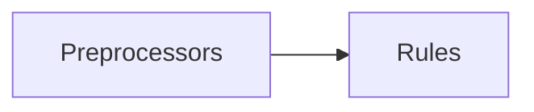

# Redocly OpenAPI CLI

## Overview

Redocly OpenAPI CLI is an open-source command-line tool used to:

- Lint and bundle your OpenAPI definition(s).
- Split single-file OpenAPI files into a multi-file format.
- Preview reference docs for local development.
- Integrate with Redocly's API registry.
- Build production-ready reference docs (requires an Enterprise license key).

:::success Useful tip
You can also [extend](custom-rules.md) the functionality of Redocly OpenAPI CLI by dynamically adding
or removing content during the bundling process using decorators or by defining your own rules to validate OpenAPI definitions
:::

## Features

Currently, Redocly OpenAPI CLI supports these features:

- ✅ Multi-file validation. No need to bundle your files before validation.
- ✅ Lightning-fast validation. Check a 1 MB file in less than one second.
- ✅ Support for remote `$ref`s. Reference a definition hosted on any location.
- ✅ Bundle a multi-file definition into a single file for compatibility with external tools.
- ✅ Configurable severity levels for each rule. Fine tune Redocly OpenAPI CLI to suit your needs.
- ✅ Human-readable error messages. Now with stacktraces and codeframes.
- ✅ Intuitive suggestions for misspelled types or references. No error will pass you by.
- ✅ Easy-to-implement custom rules. Need something? Ask us or do it yourself.
- ✅ Preview reference docs. Writing OpenAPI documents has never been easier.
- ✅ Support for OAS 3.1 and Swagger 2.0.

## Why Redocly OpenAPI CLI?

### Performance

Unlike other OpenAPI validators, Redocly OpenAPI CLI defines the possible type tree of a valid OpenAPI definition and then traverses it. This approach is very similar to how compilers work, and results in major performance benefits over other approaches.

### Extensibility

Redocly OpenAPI CLI comes with a set of built-in rules, but you can extend its functionality by creating your own rules. Both the lint and the bundle features follow the [visitor pattern](https://en.wikipedia.org/wiki/Visitor_pattern) for adding custom behavior on the parsed object.

### Lint

### Bundle

## Contributions

The source code is available in the [OpenAPI-CLI GitHub repository](https://github.com/Redocly/openapi-cli).
