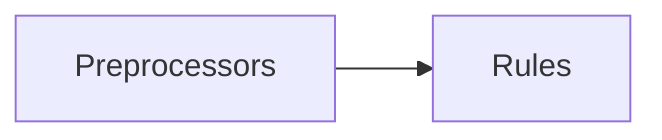
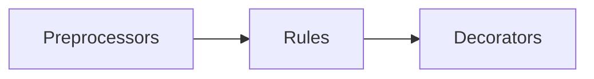
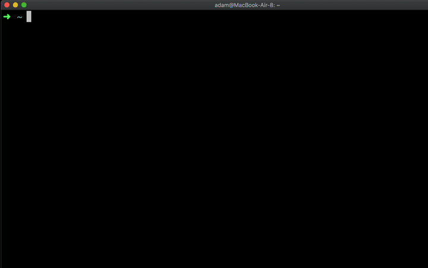

# Redocly OpenAPI CLI

Redocly OpenAPI CLI is an open source command-line tool used to:

- Lint and bundle your OpenAPI definition(s).
- Decorate your APIs (add or remove data).
- Preview reference docs for local development.
- Split single-file OpenAPI files into a multi-file format.
- Integrate with Redocly's API registry.
- Build production-ready reference docs (requires an Enterprise license key).


Redocly OpenAPI CLI can be:

- Extended by writing [custom rules and decorators](custom-rules.md).


## Features

Currently, Redocly OpenAPI CLI supports these features:

- [x] Multi-file validation. No need to bundle your files before validation.
- [x] Support for remote `$ref`s.
- [x] Configurable severity levels for each rule. Tailor your experience with Redocly OpenAPI CLI to suit your needs.
- [x] Lightning-fast validation. Check a 1 MB file in less than one second.
- [x] Human-readable error messages. Now with stacktraces and codeframes.
- [x] Intuitive suggestions for misspelled types or references.
- [x] Easy-to-implement custom rules. Need something? Ask us or do it yourself.
- [x] Bundle a multi-file definition into a single file for compatibility with external tools.
- [x] Preview reference docs.
- [x] Support for OAS 3.0 and Swagger 2.0 (OAS 3.1 is coming soon).


## What makes Redocly OpenAPI CLI different

Unlike other OpenAPI validators, Redocly OpenAPI CLI defines the possible type tree of a valid OpenAPI definition and then traverses it. This approach is very similar to how compilers work, and results in major performance benefits over other approaches.

Redocly OpenAPI CLI comes with a set of built-in rules, but you can extend its functionality by creating your own rules. Both the lint and the bundle features follow the [visitor pattern](https://en.wikipedia.org/wiki/Visitor_pattern) for adding custom behavior on the parsed object.


### Lint



### Bundle



## Installation and usage

You can install and use OpenAPI CLI in any of these ways:

- `npx` (NPM's package runner)
- `npm -g` (NPM's global installation)
- `npm` (NPM as a package local to a project)
- `yarn global` (Yarn's global installation)
- `yarn` (Yarn as a package local to a project)
- `docker` (use a Docker image)

### Global installations

**Install globally with npm**

<div class="attention">This is the recommended installation method.</div>

`npm install -g @redocly/openapi-cli@latest`



**Install globally with yarn**

`yarn global add @redocly/openapi-cli`

**Verify your global installation**

After installing it globally, run `openapi --version` to confirm the installation was successful.


#### Set up tab completion

OpenAPI CLI supports the tab completion functionality.

To set it up for your terminal, generate the completion script with the command:

```shell
openapi completion
```

The command output contains installation instructions. For example, to install the completion script in **bash**, use:

```shell
openapi completion >> ~/.bashrc
```

The approach is similar for other shells. After the installation, restart your terminal for changes to take effect.


### Runtime installations

**Install and use with npx**

NPX is NPM's package runner.
It will install and run a command at the same time (without installing it globally).

`npx @redocly/openapi-cli <command> [options]`

Here is a sample command:

```shell
npx @redocly/openapi-cli@latest lint
```

**Install and use with docker**

To give the Docker container access to the OpenAPI definition files, you need to mount the containing directory as a volume. Assuming the OAS definition is rooted in the current working directory, you need the following command:

```
docker run --rm -v $PWD:/spec redocly/openapi-cli lint path-to-root-file.yaml
```

### Using OpenAPI CLI commands

Read more about [supported commands in Redocly OpenAPI CLI](./commands.md).

### Contributions

The source code is available in the [OpenAPI-CLI GitHub repository](https://github.com/Redocly/openapi-cli).
