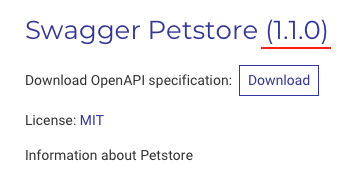

# Redocly OpenAPI CLI quickstart guide

## Before you start

1. [Install](installation.md) the OpenAPI CLI tool.

## Step 1 - Prepare your API definition file

Once you installed the tool, let's dive into what you can do with it.

For testing and demonstration purposes, we will use an example OpenAPI definition file (provided below). Save it to your computer as `petstore.yaml`.

```yaml Example OpenAPI definition file
openapi: "3.0.0"
info:
  version: 1.0.0
  title: Swagger Petstore
  description: Information about Petstore
  license:
    name: MIT
    url: https://opensource.org/licenses/MIT
servers:
  - url: http://petstore.swagger.io/v1
paths:
  /pets:
    get:
      summary: List all pets
      operationId: listPets
      tags:
        - pets
      parameters:
        - name: limit
          in: query
          description: How many items to return at one time (max 100)
          required: false
          schema:
            type: integer
            format: int
      responses:
        200:
          description: An paged array of pets
          headers:
            x-next:
              description: A link to the next page of responses
              schema:
                type: string
          content:
            application/json:
              schema:
                $ref: "#/components/schemas/Pets"
        default:
          description: unexpected error
          content:
            application/json:
              schema:
                $ref: "#/components/schemas/Error"
    post:
      summary: Create a pet
      operationId: createPets
      tags:
        - pets
      responses:
        201:
          description: Null response
        default:
          description: unexpected error
          content:
            application/json:
              schema:
                $ref: "#/components/schemas/Error"
  /pets/{petId}:
    get:
      summary: Info for a specific pet
      operationId: showPetById
      tags:
        - pets
      parameters:
        - name: petId
          in: path
          required: true
          description: The id of the pet to retrieve
          schema:
            type: string
      responses:
        200:
          description: Expected response to a valid request
          content:
            application/json:
              schema:
                $ref: "#/components/schemas/Pets"
        default:
          description: unexpected error
          content:
            application/json:
              schema:
                $ref: "#/components/schemas/Error"
components:
  schemas:
    Pet:
      required:
        - id
        - name
      properties:
        id:
          type: integer
          format: int64
        name:
          type: string
        tag:
          type: string
    Pets:
      type: array
      items:
        $ref: "#/components/schemas/Pet"
    Error:
      required:
        - code
        - message
      properties:
        code:
          type: integer
          format: int32
        message:
          type: string
```

## Step 2 - Try basic commands

### stats - get a short summary about your definition files

With this command, you can get short statistics about the structure of one or more API definition files.

In your terminal, type the following:

```bash
$ openapi stats petstore.yaml
```

You should get the following response:

```bash
$ openapi stats petstore.yaml
Document: petstore.yaml stats:

🚗 References: 3
📦 External Documents: 0
📈 Schemas: 3
👉 Parameters: 2
🔗 Links: 0
➡️ Path Items: 2
👷 Operations: 3
🔖 Tags: 1

petstore.yaml: stats processed in 10ms
```

Okay, now you know some basic information about your definition. But, is it valid? Are you sure that it doesn't contain errors and will be processed properly in your environment? No, you don't. We don't either. Let's check it.

### lint - validate your definition files

With this command, you ensure that your OpenAPI definition files do not contain errors and have a valid structure according to the specification.

In your terminal, type the following:

```bash
$ openapi lint petstore.yaml
```

You should get the following response:

```bash
$ openapi lint petstore.yaml
No configurations were defined in extends -- using built in recommended configuration by default.

validating petstore.yaml...
petstore.yaml: validated in 59ms

Woohoo! Your OpenAPI definition is valid. 🎉
```

That's great, but how does lint work when it detects errors? And what exactly is the error? To figure this out, let's introduce an error to our definition file and check the output.

1. Open your `petstore.yaml` file
1. Navigate to line #15: `operationId: listPets`
1. Change `operationId` to `operationIdentifier`
1. Save your `petstore.yaml` file
1. Run linter `$ openapi lint petstore.yaml`

You should get the following response:

```bash Full listing
validating petstore.yaml...
[1] petstore.yaml:15:7 at #/paths/~1pets/get/operationIdentifier

Property `operationIdentifier` is not expected here.

13 | get:
14 |   summary: List all pets
15 |   operationIdentifier: listPets
16 |   tags:
17 |     - pets

Error was generated by the spec rule.


[2] petstore.yaml:14:7 at #/paths/~1pets/get

Operation object should contain `operationId` field.

12 | /pets:
13 |   get:
14 |     summary: List all pets
15 |     operationIdentifier: listPets
 … |     < 27 more lines >
43 |               $ref: "#/components/schemas/Error"
44 |   post:
45 |     summary: Create a pet

Warning was generated by the operation-operationId rule.


petstore.yaml: validated in 70ms

❌ Validation failed with 1 error and 1 warning.
run with `--generate-ignore-file` to add all problems to ignore file.
```

```bash Error
[1] petstore.yaml:15:7 at #/paths/~1pets/get/operationIdentifier

Property `operationIdentifier` is not expected here.

13 | get:
14 |   summary: List all pets
15 |   operationIdentifier: listPets
16 |   tags:
17 |     - pets

Error was generated by the spec rule.
```

```bash Warning
[2] petstore.yaml:14:7 at #/paths/~1pets/get

Operation object should contain `operationId` field.

12 | /pets:
13 |   get:
14 |     summary: List all pets
15 |     operationIdentifier: listPets
 … |     < 27 more lines >
43 |               $ref: "#/components/schemas/Error"
44 |   post:
45 |     summary: Create a pet

Warning was generated by the operation-operationId rule.
```

Why did you get it? When you execute the `lint` command, OpenAPI CLI runs a large number of *rule-based* tests to verify that your definition file is correct. A rule is an atomic piece of code to check a particular part of the definition file. OpenAPI CLI ships a set of built-in rules but you can also define your own. However, to check something for validity, you must have a source of truth for what is considered valid or not. This source is the [OpenAPI Specification](https://spec.openapis.org/oas/latest.html). When you get an error, it means that one or more rules detected inconsistency of your definition file with the OpenAPI Specification.

Let's inspect the `lint` command output. As you can see, there is 1 error (point [1]) and 1 warning (point [2]). The information we are interested in is the following:

For the error:
* [1] petstore.yaml:15:7 (the error is somewhere at line 15 near the 7th symbol)
* Property `operationIdentifier` is not expected here (unexpected property)
* Error was generated by the spec rule (a rule that detected the error)

For the warning:
* [1] petstore.yaml:14:7 (the error is somewhere at line 14 near the 7th symbol)
* Operation object should contain `operationId` field (there should be a particular field here)
* Warning was generated by the operation-operationId rule (a rule that detected the warning)

You got that error because you've changed a property that is strictly defined in the specification. The linter has the [`spec`](./built-in-rules.md#spec) built-in rule that generates an error each time when it finds something that is not defined in the specification.

The warning is a consequence of the error - when you changed the `operationId`, you also changed the object that this property is a part of - the [Operation object](https://spec.openapis.org/oas/latest.html#operation-object). Since the `operationId` is no longer there, you get a warning triggered by the corresponding built-in rule - [operation-operationId](./built-in-rules.md#operation-operationid).

Let's make your definition valid again. Look at the defined Field Names of the [Operation object](https://spec.openapis.org/oas/latest.html#operation-object) (after the warning description). Detect what's wrong with your definition file - there cannot be a Field Name with the `operationIdentifier` name (it is invalid). Change it back to the `operationId` and you're done. You will fix both the warning and the error because the unexpected property `operationIdentifier` is gone.

To check that everything is correct, run the `lint` command again:

```bash
$ openapi lint petstore.yaml
No configurations were defined in extends -- using built in recommended configuration by default.

validating petstore.yaml...
petstore.yaml: validated in 47ms

Woohoo! Your OpenAPI definition is valid. 🎉
```

Congratulations! You did a great job and now your OpenAPI definition is valid again!

### split - divide your large definition into smaller constituent parts

With this command, your OpenAPI definition file will be divided into constituent parts to follow the multi-file approach.

In your terminal, type the following:

```bash
$ openapi split petstore.yaml --outDir openapi
```

You should get the following response:

```bash
$ openapi split petstore.yaml --outDir openapi
Document: petstore.yaml is successfully split
 and all related files are saved to the directory: openapi

petstore.yaml: split processed in 44ms
```

Cool, split completed. But what actually happened?

Open the `openapi` directory. See? That's where the magic took place:

```bash
.
├── components
│   └── schemas
│       ├── Error.yaml
│       ├── Pet.yaml
│       └── Pets.yaml
├── paths
│   ├── pets.yaml
│   └── pets@{petId}.yaml
└── openapi.yaml
```

With the `split` command, you can easily switch to a [multi-file structure](./index.md#multi-file-approach) in a blink of an eye even if your definition file became extremely lengthy.

### bundle - pull constituent parts of the OpenAPI definition into a single file

With this command, you can merge standalone files back into a single definition file. `bundle` does the opposite of the [`split`](#split---divide-your-large-definition-into-smaller-constituent-parts) command.

Let's bundle the definition file that you split earlier.

In your terminal, type the following:

```bash
$ openapi bundle openapi/openapi.yaml --output bundled.yaml
```

You should get the following response:

```bash
$ openapi bundle openapi/openapi.yaml --output bundled.yaml
bundling openapi/openapi.yaml...
📦 Created a bundle for openapi/openapi.yaml at bundled.yaml 46ms.
```

You should now see a new `bundled.yaml` file as a result of the `bundle` command completion. Open this file in your text editor or IDE and compare it with the linted definition file. You can see that OpenAPI definition hasn't changed, which means that the `bundle` command executed flawlessly.

### preview-docs - preview your definition files quickly

With this command, you can generate a documentation preview for your OpenAPI definition file.

In your terminal, type the following:

```bash
$ openapi preview-docs petstore.yaml
```

You should get the following response:

```bash
$ openapi preview-docs petstore.yaml
Using Redoc community edition.
Login with openapi-cli login or use an enterprise license key to preview with the premium docs.


  🔎  Preview server running at http://127.0.0.1:8080

Bundling...


  👀  Watching petstore.yaml and all related resources for changes

Created a bundle for petstore.yaml successfully
```

Navigate to `http://127.0.0.1:8080` and check that your definition file has been served successfully.


This server supports live changes. Try to modify your definition file - the modifications will be visible in the preview immediately.

For example, change the version of your Swagger Petstore from `1.0.0` to `1.1.0`:

```yaml petstore.yaml
openapi: "3.0.0"
info:
  version: 1.1.0
  ...
```

You should get the following response:

```bash
watch changed petstore.yaml
watch changed /path-to-your-project/petstore.yaml

Bundling...

Created a bundle for petstore.yaml successfully
GET /: 4.337ms
GET /: 3.825ms
GET /hot.js: 27.698ms
GET /simplewebsocket.min.js: 42.654ms
GET /: 6.77ms
GET /hot.js: 1.639ms
GET /simplewebsocket.min.js: 14.528ms
GET /simplewebsocket.min.js: 1.47ms
GET /hot.js: 1.826ms
GET /openapi.json: 0.499ms
GET /openapi.json: 2.293ms
GET /openapi.json: 0.867ms
```

Navigate to `http://127.0.0.1:8080` and check the updated definition file.



## Next steps

- Check the full list of [OpenAPI CLI commands](./commands/index.md) available to you
- Learn how to fine-tune your OpenAPI CLI tool using a [configuraton file](./configuration/index.mdx)
- Learn more about [custom plugins and rules](./custom-rules.md)
