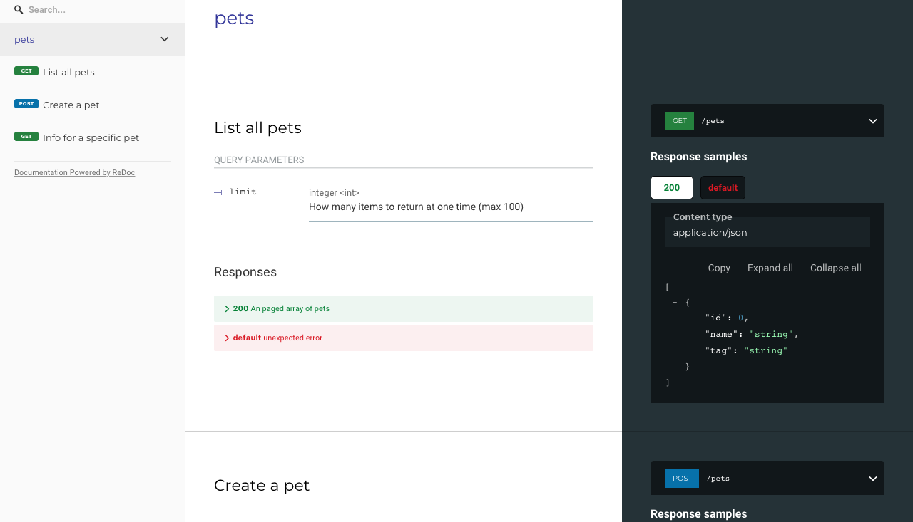

# Redocly CLI quickstart guide

Take your first steps with the Redocly CLI by following the steps in this guide.

Before you start:

- [Install the Redocly CLI](./installation.md) if you haven't already
- If you have an OpenAPI description to use, have it handy (we assume it's called `openapi.yaml`), or [try our example](https://github.com/Redocly/openapi-starter/blob/main/openapi/openapi.yaml)
- Create a new project folder and `cd` into the folder
- Git clone the [openapi-starter](https://github.com/Redocly/openapi-starter) repo in the new project folder


There's also an [openapi-starter](https://github.com/Redocly/openapi-starter) repository that you can clone and experiment with to get your bearings


## Preview API documentation

Redocly CLI has support for showing a preview of [Redoc](https://redocly.com/redoc/) rendering your API docs, which updates when the API description updates.
Run the command:

```bash
redocly preview-docs openapi.yaml
```

The output takes a few moments to build, and then lets you know the host and port where the preview server is running - usually `http://localhost:8080`.

Open that URL in your browser, and admire your lovely API documentation!



## Lint an OpenAPI description

The `lint` command is used to check that the OpenAPI description is compliant with a set of rules. You can define your own rules if you want to be specific, but to get started, try this:

```bash
redocly lint --extends minimal openapi.yaml
```

The output shows any aspects where the OpenAPI doesn't meet the standard. If you get too much output, try adding the `--format summary` parameter to the command.

Feeling brave and highly API compliant? Try the `recommended` standard instead and see how yours measures up.
