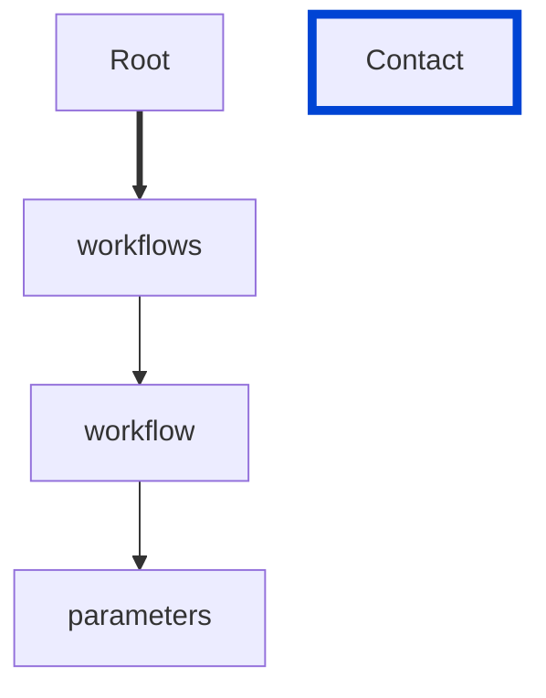
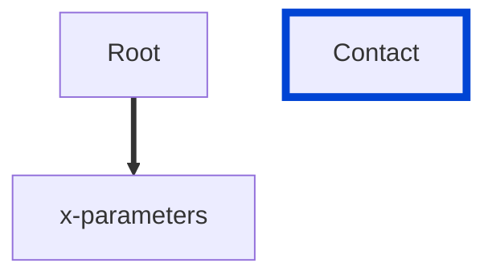
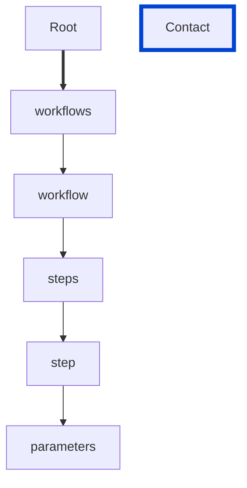

# parameters-unique

Requires the `parameters` list not to include duplicate parameters.

| ARAZZO | Compatibility |
| ------ | ------------- |
| 1.0.0  | ✅            |







## API design principles

A list of `parameters` that are applicable for step or all steps described under workflow should not be duplicated to avoid shallow parameter override.

## Configuration

| Option   | Type   | Description                                             |
| -------- | ------ | ------------------------------------------------------- |
| severity | string | Possible values: `off`, `warn`, `error`. Default `off`. |

An example configuration:

```yaml
arazzoRules:
  parameters-unique: error
```

## Examples

Given the following configuration:

```yaml
arazzoRules:
  parameters-unique: error
```

Example of an **incorrect** license:

```yaml Object example
workflows:
  - workflowId: get-museum-hours
    parameters:
      - in: header
        name: Authorization
        value: Main Og==
      - in: header
        name: Authorization
        value: Basic Og==
```

Example of a **correct** license:

```yaml Object example
workflows:
  - workflowId: get-museum-hours
    parameters:
      - in: header
        name: Authorization
        value: Basic Og==
      - in: header
        name: Auth
        value: Main Og==
```

## Related rules

## Resources

- [Rule source](https://github.com/Redocly/redocly-cli/blob/main/packages/core/src/rules/arazzo/parameters-unique.ts)
