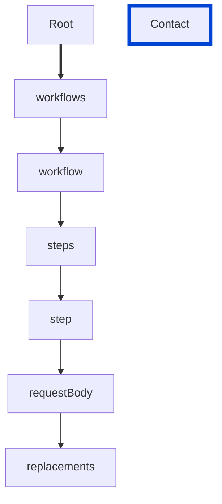

# requestBody-replacements-unique

Requires the `replacements` of the `requestBody` object to be unique.

| ARAZZO | Compatibility |
| ------ | ------------- |
| 1.0.0  | ✅            |



## API design principles

A list of locations and values to set within a payload must not have duplicates that might result in content override.

## Configuration

| Option   | Type   | Description                                             |
| -------- | ------ | ------------------------------------------------------- |
| severity | string | Possible values: `off`, `warn`, `error`. Default `off`. |

An example configuration:

```yaml
arazzoRules:
  requestBody-replacements-unique: error
```

## Examples

Given the following configuration:

```yaml
arazzoRules:
  requestBody-replacements-unique: error
```

Example of an **incorrect** license:

```yaml Object example
workflows:
  - workflowId: events-crud
    steps:
      - stepId: create-event
        operationPath: $sourceDescriptions.museum-api#/paths/~1special-events/post
        requestBody:
          payload:
            name: 'Mermaid Treasure Identification and Analysis'
            description: 'Identify and analyze mermaid treasures'
          replacements:
            - target: name
              value: 'new name'
            - target: name
              value: 'another name'
```

Example of a **correct** license:

```yaml Object example
workflows:
  - workflowId: events-crud
    steps:
      - stepId: create-event
        operationPath: $sourceDescriptions.museum-api#/paths/~1special-events/post
        requestBody:
          payload:
            name: 'Mermaid Treasure Identification and Analysis'
            description: 'Identify and analyze mermaid treasures'
          replacements:
            - target: name
              value: 'new name'
            - target: description
              value: 'another description'
```

## Resources

- [Rule source](https://github.com/Redocly/redocly-cli/blob/main/packages/core/src/rules/arazzo/requestBody-replacements-unique.ts)
