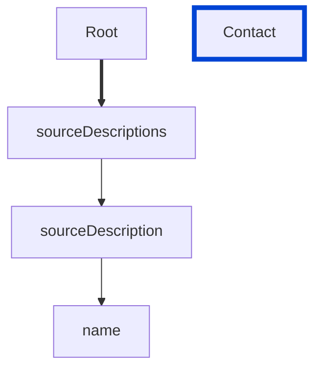

# sourceDescription-name-unique

Requires the `name` property of the `sourceDescription` object must be unique across all source descriptions.

| ARAZZO | Compatibility |
| ------ | ------------- |
| 1.0.0  | ✅            |



## API design principles

To avoid confusion, each `sourceDescription` object should have a unique `name` property.

## Configuration

| Option   | Type   | Description                                             |
| -------- | ------ | ------------------------------------------------------- |
| severity | string | Possible values: `off`, `warn`, `error`. Default `off`. |

An example configuration:

```yaml
arazzoRules:
  sourceDescription-name-unique: error
```

## Examples

Given the following configuration:

```yaml
arazzoRules:
  sourceDescription-name-unique: error
```

Example of an **incorrect** sourceDescription:

```yaml Object example
sourceDescriptions:
  - name: museum-api
    type: openapi
    url: ../openapi.yaml
  - name: museum-api
    type: openapi
    url: ../petstore.yaml
```

Example of a **correct** license:

```yaml Object example
sourceDescriptions:
  - name: museum-api
    type: openapi
    url: ../openapi.yaml
  - name: pets-api
    type: openapi
    url: ../petstore.yaml
```

## Related rules

- [sourceDescription-type](./sourceDescriptions-type.md)

## Resources

- [Rule source](https://github.com/Redocly/redocly-cli/blob/main/packages/core/src/rules/arazzo/sourceDescriptions-name-unique.ts)
