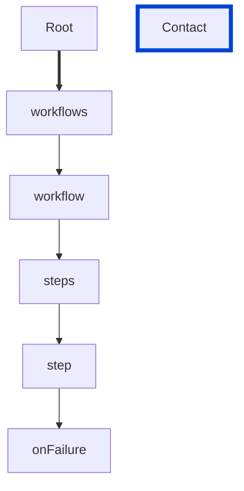

# step-onFailure-unique

Requires the `onFailure` actions of the `step` object to be unique.

| ARAZZO | Compatibility |
| ------ | ------------- |
| 1.0.0  | ✅            |



## API design principles

An array of failure action objects that specify what to do upon step failure.
Each `onFailure` action should be unique to avoid confusion.

## Configuration

| Option   | Type   | Description                                             |
| -------- | ------ | ------------------------------------------------------- |
| severity | string | Possible values: `off`, `warn`, `error`. Default `off`. |

An example configuration:

```yaml
arazzoRules:
  step-onFailure-unique: error
```

## Examples

Given the following configuration:

```yaml
arazzoRules:
  step-onFailure-unique: error
```

Example of an **incorrect** step:

```yaml Object example
workflows:
- workflowId: get-museum-hours
  description: This workflow demonstrates how to get the museum opening hours and buy tickets.
  steps:
    - stepId: get-museum-hours
      operationId: museum-api.getMuseumHours
      successCriteria:
        - condition: $statusCode == 200
      onFailure:
        - name: test
          workflowId: events-crud
          type: goto
        - name: test
          workflowId: events-crud
          type: goto
        - reference: $components.failureActions.notify
        - reference: $components.failureActions.notify
```

Example of a **correct** step:

```yaml Object example
workflows:
- workflowId: get-museum-hours
  description: This workflow demonstrates how to get the museum opening hours and buy tickets.
  steps:
    - stepId: get-museum-hours
      operationId: museum-api.getMuseumHours
      successCriteria:
        - condition: $statusCode == 200
      onFailure:
        - name: call-crud-events
          workflowId: events-crud
          type: goto
        - name: second-call-crud-events
          workflowId: events-crud
          type: goto
        - reference: $components.failureActions.notify
        - reference: $components.failureActions.report
```

## Related rules

- [step-onSuccess-unique](./step-onSuccess-unique.md)

## Resources

- [Rule source](https://github.com/Redocly/redocly-cli/blob/main/packages/core/src/rules/arazzo/step-onFailure-unique.ts)
