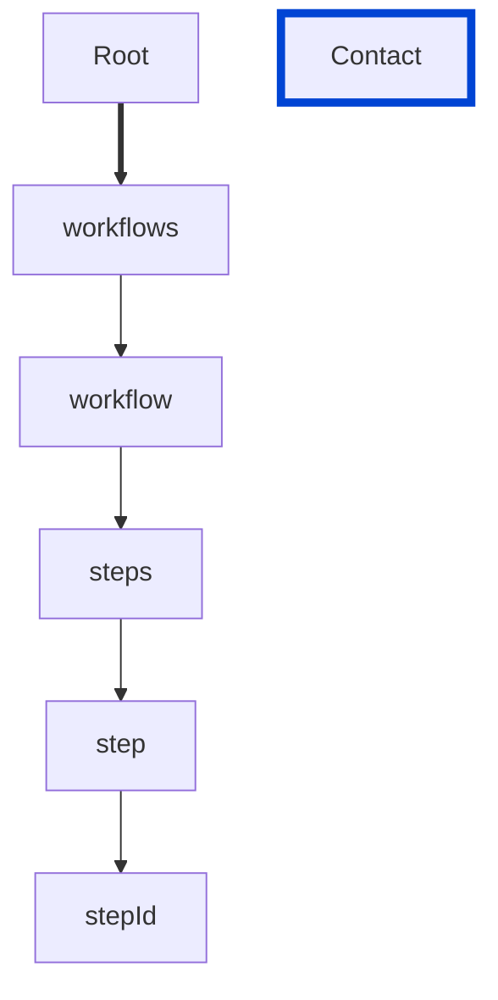

# stepId-unique

Requires the `stepId` to be unique amongst all steps described in the workflow.

| ARAZZO | Compatibility |
| ------ | ------------- |
| 1.0.0  | ✅            |



## API design principles

Unique string to represent the step. The `stepId` must be unique amongst all steps described in the workflow.
The stepId value is case-sensitive.

## Configuration

| Option   | Type   | Description                                             |
| -------- | ------ | ------------------------------------------------------- |
| severity | string | Possible values: `off`, `warn`, `error`. Default `off`. |

An example configuration:

```yaml
arazzoRules:
  stepId-unique: error
```

## Examples

Given the following configuration:

```yaml
arazzoRules:
  stepId-unique: error
```

Example of an **incorrect** step:

```yaml Object example
workflows:
  - workflowId: get-museum-hours-2
    description: This workflow demonstrates how to get the museum opening hours and buy tickets.
    steps:
      - stepId: get-museum-hours
        operationId: museum-api.getMuseumHours
        successCriteria:
          - condition: $statusCode == 200
      - stepId: get-museum-hours
        operationId: museum-api.getMuseumHours
        successCriteria:
          - condition: $statusCode == 200
```

Example of a **correct** step:

```yaml Object example
workflows:
  - workflowId: get-museum-hours-2
    description: This workflow demonstrates how to get the museum opening hours and buy tickets.
    steps:
      - stepId: get-museum-hours
        operationId: museum-api.getMuseumHours
        successCriteria:
          - condition: $statusCode == 200
      - stepId: another-step-id
        operationId: museum-api.getMuseumHours
        successCriteria:
          - condition: $statusCode == 200
```

## Resources

- [Rule source](https://github.com/Redocly/redocly-cli/blob/main/packages/core/src/rules/arazzo/stepId-unique.ts)
