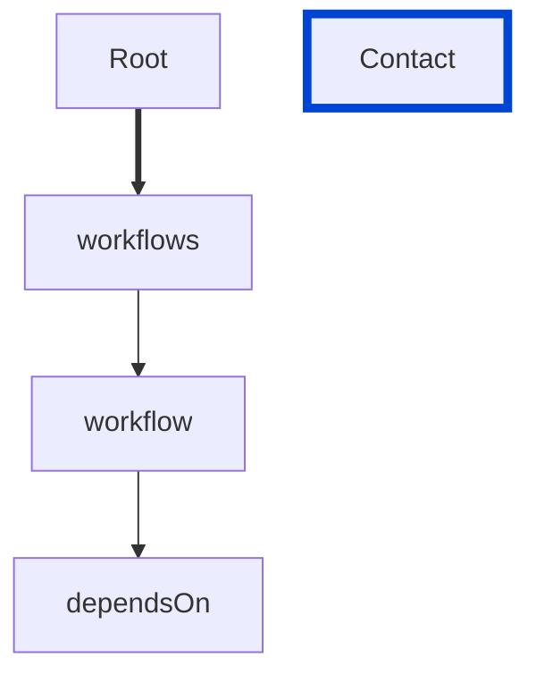

# workflow-dependsOn

Requires the items in the `workflow` `dependsOn` property to exist and to be unique.

| ARAZZO | Compatibility |
| ------ | ------------- |
| 1.0.0  | ✅            |



## API design principles

A list of workflows that should be completed before current workflow can be processed.
To avoid ambiguity or potential clashes, the `dependsOn` property should be unique.

## Configuration

| Option   | Type   | Description                                             |
| -------- | ------ | ------------------------------------------------------- |
| severity | string | Possible values: `off`, `warn`, `error`. Default `off`. |

An example configuration:

```yaml
arazzoRules:
  workflow-dependsOn: error
```

## Examples

Given the following configuration:

```yaml
arazzoRules:
  stepId-unique: error
```

Example of an **incorrect** step:

```yaml Object example
workflows:
    - workflowId: get-museum-hours
      description: This workflow demonstrates how to get the museum opening hours and buy tickets.
      dependsOn:
        - get-museum-hours-2
        - get-museum-hours-3
        - get-museum-hours-2
```

Example of a **correct** step:

```yaml Object example
workflows:
    - workflowId: get-museum-hours
      description: This workflow demonstrates how to get the museum opening hours and buy tickets.
      dependsOn:
        - get-museum-hours-2
        - get-museum-hours-3
```

## Resources

- [Rule source](https://github.com/Redocly/redocly-cli/blob/main/packages/core/src/rules/arazzo/workflow-dependsOn.ts)
