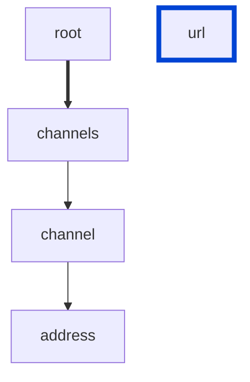

# channels-kebab-case

Channel address should be `kebab-case` (lowercase with hyphens).

| AsyncAPI | Compatibility |
| -------- | ------------- |
| 2.0      | ✅            |
| 3.0      | ✅            |



## API design principles

Channel address should be `kebab-case` (lowercase with hyphens).

## Configuration

| Option   | Type   | Description                                             |
| -------- | ------ | ------------------------------------------------------- |
| severity | string | Possible values: `off`, `warn`, `error`. Default `off`. |

An example configuration:

```yaml
rules:
  channels-kebab-case: error
```

## Examples

Given the following configuration:

```yaml
rules:
  channels-kebab-case: error
```

Example of an **incorrect** channel:

```yaml
channels:
  channel1:
    address: /NOT_A_KEBAB/
    payload:
      type: object
```

Example of a **correct** channel:

```yaml
channels:
  channel1:
    address: kebab-with-longer-channel-path
    payload:
      type: object
```

## Resources

- [Rule source async3](https://github.com/Redocly/redocly-cli/blob/main/packages/core/src/rules/async3/channels-kebab-case.ts)
- [Rule source async2](https://github.com/Redocly/redocly-cli/blob/main/packages/core/src/rules/async2/channels-kebab-case.ts)
