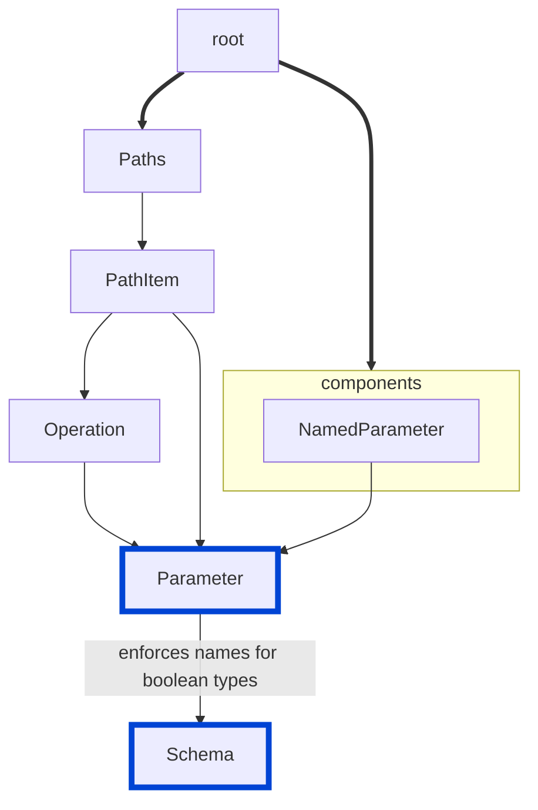

# boolean-parameter-prefixes

Enforces specific and consistent naming for request parameters with `boolean` type.
When this rule is enabled, the `name` fields of all `boolean` parameters in your API must contain one of the configured prefixes.

|OAS|Compatibility|
|---|---|
|2.0|✅|
|3.0|✅|
|3.1|✅|




## API design principles

Consistency in API design makes APIs easier to use.
Being able to identity boolean types from their names is possible when they use consistent prefixes, such as `is` or `has`.
If you saw an API with these parameters, you could identify the boolean parameters by their names:

- orderNumber
- amount
- hasPaid
- shippingService
- isFulfilled
- customerReference

The nuance of being able to identify the boolean parameters helps developers produce and consume APIs.
## Configuration

|Option|Type|Description|
|---|---|---|
|severity|string|Possible values: `off`, `warn`, `error`. Default `off`. |
|prefixes|[string]|List of allowed boolean parameter prefixes. Default values are `is` and `has`. |

An example configuration:
```yaml
rules:
  boolean-parameter-prefixes: error
```

The following example configures prefixes:
```yaml
rules:
  boolean-parameter-prefixes:
    severity: error
    prefixes: ["can", "is", "has"]
```

## Examples

Given the configuration with the prefixes `can`, `is`, and `has`, the following example shows an error.

Example of **incorrect** boolean parameter prefixes:

```yaml
schema:
  type: object
  properties:
    belongsToUser:
      type: boolean
      default: false
```

Example of **correct** boolean parameter prefixes:

```yaml
schema:
  type: object
  properties:
    isUser:
      type: boolean
      default: false
```

## Related rules
- [custom rules](./custom-rules.md)
- [no-invalid-parameter-examples](./no-invalid-parameter-examples.md)
- [parameter-description](./parameter-description.md)
- [operation-parameters-unique](./operation-parameters-unique.md)

## Resources

- [Rule source for OAS 2.0](https://github.com/Redocly/redocly-cli/blob/main/packages/core/src/rules/oas2/boolean-parameter-prefixes.ts)
- [Rule source for OAS 3.0 and 3.1](https://github.com/Redocly/redocly-cli/blob/main/packages/core/src/rules/oas3/boolean-parameter-prefixes.ts)
- [OpenAPI Parameter](https://redocly.com/docs/openapi-visual-reference/parameter/) docs
