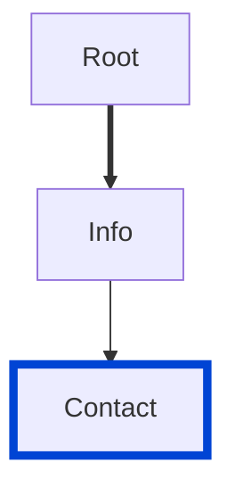

# info-contact

Requires the `Contact` info object defined in your API.

|OAS|Compatibility|
|---|---|
|2.0|✅|
|3.0|✅|
|3.1|✅|




## API design principles

When it comes to APIs, we generally want more consumers.
If they need help to purchase, integrate, or troubleshoot, your contact info should be front and center.

## Configuration

|Option|Type|Description|
|---|---|---|
|severity|string|Possible values: `off`, `warn`, `error`. Default `off`. |

An example configuration:

```yaml
rules:
  info-contact: warn
```

## Examples

Given this configuration:
```yaml
rules:
  info-contact: error
```

Example of **incorrect** contact:
```yaml Incorrect example
info:
  version: 1.0.0
  title: Incorrect example missing contact
  termsOfService: 'https://example.com/terms/'
  license:
    name: Apache 2.0
    url: 'http://www.apache.org/licenses/LICENSE-2.0.html'
```

Example of **correct** contact:
```yaml Correct example
info:
  contact:
    name: Redocly API Support
    url: https://www.redocly.com/support
    email: support@redocly.com
```

## Related rules

- [info-license](./info-license.md)
- [info-license-url](./info-license-url.md)
- [spec](./spec.md)
- [custom rules](./custom-rules.md)

## Resources

- [Rule source](https://github.com/Redocly/redocly-cli/blob/main/packages/core/src/rules/common/info-contact.ts)
- [Contact object docs](https://redocly.com/docs/openapi-visual-reference/contact/)
