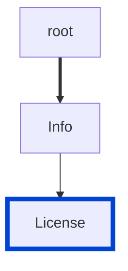

# info-license

Requires the license info in your API definitions.

|OAS|Compatibility|
|---|---|
|2.0|✅|
|3.0|✅|
|3.1|✅|




## API design principles

The principle of providing your users with accurate and relevant information does not apply to API design only, but to any product-related communication in general.

Before they can work with your API, your users must understand the terms and conditions of your API usage.

"Can I use your API? Will I get in trouble? Will I lose my job?"
Sometimes questions like these go through consumers' minds.
By being upfront with the API license, you can reduce friction towards usage.

## Configuration

|Option|Type|Description|
|---|---|---|
|severity|string|Possible values: `off`, `warn`, `error`. Default `warn` (in `recommended` configuration). |

An example configuration:

```yaml
rules:
  info-license: error
```

## Examples

Given the following configuration:
```yaml
rules:
  info-license: error
```

Example of an **incorrect** license:

```yaml Object example
info:
  version: v1.1
```

Example of a **correct** license:

```yaml Object example
info:
  license:
    name: Apache 2.0
```

## Related rules

- [info-contact](./info-contact.md)
- [info-license-url](./info-license-url.md)

## Resources

- [Rule source](https://github.com/Redocly/redocly-cli/blob/main/packages/core/src/rules/common/info-license.ts)
- [License object docs](https://redocly.com/docs/openapi-visual-reference/license/)
