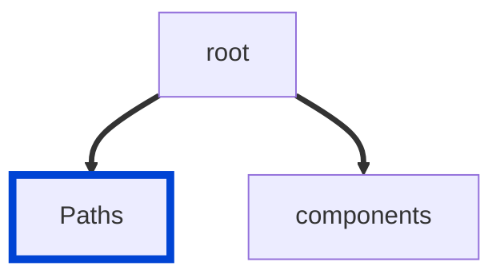

# no-ambiguous-paths

Ensures there are no ambiguous paths in your API definitions.
When this rule is enabled, templated paths that support the same HTTP methods should not have ambiguous resolution.

According to the OpenAPI specification:

> The following paths are considered identical and invalid:
>
>      /pets/{petId}
>      /pets/{name}
>
> The following may lead to ambiguous resolution:
>
>      /{entity}/me
>      /books/{id}

|OAS|Compatibility|
|---|---|
|2.0|✅|
|3.0|✅|
|3.1|✅|



## API design principles

Ambiguity is all around us.
We need to minimize ambiguity in our API designs to avoid surprises.

Consistent and predictable behavior is desirable for APIs, because it speeds up the onboarding process for API consumers and doesn't cause "surprises" in the developer experience.

Ambiguity can creep in when a single path can satisfy two different path items.
Such paths are considered ambiguous and should be avoided, because API users and tools have no way of knowing which path is actually used.

## Configuration

|Option|Type|Description|
|---|---|---|
|severity|string|Possible values: `off`, `warn`, `error`. Default `warn` (in `recommended` configuration). |

An example configuration:

```yaml
rules:
  no-ambiguous-paths: error
```

## Examples

Given this configuration:

```yaml
rules:
  no-ambiguous-paths: error
```

Example of **incorrect** ambiguous paths:

```yaml
paths:
  '/{entity}/me':
    $ref: ./paths/example.yaml
  '/books/{id}':
    $ref: ./paths/example.yaml
```

Example of **correct** paths:

```yaml
paths:
  '/electronics/{id}':
    $ref: ./paths/example.yaml
  '/books/{id}':
    $ref: ./paths/example.yaml
```

## Related rules

- [no-identical-paths](./no-identical-paths.md)

## Resources

- [Rule source](https://github.com/Redocly/redocly-cli/blob/main/packages/core/src/rules/common/no-ambiguous-paths.ts)
- [Paths object docs](https://redocly.com/docs/openapi-visual-reference/paths/)
