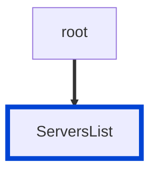

# no-empty-servers

Requires the `servers` list is defined in your API.

|OAS|Compatibility|
|---|---|
|2.0|❌|
|3.0|✅|
|3.1|✅|



## API design principles

An empty `servers` list defaults to `localhost`, which is not practical for your API consumers.
An API cannot be used without a server.
Define servers so that the *Try it* and code sample generator features in OpenAPI tools (including Redocly) can produce functional API requests.

If you don't have a server because the consumer is responsible for setting up their own server, you can still describe the server with server variables.
The following code sample shows declaration of a server variable.

```yaml
servers:
  - url: 'https://{tenant}/api/v1'
    variables:
      tenant:
        default: api.example.com
        description: Your server host
```

## Configuration

|Option|Type|Description|
|---|---|---|
|severity|string|Possible values: `off`, `warn`, `error`. Default `error` (in `recommended` configuration). |

An example configuration:

```yaml
rules:
  no-empty-servers: error
```

## Examples

Given this configuration:

```yaml
rules:
  no-empty-servers: error
```

Example of **incorrect** empty servers:

```yaml
server: []
```

Example of **correct** servers:

```yaml Example
servers:
  - url: https://development.gigantic-server.com/v1
    description: Development server
```

## Related rules
- [no-server-example.com](./no-server-example-com.md)
- [no-server-trailing-slash](./no-server-trailing-slash.md)

## Resources

- [Rule source](https://github.com/Redocly/redocly-cli/blob/main/packages/core/src/rules/oas3/no-empty-servers.ts)
- [Servers list docs](https://redocly.com/docs/openapi-visual-reference/servers/)
