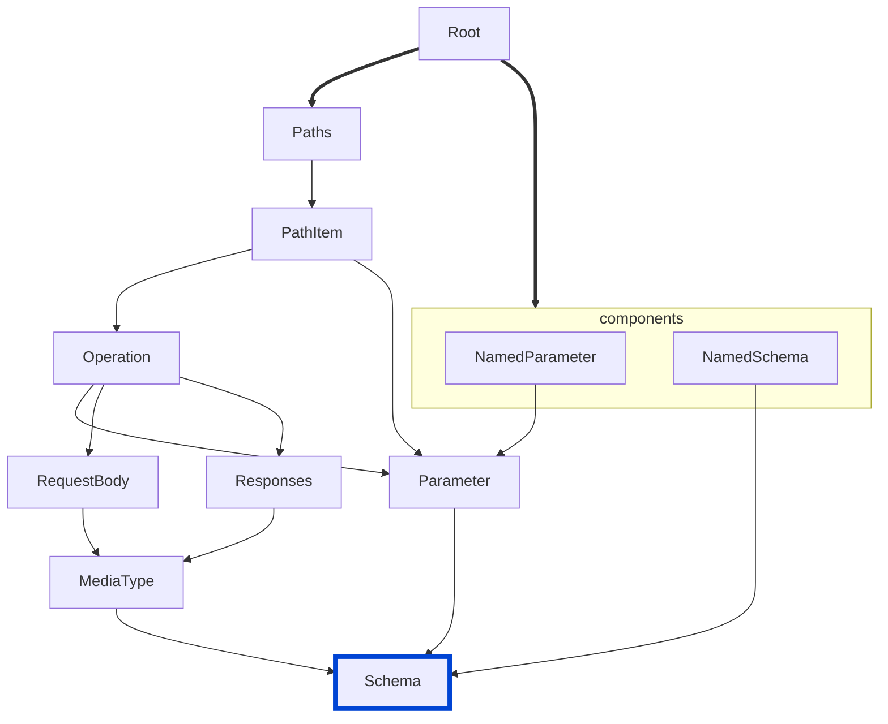

# no-enum-type-mismatch

Requires that the contents of every `enum` value in your API definition conform to the corresponding schema's specified `type`.


|OAS|Compatibility|
|---|---|
|2.0|✅|
|3.0|✅|
|3.1|✅|



## API design principles

If a property is defined for a certain type, then its corresponding `enum` values should comply with that type.
Lack of compliance is most likely the result of a typo.

## Configuration

|Option|Type|Description|
|---|---|---|
|severity|string|Possible values: `off`, `warn`, `error`. Default `error` (in `recommended` configuration). |

An example configuration:

```yaml
rules:
  no-enum-type-mismatch: error
```

## Examples

Given this configuration:

```yaml
rules:
  no-enum-type-mismatch: error
```

Example of **incorrect** enum values given the enum type:
```yaml Bad example
properties:
  huntingSkill:
    type: string
    description: The measured skill for hunting
    enum:
      - adventurous
      - 12
      - 3.14
```

Example of **correct** enum values given the enum type:
```yaml Good example
properties:
  huntingSkill:
    type: string
    description: The measured skill for hunting
    enum:
      - adventurous
      - aggressive
      - passive
```

## Related rules

- [custom rules](./custom-rules.md)
- [no-invalid-media-type-examples](./no-invalid-media-type-examples.md)
- [no-invalid-parameter-examples](./no-invalid-parameter-examples.md)
- [no-invalid-schema-examples](./no-invalid-schema-examples.md)

## Resources

- [Rule source](https://github.com/Redocly/redocly-cli/blob/main/packages/core/src/rules/common/no-enum-type-mismatch.ts)
- [Enum documentation](https://redocly.com/docs/openapi-visual-reference/schemas/#enum)
