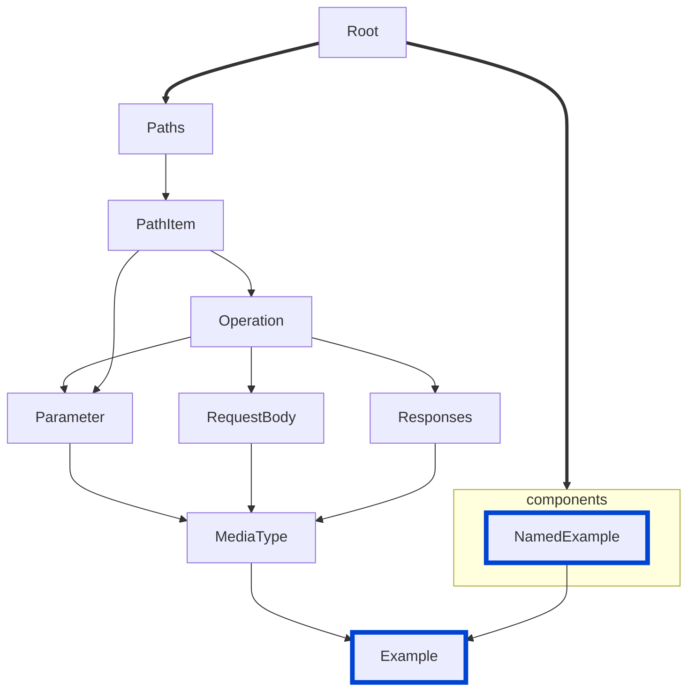

# no-example-value-and-externalValue

Ensures that `examples` object properties `externalValue` and `value` are mutually exclusive.

|OAS|Compatibility|
|---|---|
|2.0|❌|
|3.0|✅|
|3.1|✅|



## API design principles

According to the OpenAPI specification, the `value` field and `externalValue` field are mutually exclusive.
An object that contains both violates the specification.
The intended use of the `value` field is to provide in-line example values, while the `externalValue` field is meant for URIs that reference examples stored outside of the API definition file.

## Configuration

|Option|Type|Description|
|---|---|---|
|severity|string|Possible values: `off`, `warn`, `error`. Default `error` (in `recommended` configuration). |

An example configuration:

```yaml
rules:
  no-example-value-and-externalValue: error
```

## Examples

Given this configuration:
```yaml
rules:
  no-example-value-and-externalValue: error
```

Example of an **incorrect** example object:
```yaml Bad example
requestBody:
  content:
    'application/json':
      schema:
        $ref: '#/components/schemas/Address'
      examples:
        foo:
          summary: A foo example
          value: {"foo": "bar"}
          externalValue: 'https://example.org/examples/foo-example.xml'
        bar:
          summary: A bar example
          value: {"bar": "baz"}
          externalValue: 'https://example.org/examples/bar-example.xml'
```

Example of a **correct** example object:

```yaml Good example
requestBody:
  content:
    'application/json':
      schema:
        $ref: '#/components/schemas/Address'
      examples:
        foo:
          summary: A foo example
          value: {"foo": "bar"}
        bar:
          summary: A bar example
          externalValue: 'https://example.org/examples/address-example.xml'
```

## Related rules

- [custom rules](./custom-rules.md)
- [spec](./spec.md)

## Resources

- [Rule source](https://github.com/Redocly/redocly-cli/blob/main/packages/core/src/rules/oas3/no-example-value-and-externalValue.ts)
- [Example object docs](https://redocly.com/docs/openapi-visual-reference/example/)
