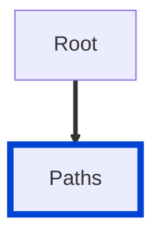

# no-http-verbs-in-paths

Disallows HTTP verbs used in paths.

|OAS|Compatibility|
|---|---|
|2.0|✅|
|3.0|✅|
|3.1|✅|




List of HTTP verbs:
- `get`
- `head`
- `post`
- `put`
- `patch`
- `delete`
- `options`
- `trace`


## API design principles

API designers generally fall into either a REST or RPC type.
The REST type prefers to name paths after resources like "customers", and "payments".
And the REST type relies on HTTP methods, like GET, to indicate the action on that resource.
It would be considered a design fail to make the path "getcustomers" or "get-customers" or any variation on that.
If you're aiming to design RESTful resources, then consider this rule your friend.
There is the option to `splitIntoWords` to reduce false positives.
Imagine a world-famous rock band, the Redockers, and they have an API powering their music tour with one resource "posters".
With the `splitIntoWords` enabled it will be identified as a resource and not trigger a false positive even though it contains the word `post`.

## Configuration

|Option|Type|Description|
|---|---|---|
|severity|string|Possible values: `off`, `warn`, `error`. Default `off` (in `recommended` configuration). |
|splitIntoWords|boolean|Matches http verbs when the string is split into words based on casing. This can reduce false positives. Default **false**.|

An example configuration:

```yaml
rules:
  no-http-verbs-in-paths: error
```

An example configuration with `splitIntoWords` enabled:

```yaml
rules:
  no-http-verbs-in-paths:
    severity: error
    splitIntoWords: true
```

## Examples

Given this configuration:

```yaml
rules:
  no-http-verbs-in-paths: error
```

Example of an **incorrect** path:

```yaml Bad example
paths:
  /getcustomers:
    $ref: ./paths/customer.yaml
```


Example of a **correct** path:

```yaml Good example
paths:
  /customers:
    $ref: ./paths/customer.yaml
```


Given the following configuration:

```yaml
rules:
  no-http-verbs-in-paths:
    severity: error
    splitIntoWords: true
```

Example of an **incorrect** path:

```yaml Bad example
paths:
  /getCustomers:
    $ref: ./paths/customer.yaml
```

Example of a **correct** path:

```yaml Correct example
paths:
  /getcustomers:
    $ref: ./paths/customer.yaml
```

This last example wouldn't trigger an error because the casing won't split "get" into its own word.

## Related rules

- [custom rules](./custom-rules.md)
- [path-excludes-patterns](./path-excludes-patterns.md)

## Resources

- [Rule source](https://github.com/Redocly/redocly-cli/blob/main/packages/core/src/rules/common/no-http-verbs-in-paths.ts)
- [Paths docs](https://redocly.com/docs/openapi-visual-reference/paths/)

