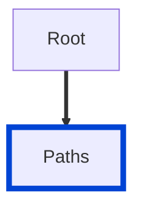

# no-identical-paths

Ensures there are no identical paths in your API definitions even when they have different path parameter names.

|OAS|Compatibility|
|---|---|
|2.0|✅|
|3.0|✅|
|3.1|✅|

According to the OpenAPI specification:

> The following paths are considered identical and invalid:
>
>      /pets/{petId}
>      /pets/{name}



## API design principles

Identical paths leads to uncertainty and doubt for both API producers and consumers.
Ambiguity surrounds us.
Minimize it in APIs to make them as easy as possible to use.

## Configuration

|Option|Type|Description|
|---|---|---|
|severity|string|Possible values: `off`, `warn`, `error`. Default `error` (in `recommended` configuration). |

An example configuration:

```yaml
rules:
  no-identical-paths: error
```

## Examples

Given this configuration:

```yaml
rules:
  no-identical-paths: error
```


Example of **incorrect** paths:

```yaml
paths:
  /pets/{petId}:
    $ref: ./paths/petById.yaml
  /pets/{name}:
    $ref: ./paths/petByName.yaml
```

Example of **correct** paths:

```yaml
paths:
  /pets/{petId}:
    $ref: ./paths/petById.yaml
  /pet-names/{name}:
    $ref: ./paths/petByName.yaml
```

## Related rules

- [no-ambiguous-paths](./no-ambiguous-paths.md)
- [spec](./spec.md)
## Resources

- [Rule source](https://github.com/Redocly/redocly-cli/blob/main/packages/core/src/rules/common/no-identical-paths.ts)
- [Paths object docs](https://redocly.com/docs/openapi-visual-reference/paths/)
